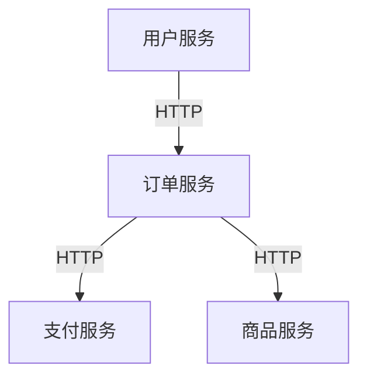

## 什么是微服务架构？

微服务架构（Microservices Architecture）是一种将单一应用程序拆分为一组小型、独立服务的软件设计方法。每个服务都运行在自己的进程中，并通过轻量级的通信机制（如 HTTP 或消息队列）与其他服务交互。每个微服务专注于完成一个特定的业务功能，并且可以独立开发、部署和扩展。

与传统的单体架构（Monolithic Architecture）相比，微服务架构具有更高的灵活性和可维护性，特别适合复杂、快速变化的业务需求。

---

## 微服务架构的核心特点

1. **服务拆分**  
   将应用程序按业务功能拆分为多个独立的服务，每个服务负责一个特定的功能模块。

2. **独立部署**  
   每个微服务可以独立开发、测试、部署和扩展，无需影响其他服务。

3. **轻量级通信**  
   微服务之间通过轻量级的通信机制（如 REST API、gRPC 或消息队列）进行交互。

4. **技术多样性**  
   每个微服务可以使用不同的编程语言、框架和数据库，选择最适合其业务需求的技术栈。

5. **自动化运维**  
   微服务架构通常与 DevOps 和容器化技术（如 Docker 和 Kubernetes）结合，实现自动化部署和运维。

---

## 微服务架构的优势

- **灵活性**：每个服务可以独立开发和部署，团队可以并行工作，加快开发速度。
- **可扩展性**：可以根据需求单独扩展某个服务，而不需要扩展整个应用程序。
- **技术多样性**：允许团队选择最适合的技术栈，提高开发效率。
- **容错性**：一个服务的故障不会影响整个系统的运行。

---

## 微服务架构的挑战

- **复杂性**：微服务架构引入了分布式系统的复杂性，如服务发现、负载均衡、数据一致性等问题。
- **运维成本**：需要更多的工具和流程来管理多个服务的部署和监控。
- **调试困难**：由于服务之间的依赖关系，调试和排查问题可能更加困难。

---

## 微服务架构的实际案例

假设我们正在开发一个电商平台，以下是微服务架构的一个简单示例：

1. **用户服务**：负责用户注册、登录和个人信息管理。
2. **商品服务**：管理商品信息，包括商品列表、详情和库存。
3. **订单服务**：处理订单的创建、支付和状态更新。
4. **支付服务**：处理支付逻辑，与第三方支付网关交互。

这些服务通过 REST API 进行通信。例如，当用户下单时，订单服务会调用支付服务完成支付，并更新商品服务的库存。



---

## 微服务架构的代码示例

以下是一个简单的微服务示例，使用 Spring Boot 实现用户服务和订单服务之间的通信。

### 用户服务（User Service）

```java
@RestController
public class UserController {

    @GetMapping("/users/{id}")
    public User getUser(@PathVariable Long id) {
        // 模拟从数据库获取用户信息
        return new User(id, "John Doe", "john.doe@example.com");
    }
}
```

### 订单服务（Order Service）

```java
@RestController
public class OrderController {

    @Autowired
    private RestTemplate restTemplate;

    @GetMapping("/orders/{userId}")
    public Order getOrder(@PathVariable Long userId) {
        // 调用用户服务获取用户信息
        User user = restTemplate.getForObject("http://user-service/users/{id}", User.class, userId);

        // 模拟生成订单
        return new Order(1L, user, "Order Details");
    }
}
```

### 输出示例

调用订单服务的 `/orders/1` 接口，返回以下 JSON 数据：

```json
{
  "id": 1,
  "user": {
    "id": 1,
    "name": "John Doe",
    "email": "john.doe@example.com"
  },
  "details": "Order Details"
}
```

---

## 总结

微服务架构通过将应用程序拆分为多个独立的服务，提供了更高的灵活性、可扩展性和技术多样性。然而，它也引入了分布式系统的复杂性和运维成本。对于初学者来说，理解微服务架构的核心概念和应用场景是掌握现代软件开发的关键。

---

## 附加资源与练习

- **推荐阅读**：
  - 《微服务设计》（Sam Newman 著）
  - 《Spring Cloud Alibaba 从入门到实战》
- **练习**：
  - 尝试将一个小型单体应用拆分为多个微服务。
  - 使用 Spring Cloud Alibaba 实现服务注册与发现功能。