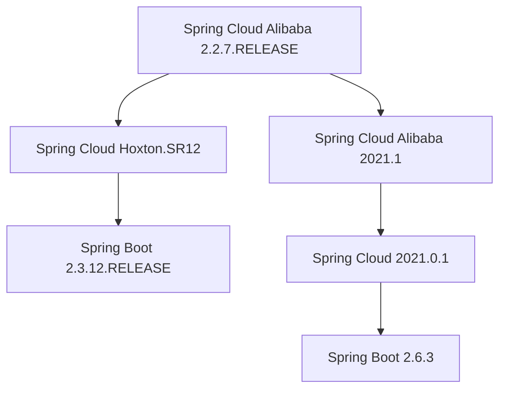

## 介绍

Spring Cloud Alibaba 是 Spring Cloud 生态中的一个重要组成部分，它提供了与阿里巴巴开源技术栈（如 Nacos、Sentinel、RocketMQ 等）的集成。选择合适的 Spring Cloud Alibaba 版本对于项目的成功至关重要。本文将指导您如何根据 Spring Cloud 和 Spring Boot 的版本来选择合适的 Spring Cloud Alibaba 版本。

## Spring Cloud Alibaba 版本与 Spring Cloud 和 Spring Boot 的关系

Spring Cloud Alibaba 的版本与 Spring Cloud 和 Spring Boot 的版本密切相关。每个 Spring Cloud Alibaba 版本都依赖于特定的 Spring Cloud 和 Spring Boot 版本。因此，在选择 Spring Cloud Alibaba 版本时，您需要确保它与您项目中使用的 Spring Cloud 和 Spring Boot 版本兼容。

### 版本兼容性表

以下是一个简化的版本兼容性表，展示了 Spring Cloud Alibaba 与 Spring Cloud 和 Spring Boot 的版本关系：



:::note
请注意，版本兼容性可能会随着时间而变化，建议您查阅官方文档以获取最新的兼容性信息。
:::

## 如何选择合适的 Spring Cloud Alibaba 版本

### 1. 确定 Spring Boot 版本

首先，您需要确定项目中使用的 Spring Boot 版本。Spring Boot 的版本决定了 Spring Cloud 和 Spring Cloud Alibaba 的版本范围。

例如，如果您使用的是 Spring Boot 2.3.x，那么您需要选择与之兼容的 Spring Cloud 和 Spring Cloud Alibaba 版本。

### 2. 确定 Spring Cloud 版本

接下来，根据 Spring Boot 的版本，选择合适的 Spring Cloud 版本。Spring Cloud 的版本通常与 Spring Boot 的版本有明确的兼容性关系。

例如，Spring Boot 2.3.x 通常与 Spring Cloud Hoxton 系列版本兼容。

### 3. 选择 Spring Cloud Alibaba 版本

最后，根据 Spring Cloud 的版本，选择合适的 Spring Cloud Alibaba 版本。Spring Cloud Alibaba 的版本通常与 Spring Cloud 的版本有明确的兼容性关系。

例如，Spring Cloud Hoxton.SR12 通常与 Spring Cloud Alibaba 2.2.7.RELEASE 兼容。

## 实际案例

假设您正在开发一个基于 Spring Boot 2.3.12.RELEASE 的项目，并且您希望使用 Spring Cloud Alibaba 来集成 Nacos 和 Sentinel。

### 步骤 1: 确定 Spring Boot 版本

您的项目使用的是 Spring Boot 2.3.12.RELEASE。

### 步骤 2: 确定 Spring Cloud 版本

根据 Spring Boot 2.3.x 的版本，您可以选择 Spring Cloud Hoxton.SR12。

### 步骤 3: 选择 Spring Cloud Alibaba 版本

根据 Spring Cloud Hoxton.SR12 的版本，您可以选择 Spring Cloud Alibaba 2.2.7.RELEASE。

### 配置示例

在您的 `pom.xml` 文件中，您可以添加以下依赖：

```xml
<dependency>
    <groupId>com.alibaba.cloud</groupId>
    <artifactId>spring-cloud-starter-alibaba-nacos-discovery</artifactId>
    <version>2.2.7.RELEASE</version>
</dependency>
<dependency>
    <groupId>com.alibaba.cloud</groupId>
    <artifactId>spring-cloud-starter-alibaba-sentinel</artifactId>
    <version>2.2.7.RELEASE</version>
</dependency>
```

## 总结

选择合适的 Spring Cloud Alibaba 版本是确保项目稳定性和兼容性的关键步骤。通过确定 Spring Boot 和 Spring Cloud 的版本，您可以轻松找到与之兼容的 Spring Cloud Alibaba 版本。希望本文能帮助您更好地理解版本选择的过程，并为您的项目选择合适的版本。

## 附加资源

- [Spring Cloud Alibaba 官方文档](https://github.com/alibaba/spring-cloud-alibaba)
- [Spring Cloud 官方文档](https://spring.io/projects/spring-cloud)
- [Spring Boot 官方文档](https://spring.io/projects/spring-boot)

## 练习

1. 尝试为您的项目选择一个合适的 Spring Cloud Alibaba 版本，并验证其与 Spring Boot 和 Spring Cloud 的兼容性。
2. 在您的项目中集成 Nacos 和 Sentinel，并测试其功能。