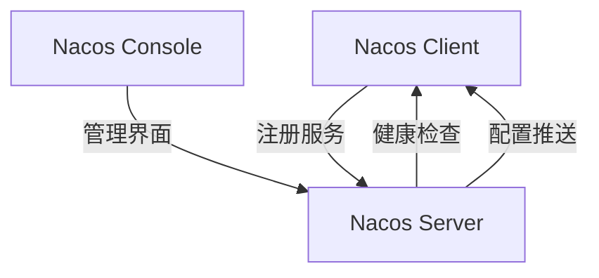

# Nacos简介与架构

## 什么是Nacos？

Nacos（Naming and Configuration Service）是一个动态服务发现、配置管理和服务管理平台。它由阿里巴巴开源，旨在帮助开发者构建云原生应用。Nacos的核心功能包括服务注册与发现、动态配置管理、服务健康检查等，是微服务架构中的重要组件。

:::tip
Nacos的名字来源于“Naming”和“Configuration”两个单词的组合，体现了其在服务发现和配置管理方面的核心能力。
:::

## Nacos的核心功能

1. **服务注册与发现**：Nacos允许服务实例在启动时注册自己，并能够动态发现其他服务实例。
2. **动态配置管理**：Nacos支持配置的动态更新，无需重启服务即可生效。
3. **服务健康检查**：Nacos能够监控服务的健康状态，自动剔除不健康的服务实例。
4. **服务元数据管理**：Nacos支持为服务实例添加元数据，便于服务治理。

## Nacos的架构

Nacos的架构设计简洁高效，主要由以下几个核心组件组成：

1. **Nacos Server**：负责服务注册、配置管理、健康检查等核心功能。
2. **Nacos Client**：与服务实例集成，负责与服务端通信，完成服务注册、配置获取等操作。
3. **Nacos Console**：提供Web界面，方便用户查看和管理服务及配置。



### Nacos Server

Nacos Server是Nacos的核心组件，负责处理服务注册、配置管理、健康检查等任务。它支持集群部署，能够保证高可用性和扩展性。

### Nacos Client

Nacos Client是集成在服务实例中的组件，负责与服务端通信。它会在服务启动时自动注册服务，并定期向服务端发送心跳以维持健康状态。

### Nacos Console

Nacos Console是一个Web管理界面，用户可以通过它查看和管理服务实例、配置信息等。它提供了友好的用户界面，便于操作和监控。

## 实际应用场景

假设我们有一个微服务架构的电商系统，包含用户服务、订单服务和商品服务。每个服务都需要注册到Nacos中，以便其他服务能够发现并调用它们。

1. **服务注册**：用户服务启动时，会自动向Nacos Server注册自己。
2. **服务发现**：订单服务需要调用用户服务时，会从Nacos Server获取用户服务的实例列表。
3. **配置管理**：商品服务的数据库连接信息可以通过Nacos进行动态配置，无需重启服务即可更新。

```java
// 示例：服务注册
NamingService naming = NacosFactory.createNamingService("127.0.0.1:8848");
naming.registerInstance("user-service", "192.168.1.1", 8080);

// 示例：服务发现
List<Instance> instances = naming.getAllInstances("user-service");
for (Instance instance : instances) {
    System.out.println(instance.getIp() + ":" + instance.getPort());
}
```

:::note
在实际开发中，Nacos Client通常与Spring Cloud Alibaba等框架集成，简化服务注册与发现的流程。
:::

## 总结

Nacos作为一个动态服务发现和配置管理平台，在微服务架构中扮演着重要角色。通过本文的介绍，你应该对Nacos的基本概念、核心功能及其架构有了初步了解。接下来，你可以尝试在实际项目中应用Nacos，进一步掌握其使用方法。

## 附加资源

- [Nacos官方文档](https://nacos.io/zh-cn/docs/what-is-nacos.html)
- [Spring Cloud Alibaba Nacos](https://github.com/alibaba/spring-cloud-alibaba/wiki/Nacos-discovery)

## 练习

1. 尝试在本地搭建一个Nacos Server，并注册一个简单的服务。
2. 使用Nacos Console查看注册的服务实例，并尝试动态更新配置。
3. 探索Nacos与其他微服务框架（如Spring Cloud）的集成方式。
