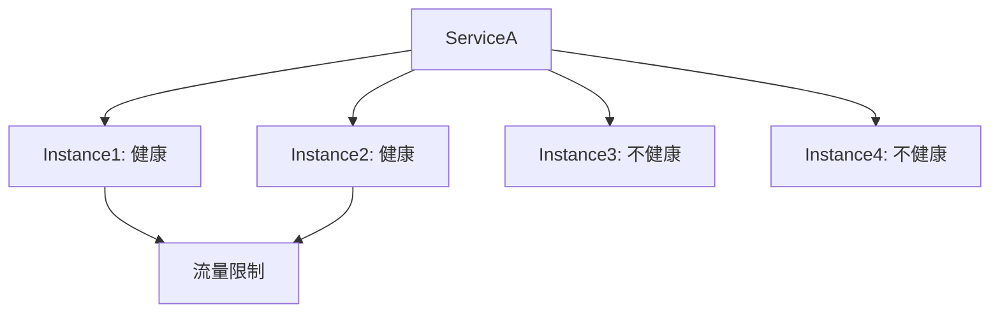

# Nacos服务保护阈值

在微服务架构中，服务注册与发现是核心组件之一。Nacos作为一款流行的服务注册与发现工具，提供了丰富的功能来帮助开发者管理服务。其中，**服务保护阈值**是一个重要的概念，它可以帮助我们在服务实例不健康或不可用时，防止服务雪崩的发生。

## 什么是服务保护阈值？

服务保护阈值是Nacos中用于保护服务的一种机制。当某个服务的健康实例比例低于设定的阈值时，Nacos会触发保护机制，防止所有流量都流向剩余的健康实例，从而避免这些实例因过载而崩溃。

简单来说，服务保护阈值的作用是：**在服务实例不健康的情况下，限制流量，避免服务雪崩**。

## 为什么需要服务保护阈值？

在微服务架构中，服务之间的调用关系非常复杂。如果一个服务的实例出现故障，可能会导致调用链上的其他服务也受到影响，最终引发整个系统的崩溃。这种现象被称为**服务雪崩**。

通过设置服务保护阈值，我们可以在服务实例不健康时，限制流量，避免剩余的健康实例被压垮，从而保护整个系统的稳定性。

## 如何配置服务保护阈值？

在Nacos中，服务保护阈值可以通过配置文件或API进行设置。以下是一个通过配置文件设置服务保护阈值的示例：

```yaml
spring:
  cloud:
    nacos:
      discovery:
        server-addr: localhost:8848
        protection-threshold: 0.5
```

在这个示例中，`protection-threshold`被设置为`0.5`，表示当服务的健康实例比例低于50%时，Nacos会触发保护机制。

## 服务保护阈值的工作原理

为了更好地理解服务保护阈值的工作原理，我们可以通过一个简单的例子来说明。

假设我们有一个服务`ServiceA`，它有4个实例，其中2个实例是健康的，2个实例是不健康的。此时，健康实例的比例为50%。

如果我们设置了服务保护阈值为`0.5`，那么当健康实例比例低于50%时，Nacos会触发保护机制，限制流量流向剩余的健康实例。



在这个例子中，由于健康实例比例低于50%，Nacos会限制流量流向`Instance1`和`Instance2`，从而避免它们被压垮。

## 实际应用场景

### 场景1：服务实例故障

假设我们有一个电商系统，其中`订单服务`依赖于`库存服务`。如果`库存服务`的某些实例出现故障，导致健康实例比例低于设定的保护阈值，Nacos会限制流量流向剩余的健康实例，从而避免`库存服务`的崩溃。

### 场景2：服务扩容

在服务扩容时，新的实例可能需要一段时间才能完全启动并注册到Nacos中。在此期间，健康实例比例可能会低于保护阈值，Nacos会触发保护机制，限制流量流向新实例，直到它们完全启动并健康。

## 总结

服务保护阈值是Nacos中一个非常重要的机制，它可以帮助我们在服务实例不健康或不可用时，防止服务雪崩的发生。通过合理配置服务保护阈值，我们可以确保微服务架构的稳定性，避免因单个服务的故障而导致整个系统的崩溃。

## 附加资源与练习

- **练习1**：在你的Nacos环境中，尝试为一个服务设置不同的保护阈值，观察Nacos的行为。
- **练习2**：模拟服务实例故障，观察Nacos如何触发保护机制。

通过以上内容的学习，你应该对Nacos中的服务保护阈值有了更深入的理解。希望你能在实际项目中灵活运用这一机制，确保系统的稳定性。