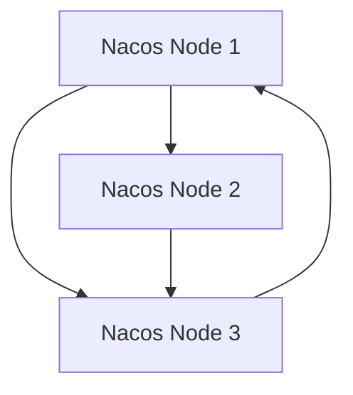
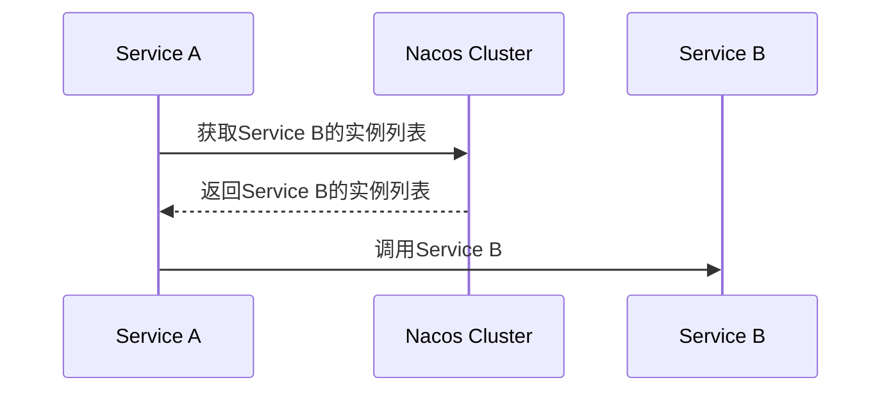

# Nacos集群部署

## 介绍

Nacos（Naming and Configuration Service）是一个动态服务发现、配置管理和服务管理平台。它支持服务注册与发现、动态配置管理、服务元数据管理等功能。在实际生产环境中，单机部署的Nacos可能无法满足高可用性和高性能的需求，因此需要将Nacos部署为集群模式。

Nacos集群部署通过多个Nacos节点协同工作，提供高可用性和负载均衡能力。本文将逐步讲解如何搭建Nacos集群，并展示其在实际应用中的使用场景。

## Nacos集群架构

Nacos集群通常由多个Nacos节点组成，这些节点通过Raft协议进行数据同步和选举。每个节点都可以独立处理客户端请求，并通过集群内部的通信机制保持数据一致性。



## 部署步骤

### 1. 环境准备

在开始部署之前，确保你已经准备好以下环境：

- 至少三台服务器（可以是虚拟机或物理机）。
- 每台服务器上安装Java环境（JDK 1.8或更高版本）。
- 下载Nacos的最新版本。

### 2. 配置Nacos集群

#### 2.1 修改配置文件

在每台服务器上，解压Nacos安装包，并进入`conf`目录。找到`cluster.conf.example`文件，将其重命名为`cluster.conf`，并编辑该文件，添加所有Nacos节点的IP地址和端口号。

```plaintext
# cluster.conf
192.168.1.101:8848
192.168.1.102:8848
192.168.1.103:8848
```

#### 2.2 配置数据库

Nacos集群需要依赖一个共享的数据库来存储配置信息。你可以选择MySQL作为Nacos的数据库。在`conf`目录下找到`application.properties`文件，并配置数据库连接信息。

```properties
# application.properties
spring.datasource.platform=mysql
db.num=1
db.url.0=jdbc:mysql://192.168.1.100:3306/nacos?characterEncoding=utf8&connectTimeout=1000&socketTimeout=3000&autoReconnect=true
db.user=root
db.password=yourpassword
```

### 3. 启动Nacos集群

在每台服务器上，进入Nacos的`bin`目录，执行以下命令启动Nacos服务：

```bash
sh startup.sh -m cluster
```

:::note
如果你在Windows环境下，可以使用`startup.cmd`命令。
:::

### 4. 验证集群状态

启动完成后，你可以通过访问任意一个Nacos节点的控制台（默认地址为`http://<节点IP>:8848/nacos`）来验证集群状态。在控制台的“集群管理”页面中，你应该能够看到所有节点的状态信息。

## 实际应用场景

### 场景：微服务架构中的服务注册与发现

在一个微服务架构中，服务之间的通信依赖于服务注册与发现机制。Nacos集群可以确保即使某个节点宕机，其他节点仍然可以提供服务注册与发现功能，从而保证整个系统的可用性。

例如，假设你有三个微服务：`Service A`、`Service B`和`Service C`。这些服务都注册到Nacos集群中。当`Service A`需要调用`Service B`时，它会通过Nacos集群获取`Service B`的实例列表，并选择一个可用的实例进行调用。



## 总结

Nacos集群部署是确保Nacos高可用性和高性能的关键步骤。通过本文的讲解，你应该已经掌握了如何搭建Nacos集群，并了解了其在实际应用中的重要性。

## 附加资源与练习

- **练习**：尝试在本地虚拟机环境中搭建一个三节点的Nacos集群，并验证其高可用性。
- **资源**：访问[Nacos官方文档](https://nacos.io/zh-cn/docs/)获取更多关于Nacos的详细信息和高级配置。

:::tip
如果你在部署过程中遇到问题，可以参考Nacos的官方文档或社区论坛，获取更多帮助。
:::