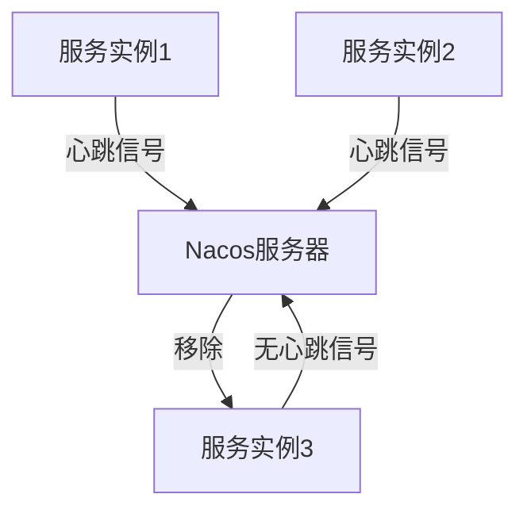
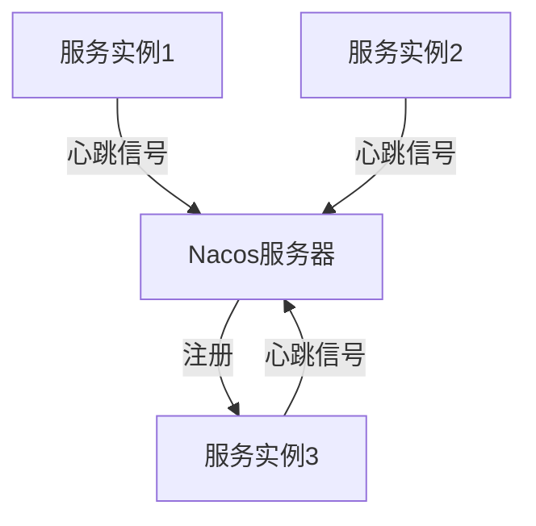

# Nacos服务健康检查

在微服务架构中，服务的健康状态至关重要。Nacos作为一款流行的服务注册与发现工具，提供了强大的服务健康检查功能，确保服务实例的可用性。本文将详细介绍Nacos服务健康检查的工作原理、配置方法以及实际应用场景。

## 什么是服务健康检查？

服务健康检查是一种机制，用于定期检测服务实例的运行状态。通过健康检查，Nacos可以及时发现并移除不可用的服务实例，从而确保服务注册中心的准确性和可靠性。

## Nacos健康检查的类型

Nacos支持两种主要的健康检查方式：

1. **客户端主动上报**：服务实例定期向Nacos服务器发送心跳信号，表明自己处于健康状态。
2. **服务器端主动探测**：Nacos服务器主动向服务实例发送请求，检测其是否可用。

### 客户端主动上报

在客户端主动上报模式下，服务实例会定期向Nacos服务器发送心跳信号。如果Nacos服务器在一定时间内未收到心跳信号，则认为该服务实例不可用，并将其从注册中心移除。

```java
// 示例：Java客户端配置心跳间隔
NamingService naming = NamingFactory.createNamingService("127.0.0.1:8848");
naming.registerInstance("my-service", "127.0.0.1", 8080);
```

### 服务器端主动探测

在服务器端主动探测模式下，Nacos服务器会定期向服务实例发送HTTP请求或TCP连接，以检测其是否可用。如果服务实例无法响应，Nacos会将其标记为不健康。

```yaml
# 示例：Nacos服务器端健康检查配置
nacos:
  health:
    check:
      enabled: true
      type: http
      path: /health
      port: 8080
      interval: 10s
```

## 实际应用场景

### 场景一：服务实例故障自动剔除

假设我们有一个微服务集群，其中某个服务实例由于网络故障无法提供服务。通过Nacos的健康检查机制，Nacos可以自动检测到该实例的不可用状态，并将其从注册中心移除，从而避免其他服务调用该故障实例。



### 场景二：服务实例恢复自动注册

当故障的服务实例恢复后，它会重新向Nacos发送心跳信号。Nacos检测到该实例的健康状态后，会将其重新注册到服务注册中心，使其再次可用。



## 总结

Nacos的服务健康检查机制是确保微服务高可用性的重要手段。通过客户端主动上报和服务器端主动探测，Nacos能够及时发现并处理不健康的服务实例，从而保证服务注册中心的准确性和可靠性。

:::tip
在实际应用中，建议根据业务需求选择合适的健康检查方式，并合理配置检查间隔和超时时间，以确保系统的稳定性和性能。
:::

## 附加资源与练习

- **资源**：
  - [Nacos官方文档](https://nacos.io/zh-cn/docs/what-is-nacos.html)
  - [微服务健康检查最佳实践](https://microservices.io/patterns/observability/health-check-api.html)

- **练习**：
  1. 在本地搭建一个Nacos服务器，并注册多个服务实例。
  2. 配置客户端主动上报和服务器端主动探测的健康检查机制，观察服务实例的健康状态变化。
  3. 模拟服务实例故障，验证Nacos是否能够自动剔除不可用实例。

通过以上学习和实践，您将能够熟练掌握Nacos服务健康检查的使用方法，并在实际项目中应用这一重要功能。