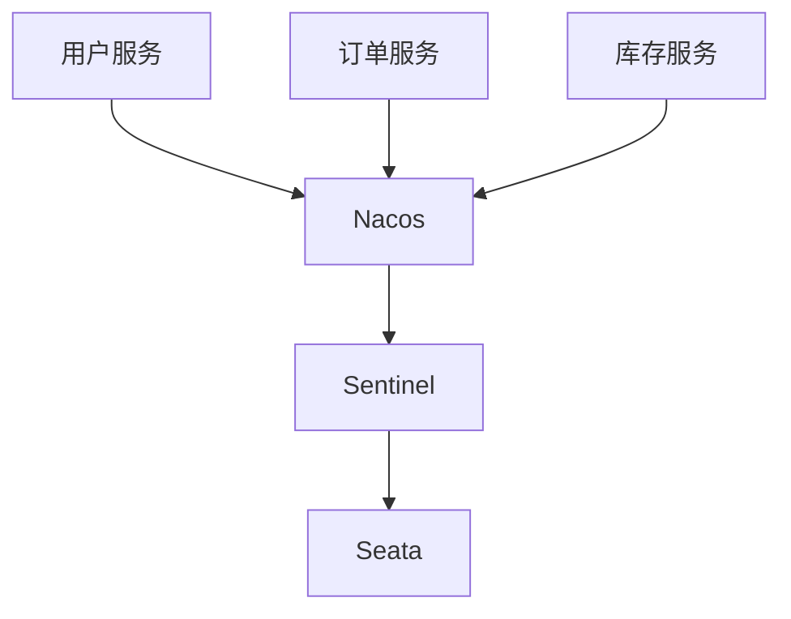

# 高可用最佳实践

在现代分布式系统中，高可用性（High Availability, HA）是一个至关重要的概念。它确保系统在面对硬件故障、网络问题或其他意外情况时，仍能持续提供服务。Spring Cloud Alibaba 提供了一系列工具和组件，帮助开发者构建高可用的微服务架构。本文将逐步讲解高可用的核心概念，并通过实际案例展示如何在实际项目中应用这些最佳实践。

## 什么是高可用性？

高可用性是指系统能够在预定的时间内持续运行，而不会因为单点故障导致服务中断。为了实现高可用性，通常需要采取以下措施：

1. **冗余设计**：通过部署多个实例，确保即使某个实例发生故障，其他实例仍能继续提供服务。
2. **负载均衡**：将请求均匀分配到多个实例上，避免单个实例过载。
3. **故障转移**：当某个实例发生故障时，自动将流量转移到其他健康的实例上。
4. **监控与恢复**：实时监控系统状态，并在发现问题时快速恢复。

## Spring Cloud Alibaba 中的高可用性

Spring Cloud Alibaba 提供了多种组件来支持高可用性，包括 Nacos、Sentinel 和 Seata 等。下面我们将通过一个实际案例，展示如何使用这些组件构建高可用的微服务系统。

### 1. 使用 Nacos 实现服务注册与发现

Nacos 是一个动态服务发现、配置和服务管理平台。通过 Nacos，我们可以轻松实现服务的注册与发现，确保服务的高可用性。

#### 示例：服务注册与发现

```java
@SpringBootApplication
@EnableDiscoveryClient
public class UserServiceApplication {
    public static void main(String[] args) {
        SpringApplication.run(UserServiceApplication.class, args);
    }
}
```

在上面的代码中，我们使用 `@EnableDiscoveryClient` 注解将服务注册到 Nacos 中。Nacos 会自动管理服务的注册与发现，确保即使某个实例发生故障，其他实例仍能被发现并继续提供服务。

### 2. 使用 Sentinel 实现流量控制与熔断

Sentinel 是一个强大的流量控制组件，可以帮助我们实现限流、熔断和降级等功能，确保系统在面对高并发或异常情况时仍能稳定运行。

#### 示例：流量控制与熔断

```java
@RestController
public class UserController {

    @GetMapping("/user/{id}")
    @SentinelResource(value = "getUserById", fallback = "fallbackMethod")
    public User getUserById(@PathVariable Long id) {
        // 业务逻辑
    }

    public User fallbackMethod(Long id) {
        // 降级逻辑
        return new User("fallback", "fallback@example.com");
    }
}
```

在上面的代码中，我们使用 `@SentinelResource` 注解对 `getUserById` 方法进行流量控制。当请求量超过阈值时，Sentinel 会自动触发熔断，并调用 `fallbackMethod` 方法返回降级结果。

### 3. 使用 Seata 实现分布式事务管理

在分布式系统中，事务管理是一个复杂的问题。Seata 是一个开源的分布式事务解决方案，可以帮助我们实现跨服务的事务一致性。

#### 示例：分布式事务管理

```java
@RestController
public class OrderController {

    @Autowired
    private OrderService orderService;

    @GlobalTransactional
    @PostMapping("/order")
    public String createOrder(@RequestBody Order order) {
        orderService.createOrder(order);
        return "Order created successfully";
    }
}
```

在上面的代码中，我们使用 `@GlobalTransactional` 注解对 `createOrder` 方法进行事务管理。Seata 会自动协调各个服务的事务，确保在发生异常时能够回滚所有操作。

## 实际案例：电商系统的高可用设计

假设我们正在开发一个电商系统，该系统包含用户服务、订单服务和库存服务。为了确保系统的高可用性，我们可以采取以下措施：

1. **服务注册与发现**：使用 Nacos 将各个服务注册到服务注册中心，确保服务的高可用性。
2. **流量控制与熔断**：使用 Sentinel 对关键接口进行流量控制，防止系统因高并发而崩溃。
3. **分布式事务管理**：使用 Seata 确保订单创建过程中各个服务的事务一致性。



在上面的架构图中，Nacos 负责服务的注册与发现，Sentinel 负责流量控制与熔断，Seata 负责分布式事务管理。通过这种设计，我们可以确保系统在面对故障时仍能稳定运行。

## 总结

高可用性是现代分布式系统的核心需求之一。通过使用 Spring Cloud Alibaba 提供的组件，如 Nacos、Sentinel 和 Seata，我们可以轻松构建高可用的微服务架构。本文通过实际案例展示了如何在实际项目中应用这些最佳实践，确保系统在面对故障时仍能稳定运行。

## 附加资源与练习

- **资源**：
  - [Nacos 官方文档](https://nacos.io/)
  - [Sentinel 官方文档](https://sentinelguard.io/)
  - [Seata 官方文档](https://seata.io/)

- **练习**：
  1. 尝试在自己的项目中集成 Nacos，并实现服务的注册与发现。
  2. 使用 Sentinel 对某个关键接口进行流量控制，并测试其熔断效果。
  3. 在分布式事务场景下，使用 Seata 确保事务的一致性。

通过以上练习，你将更深入地理解高可用性的重要性，并掌握如何在 Spring Cloud Alibaba 中实现高可用性。