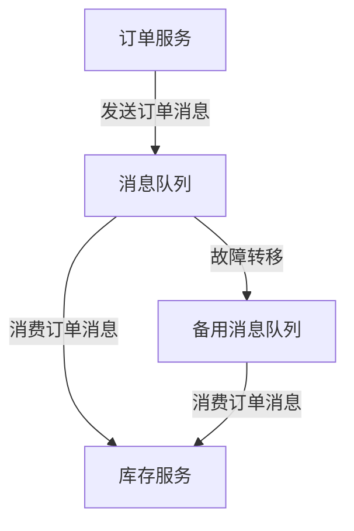

## 介绍

在现代分布式系统中，消息中间件（Message Queue, MQ）扮演着至关重要的角色。它负责在系统组件之间传递消息，确保数据的一致性和系统的可靠性。然而，随着系统规模的扩大，消息中间件的可用性成为了一个关键问题。如果消息中间件出现故障，整个系统可能会陷入瘫痪。因此，**消息中间件的高可用性**成为了分布式系统设计中的一个核心需求。

高可用性（High Availability, HA）是指系统能够在长时间内持续运行，即使在某些组件发生故障的情况下也能保持服务的可用性。对于消息中间件来说，高可用性意味着即使某个消息队列节点发生故障，系统仍然能够继续处理消息，而不会导致消息丢失或服务中断。

## 消息中间件高可用的实现方式

实现消息中间件的高可用性通常有以下几种方式：

1. **主从复制（Master-Slave Replication）**：主节点负责处理所有写操作，从节点负责复制主节点的数据。当主节点发生故障时，从节点可以接管服务。
2. **集群模式（Cluster Mode）**：多个节点组成一个集群，每个节点都可以处理读写操作。通过数据分片和负载均衡，集群模式可以提高系统的吞吐量和容错能力。
3. **多副本机制（Multi-Replica Mechanism）**：每个消息在多个节点上存储副本，确保即使某个节点发生故障，消息仍然可以从其他节点获取。

### 主从复制示例

以下是一个简单的主从复制示例，展示了如何通过 Spring Cloud Alibaba 实现消息中间件的高可用性。

```java
@Configuration
public class RabbitMQConfig {

    @Bean
    public CachingConnectionFactory connectionFactory() {
        CachingConnectionFactory connectionFactory = new CachingConnectionFactory();
        connectionFactory.setHost("master-node");
        connectionFactory.setUsername("guest");
        connectionFactory.setPassword("guest");
        connectionFactory.setPort(5672);
        return connectionFactory;
    }

    @Bean
    public RabbitTemplate rabbitTemplate() {
        RabbitTemplate rabbitTemplate = new RabbitTemplate(connectionFactory());
        rabbitTemplate.setExchange("ha-exchange");
        return rabbitTemplate;
    }
}
```

在这个示例中，`CachingConnectionFactory` 配置了主节点的连接信息。当主节点发生故障时，可以通过配置从节点来实现故障转移。

## 实际案例：电商系统中的订单处理

假设我们有一个电商系统，订单服务需要将订单消息发送到消息队列中，库存服务从队列中消费消息并更新库存。如果消息中间件发生故障，订单服务将无法发送消息，导致订单无法处理。

通过实现消息中间件的高可用性，我们可以确保即使某个消息队列节点发生故障，订单服务仍然能够将消息发送到其他可用节点，库存服务也能够继续消费消息并更新库存。



在这个案例中，消息队列的高可用性确保了订单处理流程的连续性，即使主消息队列发生故障，备用消息队列也能够接管服务。

## 总结

消息中间件的高可用性是分布式系统设计中的一个重要方面。通过主从复制、集群模式和多副本机制，我们可以确保消息中间件在发生故障时仍然能够提供服务。Spring Cloud Alibaba 提供了丰富的工具和组件，帮助我们轻松实现消息中间件的高可用性。

## 附加资源

- [Spring Cloud Alibaba 官方文档](https://spring-cloud-alibaba-group.github.io/github-pages/)
- [RabbitMQ 高可用性指南](https://www.rabbitmq.com/ha.html)
- [Kafka 高可用性设计](https://kafka.apache.org/documentation/#design)

## 练习

1. 尝试在本地环境中配置一个 RabbitMQ 主从复制集群，并测试故障转移功能。
2. 使用 Spring Cloud Alibaba 实现一个简单的订单处理系统，确保消息中间件的高可用性。
