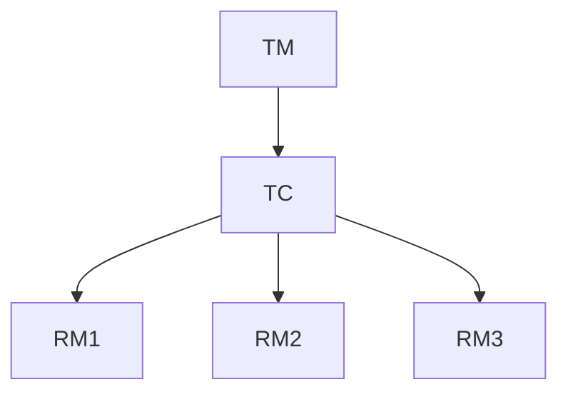

# 分布式事务高可用

在现代分布式系统中，事务管理是一个复杂且关键的问题。分布式事务的高可用性（High Availability, HA）是确保系统在面对故障时仍能保持数据一致性和服务可用性的重要特性。本文将介绍分布式事务的基本概念，并通过 Spring Cloud Alibaba 实现高可用分布式事务的解决方案。

## 什么是分布式事务？

分布式事务是指跨越多个分布式节点的事务操作。在分布式系统中，事务可能涉及多个服务或数据库，这些服务或数据库可能分布在不同的物理节点上。为了保证数据的一致性，分布式事务需要确保所有参与节点要么全部提交，要么全部回滚。

### 分布式事务的挑战

1. **网络分区**：分布式系统中的节点可能因为网络问题而无法通信。
2. **节点故障**：某个节点可能因为硬件或软件问题而宕机。
3. **数据一致性**：在分布式环境下，如何保证所有节点的数据一致性是一个难题。

## 分布式事务的高可用性

高可用性是指系统在面对故障时仍能继续提供服务的能力。对于分布式事务来说，高可用性意味着即使在部分节点或服务不可用的情况下，系统仍能保证事务的完整性和一致性。

### 实现高可用性的关键点

1. **冗余设计**：通过冗余部署事务管理器（如 Seata）来避免单点故障。
2. **故障转移**：当某个事务管理器节点出现故障时，系统能够自动切换到备用节点。
3. **数据同步**：确保事务日志和状态在多个节点之间同步，以便在故障发生时能够快速恢复。

## Spring Cloud Alibaba 与分布式事务

Spring Cloud Alibaba 提供了对分布式事务的支持，特别是通过集成 Seata 来实现分布式事务的高可用性。Seata 是一个开源的分布式事务解决方案，支持 AT（自动补偿）、TCC（Try-Confirm-Cancel）和 SAGA 模式。

### Seata 的高可用架构

Seata 的高可用架构通常包括以下几个组件：

1. **TC（Transaction Coordinator）**：事务协调器，负责全局事务的提交和回滚。
2. **TM（Transaction Manager）**：事务管理器，负责开启和提交全局事务。
3. **RM（Resource Manager）**：资源管理器，负责管理本地事务资源。



### 配置 Seata 的高可用性

为了实现 Seata 的高可用性，我们需要配置多个 TC 节点，并通过注册中心（如 Nacos）进行服务发现。以下是一个简单的配置示例：

```yaml
seata:
  enabled: true
  application-id: seata-server
  tx-service-group: my_tx_group
  service:
    vgroup-mapping:
      my_tx_group: default
    grouplist:
      default: 192.168.1.1:8091,192.168.1.2:8091
```

在这个配置中，`grouplist` 指定了多个 TC 节点的地址，Seata 客户端会根据这些地址进行负载均衡和故障转移。

## 实际案例：电商系统中的分布式事务

假设我们有一个电商系统，用户下单时需要同时扣减库存和创建订单。这两个操作分别由库存服务和订单服务处理，涉及到分布式事务。

### 代码示例

以下是一个使用 Seata 实现分布式事务的简单示例：

```java
@GlobalTransactional
public void placeOrder(String userId, String productId, int count) {
    // 扣减库存
    inventoryService.decrease(productId, count);
    
    // 创建订单
    orderService.create(userId, productId, count);
}
```

在这个示例中，`@GlobalTransactional` 注解标记了一个全局事务。如果库存扣减或订单创建中的任何一个操作失败，整个事务都会回滚，确保数据的一致性。

### 输入与输出

假设用户下单成功，输出如下：

```
库存扣减成功，剩余库存：95
订单创建成功，订单号：123456
```

如果库存不足，事务回滚，输出如下：

```
库存不足，事务回滚
```

## 总结

分布式事务的高可用性是确保分布式系统在面对故障时仍能保持数据一致性和服务可用性的关键。通过 Spring Cloud Alibaba 和 Seata，我们可以轻松实现分布式事务的高可用性，确保系统在复杂的分布式环境中稳定运行。

## 附加资源与练习

1. **官方文档**：阅读 [Seata 官方文档](https://seata.io/) 了解更多高级配置和使用场景。
2. **练习**：尝试在自己的项目中集成 Seata，并模拟节点故障，观察系统如何实现高可用性。
3. **深入阅读**：了解其他分布式事务解决方案，如 XA 协议、TCC 模式等。

:::tip
在实际生产环境中，建议结合监控和告警系统，实时监控分布式事务的状态，及时发现和处理潜在问题。
:::