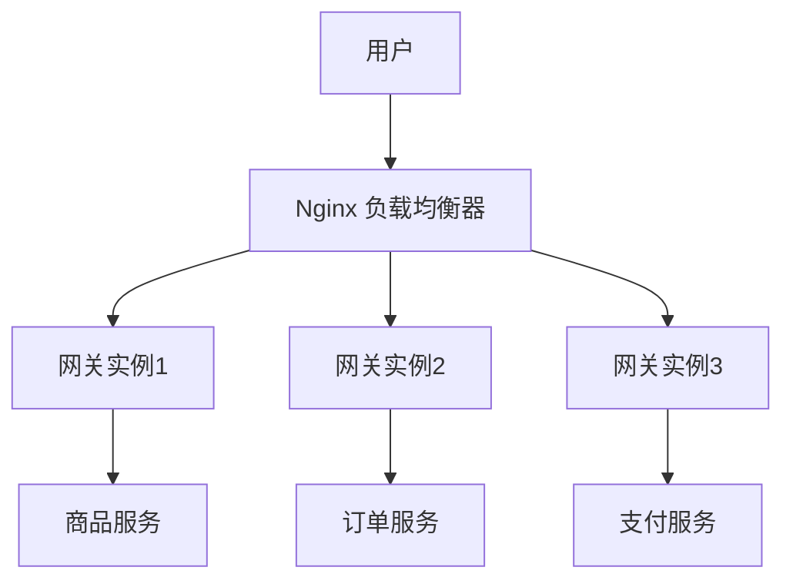

# 服务网关高可用

在现代微服务架构中，服务网关（API Gateway）扮演着至关重要的角色。它作为所有外部请求的入口，负责路由、负载均衡、安全控制、限流等功能。因此，服务网关的高可用性直接影响到整个系统的稳定性和可靠性。本文将详细介绍如何在 Spring Cloud Alibaba 中实现服务网关的高可用性。

## 什么是服务网关高可用？

服务网关高可用是指通过一系列技术手段，确保服务网关在面临硬件故障、网络问题或其他异常情况时，仍然能够正常运行，从而保证系统的持续可用性。高可用的服务网关通常具备以下特点：

- **冗余部署**：通过部署多个网关实例，避免单点故障。
- **负载均衡**：将请求均匀分配到多个网关实例，避免单个实例过载。
- **故障转移**：当某个网关实例出现故障时，能够自动将流量切换到其他健康的实例。
- **健康检查**：定期检查网关实例的健康状态，及时发现并处理异常。

## 实现服务网关高可用的步骤

### 1. 部署多个网关实例

首先，我们需要部署多个网关实例。可以通过 Kubernetes、Docker Swarm 等容器编排工具，或者直接在多个物理机或虚拟机上部署网关服务。

```yaml
# 示例：Kubernetes 部署多个网关实例
apiVersion: apps/v1
kind: Deployment
metadata:
  name: gateway
spec:
  replicas: 3
  selector:
    matchLabels:
      app: gateway
  template:
    metadata:
      labels:
        app: gateway
    spec:
      containers:
      - name: gateway
        image: my-gateway-image:1.0.0
        ports:
        - containerPort: 8080
```

### 2. 配置负载均衡

接下来，我们需要配置负载均衡器，将外部请求均匀分配到多个网关实例。可以使用 Nginx、HAProxy 等负载均衡工具，或者使用云服务商提供的负载均衡服务。

```nginx
# 示例：Nginx 负载均衡配置
http {
  upstream gateway {
    server gateway1.example.com;
    server gateway2.example.com;
    server gateway3.example.com;
  }

  server {
    listen 80;

    location / {
      proxy_pass http://gateway;
    }
  }
}
```

### 3. 实现故障转移

为了实现故障转移，我们需要配置健康检查机制。当某个网关实例出现故障时，负载均衡器能够自动将流量切换到其他健康的实例。

```yaml
# 示例：Kubernetes 健康检查配置
apiVersion: apps/v1
kind: Deployment
metadata:
  name: gateway
spec:
  replicas: 3
  selector:
    matchLabels:
      app: gateway
  template:
    metadata:
      labels:
        app: gateway
    spec:
      containers:
      - name: gateway
        image: my-gateway-image:1.0.0
        ports:
        - containerPort: 8080
        livenessProbe:
          httpGet:
            path: /health
            port: 8080
          initialDelaySeconds: 30
          periodSeconds: 10
```

### 4. 监控与告警

为了确保服务网关的高可用性，我们需要实时监控网关的运行状态，并在出现异常时及时发出告警。可以使用 Prometheus、Grafana 等监控工具，或者使用云服务商提供的监控服务。

```yaml
# 示例：Prometheus 监控配置
scrape_configs:
  - job_name: 'gateway'
    static_configs:
      - targets: ['gateway1.example.com:8080', 'gateway2.example.com:8080', 'gateway3.example.com:8080']
```

## 实际案例

假设我们有一个电商平台，用户通过服务网关访问商品、订单、支付等微服务。为了确保服务网关的高可用性，我们部署了三个网关实例，并使用 Nginx 作为负载均衡器。当某个网关实例出现故障时，Nginx 会自动将流量切换到其他健康的实例，从而保证用户的访问不受影响。



## 总结

服务网关的高可用性是确保微服务架构稳定运行的关键。通过部署多个网关实例、配置负载均衡、实现故障转移和监控告警，我们可以有效提高服务网关的可用性，从而保证系统的稳定性和可靠性。

## 附加资源

- [Spring Cloud Gateway 官方文档](https://spring.io/projects/spring-cloud-gateway)
- [Nginx 负载均衡配置指南](https://nginx.org/en/docs/http/load_balancing.html)
- [Kubernetes 健康检查配置指南](https://kubernetes.io/docs/tasks/configure-pod-container/configure-liveness-readiness-startup-probes/)

## 练习

1. 尝试在本地环境中部署多个 Spring Cloud Gateway 实例，并配置 Nginx 作为负载均衡器。
2. 使用 Kubernetes 部署网关服务，并配置健康检查和监控告警。
3. 模拟网关实例故障，观察负载均衡器是否能够自动切换流量。

:::tip
在实现服务网关高可用时，建议定期进行压力测试和故障演练，以确保系统在实际生产环境中的稳定性。
:::