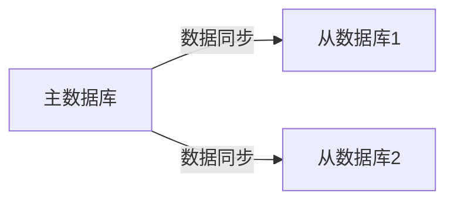

# 容灾与备份策略

在现代分布式系统中，**容灾与备份策略**是确保系统高可用性的关键。无论是硬件故障、网络中断，还是人为错误，都可能导致系统不可用或数据丢失。因此，设计合理的容灾与备份策略是每个开发者必须掌握的技能。

本文将逐步讲解容灾与备份策略的核心概念，并通过实际案例展示其在 Spring Cloud Alibaba 中的应用。

---

## 什么是容灾与备份？

**容灾**（Disaster Recovery）是指在系统发生故障时，能够快速恢复服务的能力。容灾的目标是尽量减少系统停机时间，确保业务连续性。

**备份**（Backup）是指定期将数据复制到其他存储介质中，以防止数据丢失。备份是容灾的基础，但容灾不仅仅是备份，还包括故障检测、切换和恢复等环节。

:::tip
容灾与备份策略的核心思想是：**预防为主，恢复为辅**。通过提前规划和设计，减少故障发生的概率，并在故障发生时快速恢复。
:::

---

## 容灾策略

### 1. 多区域部署

在分布式系统中，多区域部署是一种常见的容灾策略。通过将服务部署在多个地理区域，可以避免单点故障。

例如，使用 Spring Cloud Alibaba 的 `Nacos` 作为服务注册中心时，可以在多个区域部署 `Nacos` 集群，并通过 `Nacos` 的集群同步功能实现数据一致性。

```yaml
# application.yml
spring:
  cloud:
    nacos:
      discovery:
        server-addr: 192.168.1.1:8848,192.168.1.2:8848,192.168.1.3:8848
```

### 2. 服务降级与熔断

当某个服务不可用时，可以通过**服务降级**和**熔断**机制避免整个系统崩溃。Spring Cloud Alibaba 提供了 `Sentinel` 来实现这一功能。

```java
@SentinelResource(value = "fallbackMethod", fallback = "fallback")
public String fallbackMethod() {
    // 业务逻辑
}

public String fallback() {
    return "服务降级，返回默认值";
}
```

### 3. 数据同步与复制

在多区域部署中，数据同步是关键。可以使用 `RocketMQ` 或 `Canal` 等工具实现数据的实时同步。



---

## 备份策略

### 1. 定期全量备份

全量备份是指将整个数据库或文件系统复制到备份存储中。通常每周或每月执行一次。

```bash
# 使用 mysqldump 进行全量备份
mysqldump -u root -p database_name > backup.sql
```

### 2. 增量备份

增量备份只备份自上次备份以来发生变化的数据。这种方式可以节省存储空间和备份时间。

```bash
# 使用 rsync 进行增量备份
rsync -av --compare-dest=/path/to/last_backup /source /destination
```

### 3. 备份存储与恢复

备份数据应存储在不同的地理位置，以防止自然灾害导致的数据丢失。恢复时，应先恢复全量备份，再应用增量备份。

```bash
# 恢复全量备份
mysql -u root -p database_name < backup.sql

# 恢复增量备份
rsync -av /backup/incremental /destination
```

---

## 实际案例

### 案例：电商平台的容灾与备份

假设我们有一个电商平台，使用 Spring Cloud Alibaba 构建。以下是其容灾与备份策略：

1. **多区域部署**：在北京、上海和广州部署服务，使用 `Nacos` 实现服务注册与发现。
2. **服务降级**：当库存服务不可用时，使用 `Sentinel` 返回默认库存值。
3. **数据同步**：使用 `RocketMQ` 将订单数据实时同步到多个区域的数据库中。
4. **备份策略**：每天凌晨进行增量备份，每周日进行全量备份，备份数据存储在异地数据中心。

---

## 总结

容灾与备份策略是构建高可用系统的基石。通过多区域部署、服务降级、数据同步和定期备份，可以有效减少系统故障带来的影响。

:::caution
在实际应用中，容灾与备份策略需要根据业务需求进行调整。切勿盲目复制他人的方案。
:::

---

## 附加资源与练习

- **资源**：
  - [Spring Cloud Alibaba 官方文档](https://spring-cloud-alibaba-group.github.io/)
  - [Sentinel 使用指南](https://sentinelguard.io/)
  - [RocketMQ 官方文档](https://rocketmq.apache.org/)

- **练习**：
  1. 尝试在本地搭建一个多区域部署的 `Nacos` 集群。
  2. 使用 `Sentinel` 实现一个简单的服务降级功能。
  3. 设计一个备份策略，并编写脚本实现全量备份和增量备份。

通过以上学习和实践，你将能够掌握 Spring Cloud Alibaba 中的容灾与备份策略，为构建高可用系统打下坚实基础。