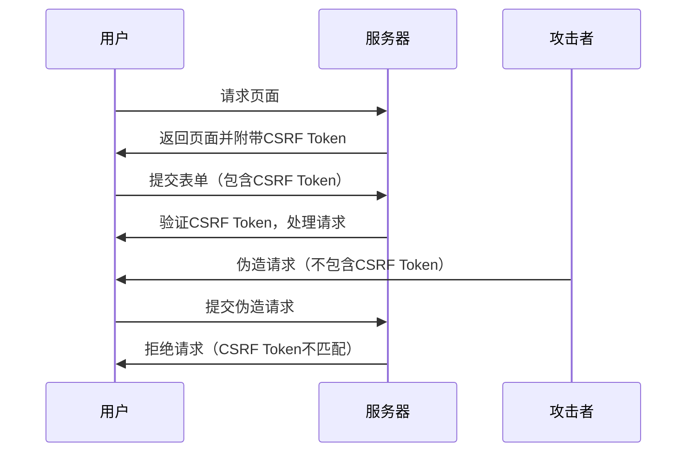

# CSRF防护

## 什么是CSRF攻击？

CSRF（Cross-Site Request Forgery，跨站请求伪造）是一种常见的Web安全漏洞。攻击者通过诱使用户在不知情的情况下，向目标网站发送恶意请求，从而执行未经授权的操作。例如，攻击者可以伪造一个请求，让用户在登录状态下修改账户信息或进行转账操作。

:::note
CSRF攻击的关键在于攻击者利用了用户已经通过身份验证的会话。因此，防护CSRF攻击的核心是确保请求是由用户主动发起的，而不是由攻击者伪造的。
:::

## CSRF防护的基本原理

为了防止CSRF攻击，常见的做法是使用**CSRF Token**。CSRF Token是一个随机生成的字符串，服务器会在用户访问页面时将其嵌入到表单或请求头中。当用户提交表单或发送请求时，服务器会验证该Token是否匹配，如果不匹配，则拒绝该请求。

### CSRF Token的工作流程



## 在Spring Cloud Alibaba中实现CSRF防护

Spring Security提供了内置的CSRF防护机制。在Spring Cloud Alibaba中，我们可以通过简单的配置来启用CSRF防护。

### 1. 启用CSRF防护

默认情况下，Spring Security已经启用了CSRF防护。如果你使用的是Spring Security的默认配置，CSRF防护会自动生效。

```java
import org.springframework.context.annotation.Configuration;
import org.springframework.security.config.annotation.web.builders.HttpSecurity;
import org.springframework.security.config.annotation.web.configuration.EnableWebSecurity;
import org.springframework.security.config.annotation.web.configuration.WebSecurityConfigurerAdapter;

@Configuration
@EnableWebSecurity
public class SecurityConfig extends WebSecurityConfigurerAdapter {

    @Override
    protected void configure(HttpSecurity http) throws Exception {
        http
            .csrf().enable() // 启用CSRF防护
            .and()
            .authorizeRequests()
            .anyRequest().authenticated();
    }
}
```

### 2. 在表单中添加CSRF Token

在HTML表单中，我们需要添加一个隐藏的CSRF Token字段。Spring Security会自动生成并验证这个Token。

```html
<form action="/update-profile" method="post">
    <input type="hidden" name="${_csrf.parameterName}" value="${_csrf.token}" />
    <input type="text" name="username" />
    <button type="submit">更新信息</button>
</form>
```

### 3. 在AJAX请求中添加CSRF Token

如果你使用的是AJAX请求，可以通过以下方式将CSRF Token添加到请求头中：

```javascript
var token = $("meta[name='_csrf']").attr("content");
var header = $("meta[name='_csrf_header']").attr("content");

$.ajax({
    url: "/update-profile",
    type: "POST",
    beforeSend: function(xhr) {
        xhr.setRequestHeader(header, token);
    },
    data: {
        username: "newUsername"
    },
    success: function(response) {
        console.log("更新成功");
    }
});
```

## 实际案例

假设我们有一个在线银行系统，用户可以通过表单修改自己的账户信息。如果没有CSRF防护，攻击者可以伪造一个请求，诱使用户在不知情的情况下修改账户信息。

通过启用CSRF防护，我们可以确保只有用户主动发起的请求才能修改账户信息，从而有效防止CSRF攻击。

## 总结

CSRF攻击是一种常见的Web安全威胁，但通过使用CSRF Token，我们可以有效地防止这种攻击。在Spring Cloud Alibaba中，Spring Security提供了内置的CSRF防护机制，只需简单的配置即可启用。

:::tip
在实际开发中，除了启用CSRF防护外，还应确保所有敏感操作（如修改账户信息、转账等）都通过POST请求进行，并且始终验证CSRF Token。
:::

## 附加资源

- [Spring Security官方文档](https://docs.spring.io/spring-security/reference/features/exploits/csrf.html)
- [OWASP CSRF防护指南](https://owasp.org/www-community/attacks/csrf)

## 练习

1. 在你的Spring Cloud Alibaba项目中启用CSRF防护，并测试其效果。
2. 尝试在AJAX请求中添加CSRF Token，并验证请求是否成功。
3. 阅读Spring Security官方文档，了解更多关于CSRF防护的高级配置选项。