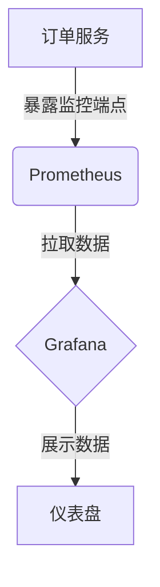

# 监控可视化

在现代分布式系统中，监控是确保系统稳定性和性能的关键。Spring Cloud Alibaba 提供了强大的监控工具，帮助开发者实时了解系统的运行状态。本文将详细介绍如何通过监控可视化工具，将复杂的监控数据转化为直观的图表和仪表盘，从而更好地管理和优化系统。

## 什么是监控可视化？

监控可视化是指将系统运行过程中产生的监控数据（如 CPU 使用率、内存占用、请求响应时间等）通过图表、仪表盘等形式展示出来。通过可视化，开发者可以更直观地理解系统的运行状态，快速发现潜在问题，并采取相应的措施。

## 为什么需要监控可视化？

1. **直观性**：图表和仪表盘比原始数据更易于理解。
2. **实时性**：可视化工具通常支持实时更新，帮助开发者及时发现问题。
3. **历史分析**：通过历史数据的可视化，可以分析系统的长期趋势和性能变化。
4. **告警机制**：可视化工具通常支持设置告警，当某些指标超出预设范围时，及时通知开发者。

## Spring Cloud Alibaba 中的监控可视化

Spring Cloud Alibaba 提供了多种监控工具，如 Prometheus 和 Grafana，帮助开发者实现监控数据的可视化。

### Prometheus

Prometheus 是一个开源的监控和告警系统，广泛用于监控微服务架构。它通过拉取方式收集数据，并提供了强大的查询语言（PromQL）来分析数据。

#### 配置 Prometheus

首先，需要在 `application.yml` 中配置 Prometheus：

```yaml
management:
  endpoints:
    web:
      exposure:
        include: "*"
  metrics:
    tags:
      application: ${spring.application.name}
```

#### 示例：监控 HTTP 请求

Spring Boot 应用默认会暴露一些监控端点，如 `/actuator/prometheus`。通过访问该端点，可以获取应用的监控数据。

```bash
curl http://localhost:8080/actuator/prometheus
```

输出示例：

```plaintext
# HELP http_server_requests_seconds  
# TYPE http_server_requests_seconds summary
http_server_requests_seconds_count{application="my-app",method="GET",status="200",uri="/api/resource"} 10
http_server_requests_seconds_sum{application="my-app",method="GET",status="200",uri="/api/resource"} 0.5
```

### Grafana

Grafana 是一个开源的可视化工具，支持多种数据源，包括 Prometheus。通过 Grafana，可以创建丰富的仪表盘，展示监控数据。

#### 配置 Grafana

1. 安装 Grafana 并启动服务。
2. 添加 Prometheus 作为数据源。
3. 创建仪表盘并添加图表。

#### 示例：创建 HTTP 请求监控仪表盘

在 Grafana 中，可以使用 PromQL 查询语言创建图表。例如，监控 HTTP 请求的响应时间：

```plaintext
rate(http_server_requests_seconds_sum[1m]) / rate(http_server_requests_seconds_count[1m])
```

通过 Grafana 的图表编辑器，可以将该查询结果展示为折线图或柱状图。

## 实际案例

假设我们有一个电商系统，需要监控订单服务的性能。通过 Spring Cloud Alibaba 和 Prometheus，我们可以收集订单服务的请求响应时间、错误率等指标，并通过 Grafana 创建仪表盘。

### 步骤

1. **配置 Prometheus**：在订单服务中配置 Prometheus，暴露监控端点。
2. **收集数据**：Prometheus 定期拉取订单服务的监控数据。
3. **创建仪表盘**：在 Grafana 中创建仪表盘，展示订单服务的请求响应时间、错误率等指标。

### 示例仪表盘



## 总结

监控可视化是 Spring Cloud Alibaba 中不可或缺的一部分，它帮助开发者更直观地理解系统的运行状态。通过 Prometheus 和 Grafana，我们可以轻松实现监控数据的收集和可视化，从而更好地管理和优化系统。

## 附加资源

- [Prometheus 官方文档](https://prometheus.io/docs/)
- [Grafana 官方文档](https://grafana.com/docs/)
- [Spring Cloud Alibaba 监控指南](https://spring-cloud-alibaba-group.github.io/github-pages/hoxton/en-us/index.html)

## 练习

1. 在你的 Spring Boot 应用中配置 Prometheus，并暴露监控端点。
2. 使用 Grafana 创建一个仪表盘，展示应用的 HTTP 请求响应时间。
3. 尝试设置告警规则，当请求响应时间超过 1 秒时，触发告警。

通过以上步骤，你将掌握 Spring Cloud Alibaba 中的监控可视化技术，并能够将其应用到实际项目中。