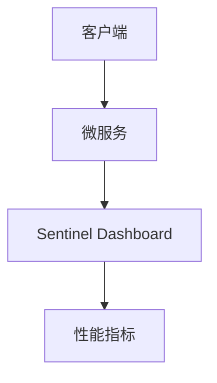

# 性能指标监控

在现代微服务架构中，性能指标监控是确保系统稳定性和高效性的关键。通过监控性能指标，我们可以实时了解系统的运行状态，及时发现并解决问题。本文将介绍如何使用 Spring Cloud Alibaba 进行性能指标监控，帮助初学者掌握这一重要技能。

## 什么是性能指标监控？

性能指标监控是指通过收集和分析系统的各种性能数据，如 CPU 使用率、内存使用率、请求响应时间等，来评估系统的运行状况。这些指标可以帮助我们识别潜在的性能瓶颈，优化系统资源的使用，从而提高系统的整体性能。

## Spring Cloud Alibaba 中的性能指标监控

Spring Cloud Alibaba 提供了一套完整的微服务解决方案，其中包括性能指标监控功能。通过集成 Spring Cloud Alibaba 的监控组件，我们可以轻松地收集和展示微服务的性能指标。

### 1. 集成 Spring Cloud Alibaba 监控

首先，我们需要在项目中引入 Spring Cloud Alibaba 的监控依赖。在 `pom.xml` 文件中添加以下依赖：

```xml
<dependency>
    <groupId>com.alibaba.cloud</groupId>
    <artifactId>spring-cloud-starter-alibaba-nacos-discovery</artifactId>
</dependency>
<dependency>
    <groupId>com.alibaba.cloud</groupId>
    <artifactId>spring-cloud-starter-alibaba-sentinel</artifactId>
</dependency>
```

### 2. 配置监控

接下来，我们需要在 `application.yml` 文件中配置监控相关的参数。以下是一个简单的配置示例：

```yaml
spring:
  application:
    name: my-service
  cloud:
    nacos:
      discovery:
        server-addr: localhost:8848
    sentinel:
      transport:
        dashboard: localhost:8080
```

### 3. 收集性能指标

Spring Cloud Alibaba 提供了多种方式来收集性能指标。我们可以通过注解或编程方式来定义需要监控的指标。以下是一个使用注解的示例：

```java
import com.alibaba.csp.sentinel.annotation.SentinelResource;
import org.springframework.web.bind.annotation.GetMapping;
import org.springframework.web.bind.annotation.RestController;

@RestController
public class MyController {

    @GetMapping("/hello")
    @SentinelResource(value = "hello", blockHandler = "handleBlock")
    public String hello() {
        return "Hello, World!";
    }

    public String handleBlock() {
        return "Blocked by Sentinel";
    }
}
```

在这个示例中，我们使用 `@SentinelResource` 注解来监控 `/hello` 接口的请求。当请求被限流或降级时，`handleBlock` 方法将被调用。

### 4. 展示性能指标

Spring Cloud Alibaba 提供了多种方式来展示性能指标。我们可以通过 Sentinel Dashboard 来实时查看系统的运行状态。以下是一个简单的展示示例：



在这个示例中，客户端发送请求到微服务，微服务将性能指标发送到 Sentinel Dashboard，最终在 Dashboard 上展示出来。

## 实际案例

假设我们有一个电商系统，其中包含多个微服务，如用户服务、商品服务和订单服务。为了确保系统的稳定性，我们需要监控每个服务的性能指标。通过集成 Spring Cloud Alibaba 的监控组件，我们可以实时查看每个服务的 CPU 使用率、内存使用率和请求响应时间，从而及时发现并解决问题。

## 总结

性能指标监控是微服务架构中不可或缺的一部分。通过 Spring Cloud Alibaba，我们可以轻松地收集和展示性能指标，确保系统的稳定性和高效性。希望本文能帮助初学者掌握这一重要技能。

## 附加资源

- [Spring Cloud Alibaba 官方文档](https://spring-cloud-alibaba-group.github.io/github-pages/hoxton/en-us/index.html)
- [Sentinel 官方文档](https://github.com/alibaba/Sentinel/wiki)
- [Nacos 官方文档](https://nacos.io/zh-cn/docs/what-is-nacos.html)

## 练习

1. 在你的项目中集成 Spring Cloud Alibaba 监控组件，并配置监控参数。
2. 使用 `@SentinelResource` 注解监控一个接口的请求。
3. 通过 Sentinel Dashboard 查看系统的性能指标，并分析系统的运行状态。
