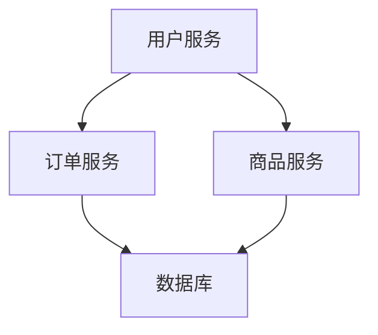

## 介绍

微服务架构是一种将应用程序拆分为多个小型、独立服务的架构风格。每个服务都可以独立开发、部署和扩展。然而，随着服务数量的增加，如何高效地部署这些服务成为了一个关键问题。本文将介绍微服务部署策略的基本概念、常见模式以及如何在 Spring Cloud Alibaba 中应用这些策略。

## 微服务部署策略概述

微服务部署策略是指在微服务架构中，如何将各个服务部署到生产环境中。常见的部署策略包括：

1. **单体部署**：将所有服务打包成一个整体进行部署。
2. **独立部署**：每个服务独立部署，可以单独扩展和更新。
3. **容器化部署**：使用容器技术（如 Docker）将每个服务打包成容器，便于管理和部署。
4. **云原生部署**：利用云平台（如 Kubernetes）进行自动化部署和管理。

## 单体部署 vs 独立部署

### 单体部署

单体部署是将所有微服务打包成一个整体进行部署。这种方式简单易行，但随着服务数量的增加，部署和扩展会变得复杂。

```bash
# 单体部署示例
java -jar my-monolithic-app.jar
```

### 独立部署

独立部署是指每个微服务独立部署，可以单独扩展和更新。这种方式灵活性强，但需要更多的管理和监控。

```bash
# 独立部署示例
java -jar service-a.jar
java -jar service-b.jar
```

## 容器化部署

容器化部署是使用容器技术（如 Docker）将每个服务打包成容器，便于管理和部署。容器化部署具有以下优点：

- **环境一致性**：确保开发、测试和生产环境一致。
- **资源隔离**：每个容器独立运行，互不干扰。
- **快速部署**：容器可以快速启动和停止。

```bash
# Dockerfile 示例
FROM openjdk:11
COPY target/service-a.jar /app/service-a.jar
ENTRYPOINT ["java", "-jar", "/app/service-a.jar"]
```

```bash
# 构建和运行容器
docker build -t service-a .
docker run -d -p 8080:8080 service-a
```

## 云原生部署

云原生部署是利用云平台（如 Kubernetes）进行自动化部署和管理。Kubernetes 提供了强大的编排能力，可以自动扩展、负载均衡和故障恢复。

```yaml
# Kubernetes Deployment 示例
apiVersion: apps/v1
kind: Deployment
metadata:
  name: service-a
spec:
  replicas: 3
  selector:
    matchLabels:
      app: service-a
  template:
    metadata:
      labels:
        app: service-a
    spec:
      containers:
      - name: service-a
        image: service-a:latest
        ports:
        - containerPort: 8080
```

```bash
# 部署到 Kubernetes
kubectl apply -f service-a-deployment.yaml
```

## 实际案例

假设我们有一个电商平台，包含用户服务、订单服务和商品服务。我们可以采用以下部署策略：

1. **用户服务**：使用独立部署，便于快速扩展用户管理功能。
2. **订单服务**：使用容器化部署，确保订单处理的高可用性。
3. **商品服务**：使用云原生部署，利用 Kubernetes 的自动扩展功能应对流量高峰。



## 总结

微服务部署策略是微服务架构中的重要组成部分。选择合适的部署策略可以提高系统的可维护性、可扩展性和可靠性。本文介绍了单体部署、独立部署、容器化部署和云原生部署的基本概念及其在 Spring Cloud Alibaba 中的应用。

## 附加资源

- [Spring Cloud Alibaba 官方文档](https://spring-cloud-alibaba-group.github.io/)
- [Docker 官方文档](https://docs.docker.com/)
- [Kubernetes 官方文档](https://kubernetes.io/docs/home/)

## 练习

1. 尝试将你的微服务项目打包成 Docker 容器并运行。
2. 使用 Kubernetes 部署一个简单的微服务应用。
3. 比较不同部署策略的优缺点，并选择适合你项目的策略。
