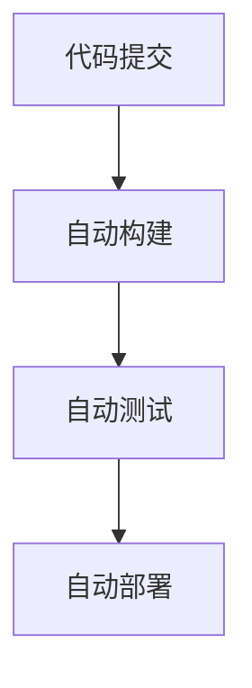

# CI/CD流水线集成

在现代软件开发中，持续集成（Continuous Integration, CI）和持续交付/持续部署（Continuous Delivery/Deployment, CD）是提高开发效率和软件质量的关键实践。通过将CI/CD流水线集成到Spring Cloud Alibaba项目中，您可以自动化构建、测试和部署流程，从而减少人为错误并加快交付速度。

## 什么是CI/CD流水线？

CI/CD流水线是一系列自动化步骤，用于将代码从开发环境推送到生产环境。CI/CD的核心目标是通过自动化流程，确保代码的快速、可靠和频繁交付。

- **持续集成（CI）**：开发人员将代码频繁地合并到共享仓库中，每次合并都会触发自动化构建和测试流程，以尽早发现和修复问题。
- **持续交付/持续部署（CD）**：在CI的基础上，CD进一步自动化了部署流程。持续交付确保代码可以随时部署到生产环境，而持续部署则自动将代码部署到生产环境。

## 为什么在Spring Cloud Alibaba中集成CI/CD？

Spring Cloud Alibaba是一套基于Spring Cloud的微服务解决方案，广泛应用于构建分布式系统。在微服务架构中，服务数量多、依赖复杂，手动构建和部署容易出错且效率低下。通过集成CI/CD流水线，您可以：

- 自动化构建和测试流程，减少人为错误。
- 快速响应需求变化，缩短交付周期。
- 提高系统的稳定性和可靠性。

## 如何集成CI/CD流水线？

### 1. 选择CI/CD工具

常见的CI/CD工具有Jenkins、GitLab CI、GitHub Actions、CircleCI等。本文以GitLab CI为例，展示如何在Spring Cloud Alibaba项目中集成CI/CD流水线。

### 2. 配置GitLab CI

在项目的根目录下创建一个名为`.gitlab-ci.yml`的文件，定义CI/CD流水线的各个阶段。

```yaml
stages:
  - build
  - test
  - deploy

build:
  stage: build
  script:
    - mvn clean package
  artifacts:
    paths:
      - target/*.jar

test:
  stage: test
  script:
    - mvn test

deploy:
  stage: deploy
  script:
    - echo "Deploying application..."
    - scp target/*.jar user@server:/path/to/deploy
  only:
    - main
```

### 3. 解释流水线配置

- **stages**：定义了流水线的三个阶段：`build`、`test`和`deploy`。
- **build**：在`build`阶段，使用Maven构建项目，并将生成的JAR文件保存为工件（artifacts）。
- **test**：在`test`阶段，运行项目的单元测试。
- **deploy**：在`deploy`阶段，将构建好的JAR文件部署到远程服务器。`only`关键字指定了只有在`main`分支上的提交才会触发部署。

### 4. 实际案例

假设您正在开发一个基于Spring Cloud Alibaba的电商平台，包含多个微服务（如订单服务、用户服务等）。通过集成CI/CD流水线，您可以实现以下自动化流程：

1. **代码提交**：开发人员将代码推送到GitLab仓库。
2. **自动构建**：GitLab CI自动触发构建流程，生成可执行的JAR文件。
3. **自动测试**：运行单元测试和集成测试，确保代码质量。
4. **自动部署**：将构建好的JAR文件部署到测试环境或生产环境。

### 5. 使用Mermaid绘制流水线流程图



## 总结

通过集成CI/CD流水线，您可以显著提高Spring Cloud Alibaba项目的开发效率和软件质量。本文以GitLab CI为例，展示了如何配置CI/CD流水线，并提供了一个实际案例。希望本文能帮助您更好地理解和应用CI/CD流水线。

## 附加资源

- [GitLab CI/CD官方文档](https://docs.gitlab.com/ee/ci/)
- [Spring Cloud Alibaba官方文档](https://spring-cloud-alibaba-group.github.io/github-pages/hoxton/en-us/index.html)
- [Maven官方文档](https://maven.apache.org/guides/)

## 练习

1. 在您的Spring Cloud Alibaba项目中创建一个`.gitlab-ci.yml`文件，并配置基本的CI/CD流水线。
2. 尝试将流水线扩展到多个微服务，确保每个服务都能独立构建、测试和部署。
3. 探索其他CI/CD工具（如Jenkins、GitHub Actions），并比较它们与GitLab CI的异同。
