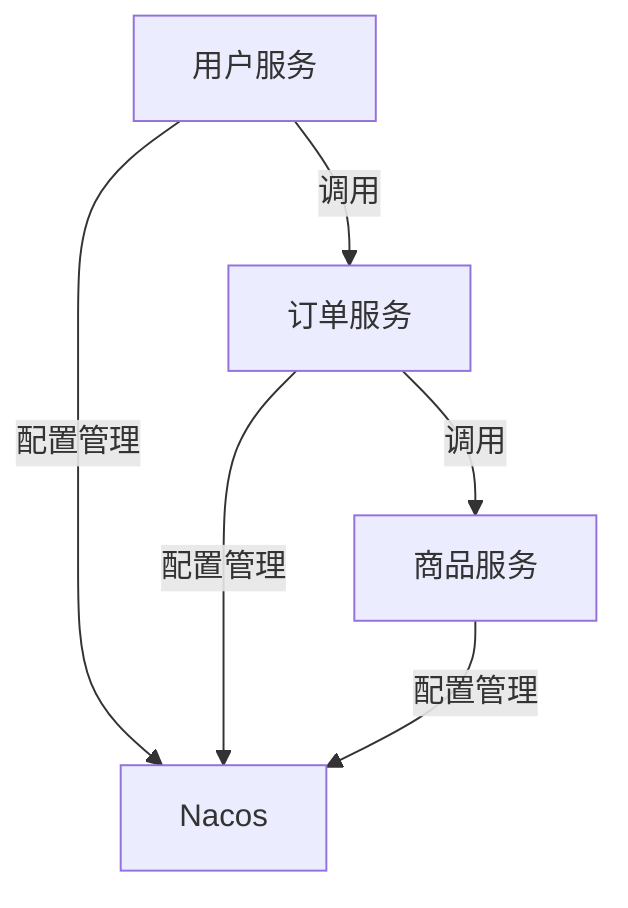

## 介绍

微服务架构是一种将应用程序拆分为多个小型、独立服务的开发方法。每个服务都可以独立开发、部署和扩展。Spring Cloud Alibaba 是一个基于 Spring Cloud 的微服务解决方案，提供了丰富的工具和组件来简化微服务的开发和部署。

在本指南中，我们将探讨如何在 Spring Cloud Alibaba 中实现微服务部署的最佳实践，涵盖容器化、配置管理、服务发现和负载均衡等关键概念。

## 容器化

容器化是微服务部署的核心。通过将每个微服务打包到独立的容器中，可以确保环境一致性，并简化部署流程。Docker 是最常用的容器化工具。

### 示例：Dockerfile

以下是一个简单的 Dockerfile 示例，用于将 Spring Boot 应用程序打包为 Docker 镜像：

```dockerfile
# 使用官方的 OpenJDK 镜像作为基础镜像
FROM openjdk:11-jre-slim

# 设置工作目录
WORKDIR /app

# 将构建的 JAR 文件复制到容器中
COPY target/my-application.jar my-application.jar

# 暴露应用程序的端口
EXPOSE 8080

# 启动应用程序
ENTRYPOINT ["java", "-jar", "my-application.jar"]
```

### 构建和运行 Docker 镜像

```bash
# 构建 Docker 镜像
docker build -t my-application .

# 运行 Docker 容器
docker run -p 8080:8080 my-application
```

## 配置管理

在微服务架构中，配置管理至关重要。Spring Cloud Alibaba 提供了 Nacos 作为配置中心，可以集中管理所有微服务的配置。

### 示例：Nacos 配置

1. 在 Nacos 控制台中创建一个新的配置项，例如 `application.properties`，内容如下：

```properties
server.port=8080
spring.application.name=my-application
```

2. 在 Spring Boot 应用程序中，添加以下依赖以集成 Nacos：

```xml
<dependency>
    <groupId>com.alibaba.cloud</groupId>
    <artifactId>spring-cloud-starter-alibaba-nacos-config</artifactId>
</dependency>
```

3. 在 `bootstrap.properties` 中配置 Nacos 服务器地址：

```properties
spring.cloud.nacos.config.server-addr=127.0.0.1:8848
```

## 服务发现

服务发现是微服务架构中的另一个关键组件。Spring Cloud Alibaba 使用 Nacos 作为服务注册中心，允许微服务动态发现和调用其他服务。

### 示例：服务注册与发现

1. 在 Spring Boot 应用程序中，添加以下依赖以集成 Nacos 服务发现：

```xml
<dependency>
    <groupId>com.alibaba.cloud</groupId>
    <artifactId>spring-cloud-starter-alibaba-nacos-discovery</artifactId>
</dependency>
```

2. 在 `application.properties` 中配置 Nacos 服务器地址：

```properties
spring.cloud.nacos.discovery.server-addr=127.0.0.1:8848
```

3. 使用 `@EnableDiscoveryClient` 注解启用服务发现：

```java
@SpringBootApplication
@EnableDiscoveryClient
public class MyApplication {
    public static void main(String[] args) {
        SpringApplication.run(MyApplication.class, args);
    }
}
```

## 负载均衡

负载均衡是确保微服务高可用性和性能的关键。Spring Cloud Alibaba 提供了 Ribbon 和 Feign 来实现客户端负载均衡。

### 示例：使用 Feign 进行负载均衡

1. 添加 Feign 依赖：

```xml
<dependency>
    <groupId>org.springframework.cloud</groupId>
    <artifactId>spring-cloud-starter-openfeign</artifactId>
</dependency>
```

2. 启用 Feign 客户端：

```java
@SpringBootApplication
@EnableFeignClients
public class MyApplication {
    public static void main(String[] args) {
        SpringApplication.run(MyApplication.class, args);
    }
}
```

3. 创建一个 Feign 客户端接口：

```java
@FeignClient(name = "my-service")
public interface MyServiceClient {
    @GetMapping("/endpoint")
    String getData();
}
```

## 实际案例

假设我们有一个电商平台，包含用户服务、订单服务和商品服务。每个服务都独立部署，并通过 Nacos 进行服务发现和配置管理。使用 Docker 容器化每个服务，并通过 Feign 实现服务间的负载均衡调用。



## 总结

在本指南中，我们探讨了在 Spring Cloud Alibaba 中实现微服务部署的最佳实践，包括容器化、配置管理、服务发现和负载均衡。通过遵循这些最佳实践，您可以构建高效、可靠的微服务架构。

## 附加资源

- [Spring Cloud Alibaba 官方文档](https://spring-cloud-alibaba-group.github.io/github-pages/hoxton/en-us/index.html)
- [Docker 官方文档](https://docs.docker.com/)
- [Nacos 官方文档](https://nacos.io/zh-cn/docs/what-is-nacos.html)

## 练习

1. 尝试将一个简单的 Spring Boot 应用程序容器化，并部署到 Docker 中。
2. 使用 Nacos 配置中心管理您的应用程序配置。
3. 创建一个包含多个微服务的项目，并使用 Feign 实现服务间的负载均衡调用。