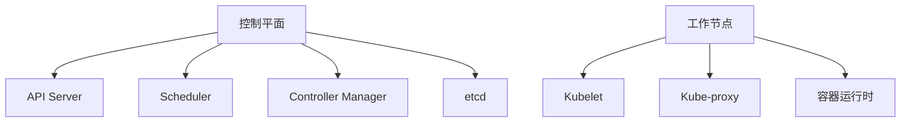

## 介绍

Kubernetes（简称 K8s）是一个开源的容器编排平台，用于自动化部署、扩展和管理容器化应用程序。它最初由 Google 开发，现由云原生计算基金会（CNCF）维护。Kubernetes 的核心目标是简化容器化应用的运维工作，提供高可用性、可扩展性和自愈能力。

对于初学者来说，理解 Kubernetes 的基础概念是掌握容器编排的第一步。本文将逐步介绍 Kubernetes 的核心组件和工作原理，并通过实际案例帮助你更好地理解这些概念。

---

## Kubernetes 核心概念

### 1. 集群（Cluster）

Kubernetes 集群是由一组节点（Node）组成的集合，这些节点可以是物理机或虚拟机。集群分为两部分：

- **控制平面（Control Plane）**：负责管理集群的状态和调度任务，包括 API Server、Scheduler、Controller Manager 和 etcd。
- **工作节点（Worker Node）**：运行容器化应用的节点，包括 Kubelet、Kube-proxy 和容器运行时（如 Docker 或 containerd）。



### 2. Pod

Pod 是 Kubernetes 中最小的部署单元，它可以包含一个或多个容器。这些容器共享网络和存储资源，通常用于运行紧密耦合的应用。

:::tip
一个 Pod 通常只运行一个主容器，但也可以包含辅助容器（如日志收集器或监控代理）。
:::

以下是一个简单的 Pod 定义示例：

```yaml
apiVersion: v1
kind: Pod
metadata:
  name: my-pod
spec:
  containers:
  - name: nginx-container
    image: nginx:latest
```

### 3. 服务（Service）

Service 是 Kubernetes 中用于暴露 Pod 的网络服务。它为 Pod 提供了一个稳定的 IP 地址和 DNS 名称，即使 Pod 的 IP 地址发生变化，Service 也能确保访问的稳定性。

以下是一个简单的 Service 定义示例：

```yaml
apiVersion: v1
kind: Service
metadata:
  name: my-service
spec:
  selector:
    app: my-app
  ports:
  - protocol: TCP
    port: 80
    targetPort: 8080
```

### 4. 部署（Deployment）

Deployment 是 Kubernetes 中用于管理 Pod 副本的控制器。它允许你定义 Pod 的副本数、更新策略和回滚机制，确保应用的高可用性和可扩展性。

以下是一个简单的 Deployment 定义示例：

```yaml
apiVersion: apps/v1
kind: Deployment
metadata:
  name: my-deployment
spec:
  replicas: 3
  selector:
    matchLabels:
      app: my-app
  template:
    metadata:
      labels:
        app: my-app
    spec:
      containers:
      - name: nginx-container
        image: nginx:latest
```

---

## 实际案例：部署一个简单的 Web 应用

假设我们需要在 Kubernetes 上部署一个简单的 Nginx Web 应用，以下是具体步骤：

1. **创建 Pod**：定义一个 Pod 来运行 Nginx 容器。
2. **创建 Service**：定义一个 Service 来暴露 Nginx 服务。
3. **创建 Deployment**：定义一个 Deployment 来管理 Pod 的副本。

### 1. 创建 Pod

```yaml
apiVersion: v1
kind: Pod
metadata:
  name: nginx-pod
spec:
  containers:
  - name: nginx-container
    image: nginx:latest
```

### 2. 创建 Service

```yaml
apiVersion: v1
kind: Service
metadata:
  name: nginx-service
spec:
  selector:
    app: nginx
  ports:
  - protocol: TCP
    port: 80
    targetPort: 80
```

### 3. 创建 Deployment

```yaml
apiVersion: apps/v1
kind: Deployment
metadata:
  name: nginx-deployment
spec:
  replicas: 3
  selector:
    matchLabels:
      app: nginx
  template:
    metadata:
      labels:
        app: nginx
    spec:
      containers:
      - name: nginx-container
        image: nginx:latest
```

---

## 总结

Kubernetes 是一个强大的容器编排平台，掌握其核心概念是部署和管理容器化应用的关键。本文介绍了 Kubernetes 的集群、Pod、Service 和 Deployment 等基础概念，并通过一个简单的 Web 应用部署案例展示了这些概念的实际应用。

:::note
Kubernetes 的学习曲线较陡峭，建议初学者从简单的应用场景入手，逐步深入。
:::

---

## 附加资源

- [Kubernetes 官方文档](https://kubernetes.io/docs/home/)
- [Kubernetes 入门指南](https://kubernetes.io/docs/tutorials/kubernetes-basics/)
- [Kubernetes 实战教程](https://www.katacoda.com/courses/kubernetes)

---

## 练习

1. 尝试在本地 Kubernetes 集群中部署一个简单的 Nginx 应用。
2. 修改 Deployment 的副本数，观察 Pod 的变化。
3. 创建一个新的 Service，将 Nginx 服务暴露到外部网络。

通过实践，你将更好地理解 Kubernetes 的工作原理和应用场景。祝你学习愉快！