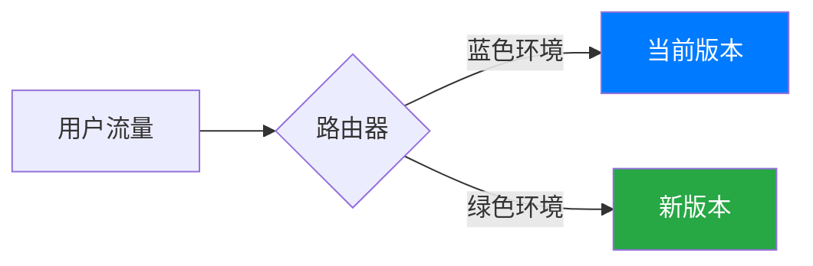

# 蓝绿部署

蓝绿部署（Blue-Green Deployment）是一种软件发布策略，旨在减少系统停机时间并降低部署风险。它通过维护两个独立的环境（蓝色和绿色）来实现无缝切换，确保新版本上线时用户不会受到影响。本文将详细介绍蓝绿部署的概念、实现方式及其在 Spring Cloud Alibaba 中的应用。

## 什么是蓝绿部署？

蓝绿部署的核心思想是同时维护两个生产环境：蓝色环境和绿色环境。其中一个环境（例如蓝色）用于运行当前的生产版本，而另一个环境（绿色）用于部署新版本。当新版本经过测试并准备上线时，流量会从蓝色环境切换到绿色环境。如果新版本出现问题，可以快速切换回蓝色环境，从而减少对用户的影响。

:::tip
蓝绿部署的关键优势在于零停机时间和快速回滚能力。
:::

## 蓝绿部署的工作原理

1. **准备两个环境**：蓝色环境和绿色环境。蓝色环境运行当前的生产版本，绿色环境用于部署新版本。
2. **部署新版本**：在绿色环境中部署新版本，并进行测试。
3. **切换流量**：当新版本通过测试后，将流量从蓝色环境切换到绿色环境。
4. **回滚（可选）**：如果新版本出现问题，可以快速将流量切换回蓝色环境。



## 在 Spring Cloud Alibaba 中实现蓝绿部署

Spring Cloud Alibaba 提供了丰富的工具和组件来支持蓝绿部署。以下是一个简单的实现示例：

### 1. 配置两个环境

假设我们有两个服务实例：`service-blue` 和 `service-green`，分别运行蓝色环境和绿色环境。

```yaml
# application-blue.yml
server:
  port: 8081
spring:
  application:
    name: service-blue

# application-green.yml
server:
  port: 8082
spring:
  application:
    name: service-green
```

### 2. 使用 Spring Cloud Gateway 进行流量切换

Spring Cloud Gateway 可以帮助我们动态切换流量。以下是一个简单的路由配置示例：

```yaml
spring:
  cloud:
    gateway:
      routes:
        - id: blue-route
          uri: http://localhost:8081
          predicates:
            - Path=/blue/**
        - id: green-route
          uri: http://localhost:8082
          predicates:
            - Path=/green/**
```

### 3. 动态切换流量

通过修改路由配置，我们可以动态切换流量。例如，将流量从蓝色环境切换到绿色环境：

```java
@RestController
public class TrafficSwitchController {

    @Autowired
    private GatewayDefinitionRepository gatewayDefinitionRepository;

    @PostMapping("/switch-to-green")
    public String switchToGreen() {
        RouteDefinition routeDefinition = new RouteDefinition();
        routeDefinition.setId("blue-route");
        routeDefinition.setUri(URI.create("http://localhost:8082"));
        routeDefinition.setPredicates(Collections.singletonList(new PredicateDefinition("Path=/blue/**")));
        gatewayDefinitionRepository.save(routeDefinition);
        return "Switched to Green Environment";
    }
}
```

### 4. 测试与验证

在切换流量后，可以通过访问 `/blue` 路径来验证流量是否已成功切换到绿色环境。

## 实际应用场景

蓝绿部署在以下场景中非常有用：

1. **零停机发布**：在需要频繁发布新功能的系统中，蓝绿部署可以确保用户不会感受到任何停机时间。
2. **快速回滚**：如果新版本出现问题，可以快速切换回旧版本，减少对用户的影响。
3. **A/B 测试**：可以通过蓝绿部署同时运行两个版本，进行 A/B 测试以评估新功能的效果。

## 总结

蓝绿部署是一种强大的发布策略，能够显著降低部署风险并提高系统的可用性。通过 Spring Cloud Alibaba 提供的工具，我们可以轻松实现蓝绿部署，并在实际应用中发挥其优势。

:::note
**附加资源**：
- [Spring Cloud Gateway 官方文档](https://spring.io/projects/spring-cloud-gateway)
- [蓝绿部署最佳实践](https://martinfowler.com/bliki/BlueGreenDeployment.html)
:::

:::tip
**练习**：
1. 尝试在本地环境中配置两个 Spring Boot 服务，并使用 Spring Cloud Gateway 实现蓝绿部署。
2. 模拟流量切换，并观察服务的行为。
:::