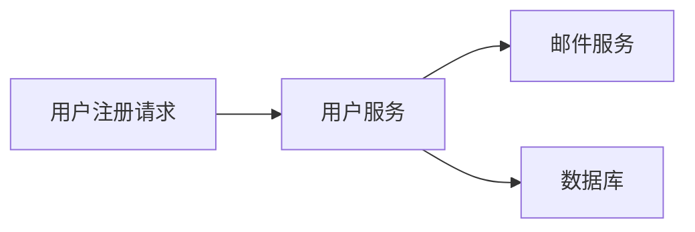

# 微服务测试策略

在微服务架构中，测试是确保系统稳定性和功能正确性的关键环节。由于微服务架构的分布式特性，传统的单体应用测试方法不再适用。本文将介绍微服务测试的核心策略，并通过实际案例展示如何在 Spring Cloud Alibaba 中实现这些测试策略。

## 什么是微服务测试策略？

微服务测试策略是指在微服务架构中，针对不同层次和范围的测试方法。由于微服务之间相互独立但又紧密协作，测试需要覆盖从单个服务到整个系统的各个层面。常见的微服务测试策略包括：

1. **单元测试**：测试单个服务的最小功能单元。
2. **集成测试**：测试服务之间的交互。
3. **端到端测试**：验证整个系统的功能是否符合预期。
4. **契约测试**：确保服务之间的接口一致性。
5. **性能测试**：评估系统在高负载下的表现。

接下来，我们将逐步讲解这些测试策略，并通过代码示例展示如何在 Spring Cloud Alibaba 中实现它们。

---

## 1. 单元测试

单元测试是微服务测试的基础，它专注于测试单个服务的最小功能单元。在 Spring Cloud Alibaba 中，通常使用 JUnit 和 Mockito 进行单元测试。

### 示例：测试一个简单的服务方法

假设我们有一个 `UserService`，其中包含一个方法 `getUserById`：

```java
@Service
public class UserService {
    @Autowired
    private UserRepository userRepository;

    public User getUserById(Long id) {
        return userRepository.findById(id).orElseThrow(() -> new RuntimeException("User not found"));
    }
}
```

我们可以编写以下单元测试：

```java
@ExtendWith(MockitoExtension.class)
public class UserServiceTest {

    @Mock
    private UserRepository userRepository;

    @InjectMocks
    private UserService userService;

    @Test
    void testGetUserById() {
        User mockUser = new User(1L, "John Doe");
        when(userRepository.findById(1L)).thenReturn(Optional.of(mockUser));

        User result = userService.getUserById(1L);
        assertEquals("John Doe", result.getName());
    }
}
```

:::tip
在单元测试中，我们使用 `@Mock` 注解模拟依赖项（如 `UserRepository`），并使用 `@InjectMocks` 将模拟对象注入到被测类中。
:::

---

## 2. 集成测试

集成测试用于验证服务之间的交互是否正确。在 Spring Cloud Alibaba 中，可以使用 `@SpringBootTest` 注解启动完整的 Spring 上下文进行测试。

### 示例：测试服务与数据库的交互

假设我们有一个 `UserController`，它依赖于 `UserService`：

```java
@RestController
@RequestMapping("/users")
public class UserController {

    @Autowired
    private UserService userService;

    @GetMapping("/{id}")
    public User getUserById(@PathVariable Long id) {
        return userService.getUserById(id);
    }
}
```

我们可以编写以下集成测试：

```java
@SpringBootTest
@AutoConfigureMockMvc
public class UserControllerIntegrationTest {

    @Autowired
    private MockMvc mockMvc;

    @MockBean
    private UserService userService;

    @Test
    void testGetUserById() throws Exception {
        User mockUser = new User(1L, "John Doe");
        when(userService.getUserById(1L)).thenReturn(mockUser);

        mockMvc.perform(get("/users/1"))
               .andExpect(status().isOk())
               .andExpect(jsonPath("$.name").value("John Doe"));
    }
}
```

:::note
在集成测试中，我们使用 `@MockBean` 模拟服务层，并通过 `MockMvc` 模拟 HTTP 请求。
:::

---

## 3. 端到端测试

端到端测试用于验证整个系统的功能是否符合预期。在 Spring Cloud Alibaba 中，可以使用工具如 Testcontainers 来启动依赖的外部服务（如数据库、消息队列等）。

### 示例：测试用户注册流程

假设我们有一个用户注册流程，涉及多个服务：



我们可以编写以下端到端测试：

```java
@SpringBootTest
@Testcontainers
public class UserRegistrationEndToEndTest {

    @Container
    private static final PostgreSQLContainer<?> postgres = new PostgreSQLContainer<>("postgres:13");

    @DynamicPropertySource
    static void configureProperties(DynamicPropertyRegistry registry) {
        registry.add("spring.datasource.url", postgres::getJdbcUrl);
        registry.add("spring.datasource.username", postgres::getUsername);
        registry.add("spring.datasource.password", postgres::getPassword);
    }

    @Autowired
    private MockMvc mockMvc;

    @Test
    void testUserRegistration() throws Exception {
        mockMvc.perform(post("/users/register")
               .contentType(MediaType.APPLICATION_JSON)
               .content("{\"name\": \"John Doe\", \"email\": \"john@example.com\"}"))
               .andExpect(status().isCreated());
    }
}
```

:::caution
端到端测试通常耗时较长，建议仅在关键流程中使用。
:::

---

## 4. 契约测试

契约测试用于确保服务之间的接口一致性。在 Spring Cloud Alibaba 中，可以使用 Pact 或 Spring Cloud Contract 进行契约测试。

### 示例：使用 Spring Cloud Contract

假设我们有一个 `OrderService`，它提供了一个创建订单的接口：

```java
@RestController
@RequestMapping("/orders")
public class OrderController {

    @PostMapping
    public Order createOrder(@RequestBody OrderRequest request) {
        // 创建订单逻辑
    }
}
```

我们可以定义一个契约文件 `createOrder.groovy`：

```groovy
Contract.make {
    request {
        method 'POST'
        url '/orders'
        body([
            productId: 1,
            quantity: 2
        ])
    }
    response {
        status 201
        body([
            orderId: 1,
            status: "CREATED"
        ])
    }
}
```

然后通过 Spring Cloud Contract 生成测试用例并验证接口是否符合契约。

---

## 5. 性能测试

性能测试用于评估系统在高负载下的表现。在 Spring Cloud Alibaba 中，可以使用 JMeter 或 Gatling 进行性能测试。

### 示例：使用 Gatling 测试用户登录接口

```scala
class UserLoginSimulation extends Simulation {

  val httpProtocol = http
    .baseUrl("http://localhost:8080")
    .acceptHeader("application/json")

  val scn = scenario("User Login")
    .exec(http("Login Request")
      .post("/users/login")
      .body(StringBody("""{"username": "john", "password": "password"}"""))
      .check(status.is(200)))

  setUp(
    scn.inject(atOnceUsers(100))
  ).protocols(httpProtocol)
}
```

---

## 总结

微服务测试策略是确保分布式系统稳定性和功能正确性的关键。通过单元测试、集成测试、端到端测试、契约测试和性能测试，我们可以全面覆盖微服务架构中的各个测试层面。在 Spring Cloud Alibaba 中，结合适当的工具和框架，可以高效地实现这些测试策略。

---

## 附加资源

- [Spring Boot Testing Guide](https://docs.spring.io/spring-boot/docs/current/reference/html/features.html#features.testing)
- [Testcontainers Documentation](https://www.testcontainers.org/)
- [Spring Cloud Contract Documentation](https://spring.io/projects/spring-cloud-contract)

---

## 练习

1. 为你的微服务项目编写单元测试和集成测试。
2. 使用 Testcontainers 实现一个端到端测试。
3. 尝试使用 Spring Cloud Contract 定义并验证一个服务契约。

Happy Testing! 🚀