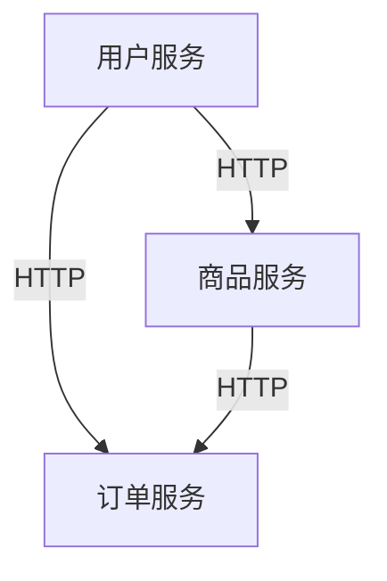

## 介绍

微服务架构是一种将应用程序拆分为多个小型、独立服务的架构风格。每个服务都运行在自己的进程中，并通过轻量级的通信机制（如 HTTP 或消息队列）进行交互。微服务架构的核心优势在于其灵活性和可扩展性，但这也带来了项目结构设计的复杂性。

在微服务项目中，合理的结构设计是确保代码可维护性、可扩展性和团队协作效率的关键。本文将逐步讲解微服务项目结构设计的基本原则，并通过实际案例展示如何应用这些原则。

## 微服务项目结构的基本原则

### 1. 单一职责原则

每个微服务应该只负责一个特定的业务功能。这种设计有助于减少服务之间的耦合，使得每个服务可以独立开发、部署和扩展。

### 2. 分层架构

微服务项目通常采用分层架构，常见的分层包括：

- **表现层（Presentation Layer）**：负责处理用户请求和响应。
- **业务逻辑层（Business Logic Layer）**：包含核心业务逻辑。
- **数据访问层（Data Access Layer）**：负责与数据库或其他数据存储交互。

### 3. 模块化设计

将项目拆分为多个模块，每个模块负责一个特定的功能或领域。模块化设计有助于提高代码的可读性和可维护性。

### 4. 依赖管理

合理管理服务之间的依赖关系，避免循环依赖。可以使用依赖注入（Dependency Injection）等技术来管理依赖。

## 微服务项目结构示例

以下是一个典型的微服务项目结构示例：

```
my-microservice/
├── src/
│   ├── main/
│   │   ├── java/
│   │   │   ├── com/
│   │   │   │   ├── example/
│   │   │   │   │   ├── controller/
│   │   │   │   │   ├── service/
│   │   │   │   │   ├── repository/
│   │   │   │   │   ├── model/
│   │   │   │   │   └── config/
│   │   │   └── resources/
│   │   │       ├── application.yml
│   │   │       └── logback-spring.xml
│   │   └── webapp/
│   └── test/
│       └── java/
│           └── com/
│               └── example/
│                   ├── controller/
│                   ├── service/
│                   └── repository/
├── pom.xml
└── README.md
```

### 代码示例

以下是一个简单的 Spring Boot 控制器示例：

```java
package com.example.controller;

import com.example.service.UserService;
import org.springframework.beans.factory.annotation.Autowired;
import org.springframework.web.bind.annotation.GetMapping;
import org.springframework.web.bind.annotation.RequestMapping;
import org.springframework.web.bind.annotation.RestController;

@RestController
@RequestMapping("/users")
public class UserController {

    @Autowired
    private UserService userService;

    @GetMapping
    public List<User> getAllUsers() {
        return userService.getAllUsers();
    }
}
```

:::note
**注意**：在实际项目中，控制器应该只负责处理 HTTP 请求和响应，业务逻辑应该放在服务层。
:::

## 实际案例

假设我们正在开发一个电商平台，该平台包含以下微服务：

1. **用户服务（User Service）**：负责用户注册、登录和用户信息管理。
2. **商品服务（Product Service）**：负责商品信息管理和库存管理。
3. **订单服务（Order Service）**：负责订单创建、支付和物流跟踪。

每个服务都遵循上述项目结构设计原则，并且通过 REST API 进行通信。



:::tip
**提示**：在实际项目中，可以使用 Spring Cloud Alibaba 提供的服务注册与发现、配置中心等功能来简化微服务之间的通信和管理。
:::

## 总结

微服务项目结构设计是微服务架构成功的关键。通过遵循单一职责原则、分层架构、模块化设计和合理管理依赖，可以构建出清晰、可维护的微服务项目。本文通过实际案例展示了如何应用这些原则，并提供了代码示例和图表帮助理解。

## 附加资源

- [Spring Cloud Alibaba 官方文档](https://spring-cloud-alibaba-group.github.io/github-pages/)
- [微服务架构设计模式](https://microservices.io/patterns/)
- [Spring Boot 官方文档](https://spring.io/projects/spring-boot)

## 练习

1. 尝试将本文中的电商平台案例扩展为一个完整的微服务项目，包含用户服务、商品服务和订单服务。
2. 使用 Spring Cloud Alibaba 提供的服务注册与发现功能，实现服务之间的通信。
3. 思考如何在微服务项目中实现分布式事务管理，并尝试实现一个简单的分布式事务场景。