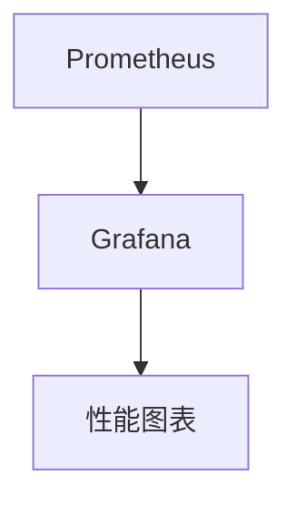

## 介绍

在微服务架构中，性能优化是一个至关重要的环节。Spring Cloud Alibaba 作为一套成熟的微服务解决方案，提供了丰富的工具和组件来支持高性能的分布式系统。然而，仅仅依赖工具是不够的，我们还需要一套系统化的方法论来指导性能优化工作。

本文将介绍性能优化的核心方法论，帮助初学者理解如何通过系统化的方法提升 Spring Cloud Alibaba 微服务架构的性能。

## 性能优化的核心方法论

性能优化通常包括以下几个步骤：

1. **性能评估**：首先，我们需要对系统的当前性能进行评估，找出瓶颈所在。
2. **目标设定**：根据评估结果，设定明确的性能优化目标。
3. **优化策略**：制定具体的优化策略，包括代码优化、配置调整、架构改进等。
4. **实施与测试**：实施优化策略，并通过测试验证优化效果。
5. **监控与调优**：持续监控系统性能，并根据实际情况进行调优。

### 1. 性能评估

性能评估是性能优化的第一步。我们需要通过工具和方法来收集系统的性能数据，找出瓶颈所在。

#### 常用工具

- **Prometheus**：用于监控和收集系统性能数据。
- **Grafana**：用于可视化性能数据。
- **JProfiler**：用于分析 Java 应用的性能瓶颈。

#### 示例：使用 Prometheus 监控 Spring Cloud Alibaba 应用

```yaml
# prometheus.yml
scrape_configs:
  - job_name: 'spring-cloud-alibaba'
    metrics_path: '/actuator/prometheus'
    static_configs:
      - targets: ['localhost:8080']
```

通过上述配置，Prometheus 会定期从 Spring Cloud Alibaba 应用的 `/actuator/prometheus` 端点收集性能数据。

### 2. 目标设定

在性能评估之后，我们需要设定明确的性能优化目标。目标应该是具体的、可衡量的、可实现的、相关的和有时间限制的（SMART）。

#### 示例目标

- 将 API 响应时间从 500ms 降低到 200ms。
- 将系统吞吐量从 1000 请求/秒提升到 2000 请求/秒。

### 3. 优化策略

根据性能评估结果和目标设定，我们可以制定具体的优化策略。常见的优化策略包括：

- **代码优化**：优化算法、减少不必要的计算、使用缓存等。
- **配置调整**：调整线程池大小、数据库连接池大小等。
- **架构改进**：引入缓存、消息队列、负载均衡等。

#### 示例：使用缓存优化 API 响应时间

```java
@Service
public class UserService {

    @Autowired
    private UserRepository userRepository;

    @Cacheable(value = "users", key = "#userId")
    public User getUserById(Long userId) {
        return userRepository.findById(userId).orElse(null);
    }
}
```

通过使用 `@Cacheable` 注解，我们可以将用户数据缓存起来，从而减少数据库查询次数，提升 API 响应速度。

### 4. 实施与测试

在制定优化策略后，我们需要实施这些策略，并通过测试验证优化效果。

#### 示例：使用 JMeter 进行性能测试

```bash
jmeter -n -t test_plan.jmx -l result.jtl
```

通过 JMeter，我们可以模拟大量并发请求，测试系统的性能表现。

### 5. 监控与调优

性能优化是一个持续的过程。我们需要持续监控系统性能，并根据实际情况进行调优。

#### 示例：使用 Grafana 监控系统性能



通过 Grafana，我们可以实时查看系统的性能图表，及时发现并解决问题。

## 实际案例

### 案例：电商平台的性能优化

某电商平台在使用 Spring Cloud Alibaba 构建微服务架构后，发现其商品详情页的 API 响应时间较长。通过性能评估，发现瓶颈在于数据库查询。

#### 优化策略

1. **引入缓存**：将商品详情数据缓存到 Redis 中。
2. **优化数据库查询**：使用索引优化查询语句。
3. **调整线程池大小**：增加处理请求的线程数。

#### 优化效果

- API 响应时间从 500ms 降低到 200ms。
- 系统吞吐量从 1000 请求/秒提升到 2000 请求/秒。

## 总结

性能优化是一个系统化的过程，需要从性能评估、目标设定、优化策略、实施与测试、监控与调优等多个方面入手。通过本文的介绍，希望初学者能够掌握 Spring Cloud Alibaba 性能优化的核心方法论，并在实际项目中应用这些方法。

## 附加资源

- [Spring Cloud Alibaba 官方文档](https://spring.io/projects/spring-cloud-alibaba)
- [Prometheus 官方文档](https://prometheus.io/docs/)
- [Grafana 官方文档](https://grafana.com/docs/)

## 练习

1. 使用 Prometheus 和 Grafana 监控你的 Spring Cloud Alibaba 应用，找出性能瓶颈。
2. 尝试使用缓存优化一个 API 的响应时间，并测试优化效果。
3. 使用 JMeter 进行性能测试，记录测试结果并分析优化前后的性能差异。
