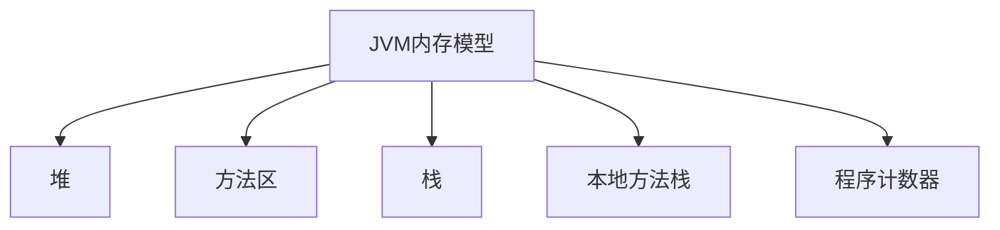

## 介绍

Java虚拟机（JVM）是Java应用程序运行的核心环境。JVM调优是通过调整JVM参数和配置，优化应用程序的性能、稳定性和资源利用率的过程。对于Spring Cloud Alibaba这样的分布式微服务框架，JVM调优尤为重要，因为它直接影响系统的响应速度、吞吐量和资源消耗。

本文将介绍JVM调优的基础知识，包括JVM内存模型、垃圾回收机制、常用调优工具和实际案例，帮助你更好地理解和应用这些概念。

## JVM内存模型

JVM内存主要分为以下几个区域：

1. **堆（Heap）**：存储对象实例和数组，是垃圾回收的主要区域。
2. **方法区（Method Area）**：存储类信息、常量、静态变量等。
3. **栈（Stack）**：存储局部变量、方法调用和部分对象引用。
4. **本地方法栈（Native Method Stack）**：用于执行本地方法。
5. **程序计数器（Program Counter Register）**：记录当前线程执行的字节码指令地址。



:::note
堆是JVM中最大的一块内存区域，也是垃圾回收的主要目标。调优时，通常需要关注堆的大小和垃圾回收策略。
:::

## 垃圾回收机制

JVM的垃圾回收（GC）机制负责自动管理内存，回收不再使用的对象。常见的垃圾回收器包括：

- **Serial GC**：单线程垃圾回收器，适用于小型应用。
- **Parallel GC**：多线程垃圾回收器，适用于多核处理器。
- **CMS GC**：并发标记清除垃圾回收器，减少停顿时间。
- **G1 GC**：面向服务端应用的垃圾回收器，具有可预测的停顿时间。

:::tip
选择合适的垃圾回收器可以显著提高应用程序的性能。例如，对于高并发的Spring Cloud Alibaba应用，G1 GC通常是一个不错的选择。
:::

## 常用JVM调优参数

以下是一些常用的JVM调优参数：

- `-Xms`：设置初始堆大小。
- `-Xmx`：设置最大堆大小。
- `-XX:NewRatio`：设置新生代与老年代的比例。
- `-XX:SurvivorRatio`：设置Eden区与Survivor区的比例。
- `-XX:+UseG1GC`：启用G1垃圾回收器。

```bash
java -Xms512m -Xmx1024m -XX:+UseG1GC -jar myapp.jar
```

:::caution
设置堆大小时，`-Xms`和`-Xmx`的值应相同，以避免堆大小动态调整带来的性能开销。
:::

## 实际案例

假设我们有一个Spring Cloud Alibaba应用，运行在高并发环境下，经常出现Full GC（全局垃圾回收）导致的应用停顿。我们可以通过以下步骤进行调优：

1. **分析GC日志**：使用`-XX:+PrintGCDetails`参数生成GC日志，分析Full GC的频率和原因。
2. **调整堆大小**：根据应用的内存需求，适当增加堆大小。
3. **选择垃圾回收器**：启用G1垃圾回收器，减少停顿时间。
4. **优化代码**：减少不必要的对象创建，避免内存泄漏。

```bash
java -Xms1024m -Xmx1024m -XX:+UseG1GC -XX:+PrintGCDetails -jar myapp.jar
```

:::warning
调优过程中，应逐步调整参数，并监控应用性能，避免过度调优导致资源浪费。
:::

## 总结

JVM调优是优化Spring Cloud Alibaba应用性能的重要手段。通过理解JVM内存模型、垃圾回收机制和常用调优参数，你可以有效地提升应用的响应速度和稳定性。实际调优过程中，建议结合监控工具和性能测试，逐步优化JVM配置。

## 附加资源

- [Oracle官方JVM调优指南](https://docs.oracle.com/javase/8/docs/technotes/guides/vm/gctuning/)
- [G1垃圾回收器详解](https://www.oracle.com/technical-resources/articles/java/g1gc.html)
- [Spring Cloud Alibaba性能优化实践](https://spring.io/projects/spring-cloud-alibaba)

## 练习

1. 尝试在你的Spring Cloud Alibaba应用中启用G1垃圾回收器，并观察性能变化。
2. 使用`-XX:+PrintGCDetails`参数生成GC日志，分析Full GC的原因，并尝试优化。