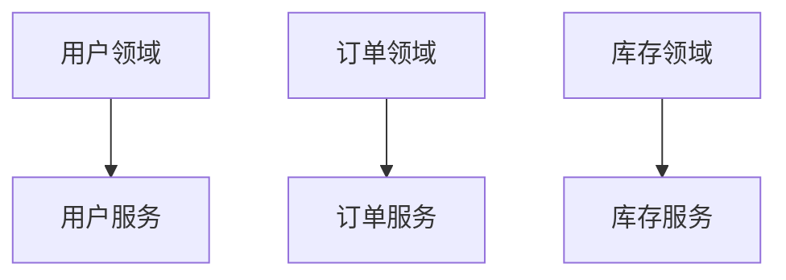
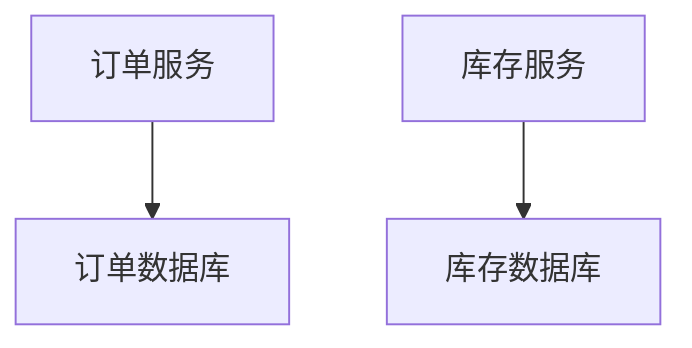

# 服务拆分原则

在微服务架构中，服务拆分是一个至关重要的步骤。它决定了系统的可维护性、可扩展性和性能。本文将详细介绍服务拆分的基本原则，并通过实际案例帮助你理解如何在实际项目中应用这些原则。

## 什么是服务拆分？

服务拆分是指将一个单体应用（Monolithic Application）拆分为多个独立的微服务（Microservices）。每个微服务负责一个特定的业务功能，并通过轻量级的通信机制（如HTTP或消息队列）与其他服务交互。

:::note
服务拆分的目标是实现高内聚、低耦合的系统架构，从而提高系统的灵活性和可维护性。
:::

## 服务拆分的基本原则

### 1. 单一职责原则（Single Responsibility Principle, SRP）

每个微服务应该只负责一个特定的业务功能。这样可以使服务更加专注，易于理解和维护。

**示例：**
假设我们有一个电商系统，可以将订单管理、用户管理和库存管理拆分为三个独立的微服务。

```java
// 订单服务
public class OrderService {
    public void createOrder(Order order) {
        // 创建订单逻辑
    }
}

// 用户服务
public class UserService {
    public User getUserById(String userId) {
        // 获取用户信息逻辑
    }
}

// 库存服务
public class InventoryService {
    public void updateStock(String productId, int quantity) {
        // 更新库存逻辑
    }
}
```

### 2. 高内聚、低耦合

高内聚意味着一个服务内部的组件应该紧密相关，低耦合则意味着服务之间的依赖应该尽可能少。这样可以减少服务之间的相互影响，提高系统的稳定性。

**示例：**
在电商系统中，订单服务不需要直接依赖库存服务，而是通过消息队列异步处理库存更新。

```java
// 订单服务发送消息到消息队列
public class OrderService {
    public void createOrder(Order order) {
        // 创建订单逻辑
        messageQueue.send("order_created", order);
    }
}

// 库存服务监听消息队列
public class InventoryService {
    public void listenToOrderCreated() {
        messageQueue.listen("order_created", this::updateStock);
    }

    private void updateStock(Order order) {
        // 更新库存逻辑
    }
}
```

### 3. 领域驱动设计（Domain-Driven Design, DDD）

领域驱动设计是一种将系统划分为多个领域（Domain）的方法。每个领域对应一个微服务，这样可以更好地组织代码和业务逻辑。

**示例：**
在电商系统中，可以将系统划分为用户领域、订单领域和库存领域，每个领域对应一个微服务。



### 4. 数据隔离

每个微服务应该拥有自己的数据库，避免服务之间直接共享数据。这样可以减少服务之间的耦合，提高系统的可扩展性。

**示例：**
在电商系统中，订单服务和库存服务各自拥有自己的数据库。



## 实际案例

### 案例：电商系统的服务拆分

假设我们有一个电商系统，最初是一个单体应用，包含用户管理、订单管理和库存管理等功能。随着业务的发展，系统变得越来越复杂，维护和扩展变得困难。于是，我们决定将系统拆分为多个微服务。

1. **用户服务**：负责用户注册、登录、信息管理等功能。
2. **订单服务**：负责订单的创建、查询、支付等功能。
3. **库存服务**：负责商品的库存管理、库存更新等功能。

通过服务拆分，我们实现了以下目标：
- 每个服务可以独立开发、部署和扩展。
- 服务之间的依赖减少，系统的稳定性提高。
- 系统的可维护性和可扩展性大大增强。

## 总结

服务拆分是微服务架构中的关键步骤。通过遵循单一职责原则、高内聚低耦合原则、领域驱动设计和数据隔离原则，我们可以将一个复杂的单体应用拆分为多个独立的微服务，从而提高系统的灵活性和可维护性。

:::tip
在实际项目中，服务拆分需要根据具体的业务需求和系统架构进行调整。建议在拆分前进行充分的调研和设计，以确保拆分后的系统能够满足未来的需求。
:::

## 附加资源

- [微服务架构设计模式](https://microservices.io/patterns/)
- [领域驱动设计（DDD）入门指南](https://dddcommunity.org/learning-ddd/)
- [Spring Cloud Alibaba 官方文档](https://spring.io/projects/spring-cloud-alibaba)

## 练习

1. 尝试将一个简单的单体应用拆分为多个微服务，并实现服务之间的通信。
2. 思考在你的项目中，哪些模块可以拆分为独立的微服务，并设计相应的拆分方案。
