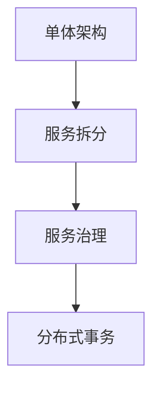

# 架构演进路线图

在当今的软件开发中，架构的演进是一个不可避免的过程。随着业务需求的增长和技术的发展，系统架构需要不断调整和优化。Spring Cloud Alibaba 作为微服务架构的重要工具，提供了一套完整的解决方案，帮助开发者从单体架构逐步演进到微服务架构。本文将带你了解 Spring Cloud Alibaba 的架构演进路线图，并通过实际案例展示其应用场景。

## 1. 什么是架构演进？

架构演进是指随着业务需求的变化和技术的发展，系统架构从简单到复杂、从单体到分布式的逐步优化过程。在这个过程中，开发者需要不断调整系统的设计，以满足更高的性能、可扩展性和可维护性要求。

:::note
架构演进的核心目标是：**高可用性**、**可扩展性**、**可维护性**。
:::

## 2. 单体架构 vs 微服务架构

在架构演进的初期，大多数系统采用单体架构（Monolithic Architecture）。单体架构的特点是所有功能模块都集中在一个应用中，部署简单，但随着业务复杂度的增加，单体架构的缺点逐渐显现：

- **耦合度高**：模块之间紧密耦合，修改一个模块可能影响整个系统。
- **扩展性差**：无法针对特定模块进行扩展，必须整体扩展。
- **维护困难**：随着代码量的增加，开发和维护成本急剧上升。

相比之下，微服务架构（Microservices Architecture）通过将系统拆分为多个独立的服务，解决了单体架构的痛点：

- **松耦合**：每个服务独立开发、部署和扩展。
- **高可用性**：单个服务的故障不会影响整个系统。
- **技术栈灵活**：不同服务可以使用不同的技术栈。

## 3. Spring Cloud Alibaba 的架构演进路线图

Spring Cloud Alibaba 提供了一套完整的微服务解决方案，帮助开发者从单体架构平滑过渡到微服务架构。以下是典型的架构演进路线图：

### 3.1 单体架构阶段

在单体架构阶段，所有功能模块都集中在一个应用中。以下是一个简单的单体架构示例：

```java
// 单体架构示例：用户服务
public class UserService {
    public User getUserById(Long id) {
        // 从数据库查询用户信息
        return userRepository.findById(id);
    }
}
```

:::caution
单体架构的缺点是随着业务增长，代码库会变得臃肿，难以维护。
:::

### 3.2 服务拆分阶段

在服务拆分阶段，我们将单体应用拆分为多个独立的服务。例如，将用户服务和订单服务拆分为两个独立的微服务：

```java
// 用户服务
@RestController
public class UserController {
    @Autowired
    private UserService userService;

    @GetMapping("/users/{id}")
    public User getUserById(@PathVariable Long id) {
        return userService.getUserById(id);
    }
}

// 订单服务
@RestController
public class OrderController {
    @Autowired
    private OrderService orderService;

    @GetMapping("/orders/{id}")
    public Order getOrderById(@PathVariable Long id) {
        return orderService.getOrderById(id);
    }
}
```

:::tip
服务拆分的关键是定义清晰的接口和边界，确保服务之间的松耦合。
:::

### 3.3 服务治理阶段

在微服务架构中，服务治理是一个重要的环节。Spring Cloud Alibaba 提供了丰富的服务治理工具，例如：

- **服务注册与发现**：通过 Nacos 实现服务的自动注册与发现。
- **负载均衡**：通过 Ribbon 或 Spring Cloud LoadBalancer 实现负载均衡。
- **熔断与限流**：通过 Sentinel 实现服务的熔断与限流。

以下是一个使用 Nacos 进行服务注册的示例：

```java
// 用户服务注册到 Nacos
@SpringBootApplication
@EnableDiscoveryClient
public class UserServiceApplication {
    public static void main(String[] args) {
        SpringApplication.run(UserServiceApplication.class, args);
    }
}
```

### 3.4 分布式事务阶段

在微服务架构中，分布式事务是一个复杂的挑战。Spring Cloud Alibaba 提供了 Seata 来解决分布式事务问题。以下是一个使用 Seata 的示例：

```java
// 用户服务调用订单服务，使用 Seata 管理分布式事务
@GlobalTransactional
public void createOrder(User user, Order order) {
    userService.updateUser(user);
    orderService.createOrder(order);
}
```

:::warning
分布式事务的性能开销较大，应尽量避免在性能敏感的场景中使用。
:::

## 4. 实际案例：电商系统的架构演进

假设我们有一个电商系统，最初采用单体架构，随着业务增长，逐步演进为微服务架构。以下是其架构演进的过程：

1. **单体架构**：所有功能（用户、商品、订单）集中在一个应用中。
2. **服务拆分**：将用户服务、商品服务、订单服务拆分为独立的微服务。
3. **服务治理**：使用 Nacos 进行服务注册与发现，使用 Sentinel 进行熔断与限流。
4. **分布式事务**：使用 Seata 管理订单创建过程中的分布式事务。



## 5. 总结

Spring Cloud Alibaba 的架构演进路线图帮助开发者从单体架构平滑过渡到微服务架构。通过服务拆分、服务治理和分布式事务等步骤，开发者可以构建高可用、可扩展和易维护的微服务系统。

## 6. 附加资源与练习

- **资源**：
  - [Spring Cloud Alibaba 官方文档](https://spring-cloud-alibaba-group.github.io/)
  - [Nacos 官方文档](https://nacos.io/)
  - [Sentinel 官方文档](https://sentinelguard.io/)
  - [Seata 官方文档](https://seata.io/)

- **练习**：
  1. 尝试将一个简单的单体应用拆分为多个微服务。
  2. 使用 Nacos 实现服务的注册与发现。
  3. 使用 Sentinel 实现服务的熔断与限流。
  4. 使用 Seata 实现一个简单的分布式事务场景。

通过以上学习和实践，你将掌握 Spring Cloud Alibaba 的核心概念，并能够将其应用于实际项目中。