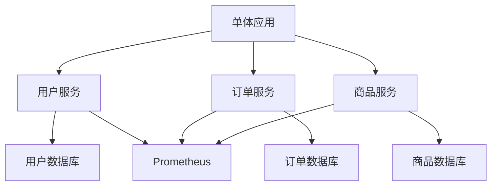

## 介绍

微服务重构是将传统的单体应用拆分为多个独立的、可独立部署的服务的过程。这种架构模式能够提高系统的可维护性、可扩展性和灵活性。然而，重构过程需要谨慎规划和执行，以避免引入新的问题。本文将逐步讲解微服务重构的方法，并通过实际案例展示其应用。

## 微服务重构的步骤

### 1. 识别边界上下文

在微服务架构中，边界上下文（Bounded Context）是划分服务的关键。每个边界上下文代表一个独立的业务领域或功能模块。识别边界上下文是重构的第一步。

:::tip
**提示**：使用领域驱动设计（DDD）中的概念来帮助识别边界上下文。
:::

### 2. 提取服务

一旦确定了边界上下文，就可以开始将单体应用中的相关代码提取到独立的服务中。这个过程通常包括以下步骤：

1. **创建新服务**：为每个边界上下文创建一个新的微服务。
2. **迁移代码**：将单体应用中的相关代码迁移到新服务中。
3. **配置服务间通信**：使用 REST API、gRPC 或消息队列等方式实现服务间的通信。

```java
// 示例：创建一个新的用户服务
@RestController
public class UserController {
    @GetMapping("/users/{id}")
    public User getUser(@PathVariable Long id) {
        // 从数据库或其他服务中获取用户信息
        return userService.getUserById(id);
    }
}
```

### 3. 数据迁移

在微服务架构中，每个服务通常拥有自己的数据库。因此，数据迁移是重构过程中的一个重要环节。

:::caution
**注意**：数据迁移可能会导致数据一致性问题，因此需要谨慎处理。
:::

```sql
-- 示例：将用户数据从单体应用的数据库迁移到用户服务的数据库
INSERT INTO user_service.users (id, name, email)
SELECT id, name, email FROM monolithic_app.users;
```

### 4. 服务间通信

微服务之间需要通过某种方式进行通信。常见的通信方式包括同步通信（如 REST API）和异步通信（如消息队列）。

```java
// 示例：使用 Feign 客户端进行服务间通信
@FeignClient(name = "order-service")
public interface OrderServiceClient {
    @GetMapping("/orders/{userId}")
    List<Order> getOrdersByUserId(@PathVariable Long userId);
}
```

### 5. 监控和日志

微服务架构中，监控和日志管理变得更加复杂。因此，需要引入集中式的监控和日志系统，如 Prometheus 和 ELK Stack。

```yaml
# 示例：Prometheus 配置
scrape_configs:
  - job_name: 'user-service'
    static_configs:
      - targets: ['user-service:8080']
```

## 实际案例

### 案例：电商平台的重构

假设我们有一个电商平台，最初是一个单体应用。随着业务的发展，我们决定将其重构为微服务架构。

1. **识别边界上下文**：我们识别出用户管理、订单管理、商品管理等边界上下文。
2. **提取服务**：我们为每个边界上下文创建了独立的服务，如用户服务、订单服务和商品服务。
3. **数据迁移**：我们将用户数据、订单数据和商品数据分别迁移到各自的数据库中。
4. **服务间通信**：我们使用 REST API 和消息队列实现服务间的通信。
5. **监控和日志**：我们引入了 Prometheus 和 ELK Stack 来监控和记录系统状态。



## 总结

微服务重构是一个复杂但值得的过程。通过识别边界上下文、提取服务、迁移数据、配置服务间通信以及引入监控和日志系统，我们可以将单体应用逐步演进为微服务架构。这种架构能够提高系统的可维护性、可扩展性和灵活性。

## 附加资源

- [领域驱动设计（DDD）](https://domainlanguage.com/ddd/)
- [Spring Cloud Alibaba 官方文档](https://spring.io/projects/spring-cloud-alibaba)
- [微服务架构设计模式](https://microservices.io/)

## 练习

1. 尝试将一个简单的单体应用拆分为两个微服务。
2. 使用 Feign 客户端实现服务间的通信。
3. 配置 Prometheus 监控一个微服务的性能指标。
