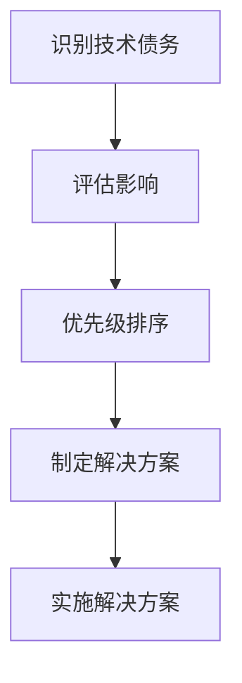

## 什么是技术债务？

技术债务（Technical Debt）是软件开发中的一个比喻，指的是为了快速实现功能而采取的一些短期解决方案，这些方案在长期来看可能会带来额外的维护成本。就像金融债务一样，技术债务也需要“偿还”，否则会积累利息，导致系统变得难以维护和扩展。

在Spring Cloud Alibaba架构演进中，技术债务管理尤为重要。随着系统的复杂性增加，未解决的技术债务可能会导致系统性能下降、开发效率降低，甚至引发严重的技术故障。

## 技术债务的来源

技术债务的来源多种多样，以下是一些常见的来源：

1. **快速交付压力**：为了满足业务需求，开发团队可能会选择快速实现功能，而忽略了代码质量和架构设计。
2. **缺乏经验**：开发人员可能缺乏足够的经验，导致代码质量不高。
3. **技术选型不当**：选择了不适合当前业务需求的技术栈，导致后续维护困难。
4. **文档缺失**：缺乏足够的文档，导致后续开发人员难以理解和维护代码。

## 技术债务的影响

未解决的技术债务会对系统产生多方面的负面影响：

- **维护成本增加**：随着技术债务的积累，系统的维护成本会显著增加。
- **开发效率降低**：开发人员需要花费更多的时间来理解和修复代码，导致开发效率降低。
- **系统稳定性下降**：技术债务可能导致系统出现更多的bug和性能问题，影响系统的稳定性。
- **扩展性受限**：技术债务可能限制系统的扩展性，使得新功能的开发变得更加困难。

## 技术债务管理策略

在Spring Cloud Alibaba架构演进中，技术债务管理需要采取系统化的策略。以下是一些有效的管理策略：

### 1. 识别技术债务

首先，开发团队需要识别系统中的技术债务。可以通过代码审查、静态代码分析工具、性能测试等方式来识别潜在的技术债务。

```java
// 示例：使用静态代码分析工具识别技术债务
public class TechnicalDebtExample {
    public void processData() {
        // 快速实现的代码，可能存在技术债务
        if (data == null) {
            throw new RuntimeException("Data is null");
        }
        // 其他处理逻辑
    }
}
```

### 2. 优先级排序

识别出技术债务后，需要根据其影响和紧急程度进行优先级排序。高优先级的技术债务应该尽快解决，以避免对系统产生更大的影响。



### 3. 制定解决方案

针对每个技术债务，制定具体的解决方案。解决方案可能包括重构代码、优化架构、更新技术栈等。

```java
// 示例：重构代码以减少技术债务
public class TechnicalDebtExample {
    public void processData() {
        if (data == null) {
            throw new IllegalArgumentException("Data cannot be null");
        }
        // 其他处理逻辑
    }
}
```

### 4. 定期偿还技术债务

技术债务的偿还应该是一个持续的过程。开发团队应该定期安排时间来处理技术债务，避免其积累。

:::tip
建议在每个迭代周期中预留一定的时间来处理技术债务，确保系统始终保持健康状态。
:::

## 实际案例

假设我们有一个基于Spring Cloud Alibaba的微服务系统，系统中存在一些技术债务，例如：

- **服务间通信过于依赖同步调用**：这导致系统的响应时间变长，且在高并发情况下容易出现性能瓶颈。
- **缺乏统一的异常处理机制**：不同服务的异常处理方式不一致，导致错误排查困难。

针对这些问题，我们可以采取以下措施：

1. **引入异步通信机制**：使用消息队列（如RocketMQ）来解耦服务间的通信，提高系统的响应速度和并发处理能力。
2. **统一异常处理机制**：在Spring Cloud Alibaba中引入全局异常处理器，统一处理所有服务的异常。

```java
// 示例：全局异常处理器
@ControllerAdvice
public class GlobalExceptionHandler {
    @ExceptionHandler(Exception.class)
    public ResponseEntity<String> handleException(Exception ex) {
        return new ResponseEntity<>("An error occurred: " + ex.getMessage(), HttpStatus.INTERNAL_SERVER_ERROR);
    }
}
```

## 总结

技术债务是软件开发中不可避免的一部分，但通过有效的管理策略，可以将其影响降到最低。在Spring Cloud Alibaba架构演进中，技术债务管理尤为重要。开发团队需要识别、评估、优先级排序并定期偿还技术债务，以确保系统的长期健康和可维护性。

## 附加资源与练习

- **资源**：
  - [《重构：改善既有代码的设计》](https://book.douban.com/subject/4262627/)：一本经典的重构书籍，帮助你理解如何通过重构来减少技术债务。
  - [Spring Cloud Alibaba官方文档](https://spring.io/projects/spring-cloud-alibaba)：了解如何在Spring Cloud Alibaba中进行技术债务管理。

- **练习**：
  - 选择一个你参与的项目，识别其中的技术债务，并制定一个偿还计划。
  - 尝试在Spring Cloud Alibaba项目中引入全局异常处理器，统一处理所有服务的异常。
