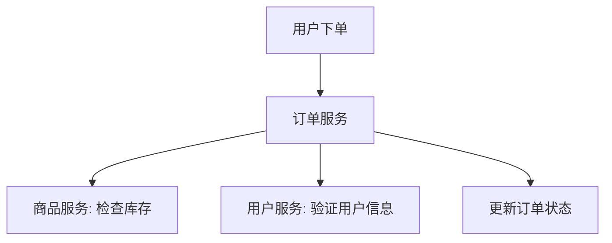

# 领域驱动设计应用

领域驱动设计（Domain-Driven Design，简称DDD）是一种软件开发方法论，旨在通过将业务逻辑与代码紧密结合，帮助开发者更好地理解和实现复杂业务系统。在Spring Cloud Alibaba架构中，DDD的应用可以帮助我们构建高内聚、低耦合的微服务系统。

## 什么是领域驱动设计？

领域驱动设计（DDD）由Eric Evans在其同名书籍中提出，核心思想是通过**领域模型**来驱动软件设计。DDD强调将业务逻辑放在核心位置，通过分层架构、领域模型和通用语言（Ubiquitous Language）来实现业务与技术的对齐。

### DDD的核心概念

1. **领域（Domain）**：业务的核心逻辑和规则。
2. **领域模型（Domain Model）**：对业务逻辑的抽象表示。
3. **通用语言（Ubiquitous Language）**：开发团队与业务专家共同使用的统一语言。
4. **限界上下文（Bounded Context）**：定义领域模型的边界，避免模型之间的混淆。
5. **实体（Entity）**：具有唯一标识的对象。
6. **值对象（Value Object）**：没有唯一标识的对象，通常用于描述属性。
7. **聚合（Aggregate）**：一组相关对象的集合，通常由一个根实体管理。
8. **仓储（Repository）**：用于持久化领域对象的接口。

## DDD在Spring Cloud Alibaba中的应用

在Spring Cloud Alibaba架构中，DDD可以帮助我们更好地组织微服务，尤其是在处理复杂业务逻辑时。以下是一个简单的示例，展示如何在Spring Cloud Alibaba中应用DDD。

### 示例：订单管理系统

假设我们正在开发一个订单管理系统，以下是DDD的应用步骤：

#### 1. 定义领域模型

首先，我们需要定义订单管理系统的领域模型。订单系统的主要领域包括**订单（Order）**、**商品（Product）**和**用户（User）**。

```java
// 订单实体
public class Order {
    private String orderId;
    private List<Product> products;
    private User user;
    private OrderStatus status;

    // 业务方法
    public void placeOrder() {
        this.status = OrderStatus.PLACED;
    }
}

// 商品值对象
public class Product {
    private String productId;
    private String name;
    private BigDecimal price;
}

// 用户实体
public class User {
    private String userId;
    private String name;
}
```

#### 2. 定义限界上下文

在订单管理系统中，我们可以将**订单**、**商品**和**用户**划分为不同的限界上下文。例如：

- **订单上下文**：负责订单的创建、修改和状态管理。
- **商品上下文**：负责商品信息的管理。
- **用户上下文**：负责用户信息的管理。

#### 3. 实现仓储接口

在DDD中，仓储接口用于持久化领域对象。以下是一个简单的订单仓储接口：

```java
public interface OrderRepository {
    Order findById(String orderId);
    void save(Order order);
}
```

#### 4. 应用层与领域层的分离

在Spring Cloud Alibaba中，我们可以通过分层架构来实现DDD。通常，我们会将应用层与领域层分离：

- **应用层**：负责处理外部请求，调用领域层的业务逻辑。
- **领域层**：包含核心业务逻辑和领域模型。

```java
// 应用层服务
@Service
public class OrderService {
    @Autowired
    private OrderRepository orderRepository;

    public void placeOrder(String orderId) {
        Order order = orderRepository.findById(orderId);
        order.placeOrder();
        orderRepository.save(order);
    }
}
```

### 实际案例：电商平台的订单处理

在一个电商平台中，订单处理是一个典型的复杂业务场景。通过DDD，我们可以将订单处理的核心逻辑抽象为领域模型，并通过限界上下文将其与商品管理、用户管理等其他业务逻辑分离。

例如，当用户下单时，订单服务会调用商品服务检查库存，调用用户服务验证用户信息，最后将订单状态更新为“已下单”。通过DDD，我们可以清晰地定义每个服务的职责，避免业务逻辑的混乱。



## 总结

领域驱动设计（DDD）是一种强大的方法论，特别适用于处理复杂业务逻辑的系统。在Spring Cloud Alibaba架构中，DDD可以帮助我们构建高内聚、低耦合的微服务系统。通过定义领域模型、限界上下文和分层架构，我们可以更好地组织代码，提升系统的可维护性和扩展性。

### 附加资源

- [《领域驱动设计》 - Eric Evans](https://www.amazon.com/Domain-Driven-Design-Tackling-Complexity-Software/dp/0321125215)
- [Spring Cloud Alibaba官方文档](https://spring.io/projects/spring-cloud-alibaba)
- [DDD实战：从零开始构建微服务](https://www.infoq.cn/article/ddd-in-practice)

### 练习

1. 尝试为你的项目定义一个领域模型，并划分限界上下文。
2. 实现一个简单的仓储接口，并编写单元测试验证其功能。
3. 思考如何通过DDD优化现有的微服务架构。

:::tip
在学习DDD时，建议多与业务专家沟通，确保领域模型的准确性。同时，实践是掌握DDD的最佳方式，尝试在实际项目中应用这些概念。
:::