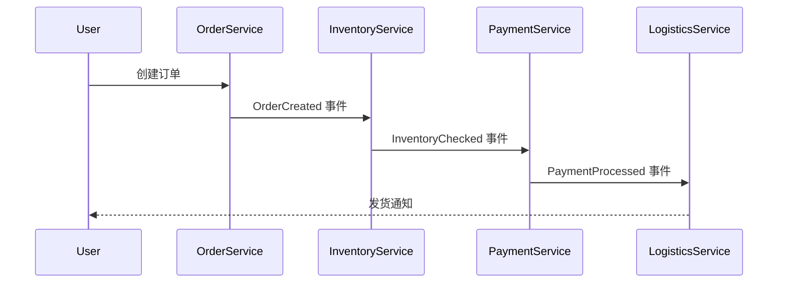

# 事件驱动架构

事件驱动架构（Event-Driven Architecture，简称 EDA）是一种以事件为核心的系统设计模式。在这种架构中，系统的各个组件通过生成、发布和消费事件来相互通信和协作。事件驱动架构非常适合处理异步、松耦合的场景，尤其是在微服务架构中，它能够有效解耦服务之间的依赖关系。

## 什么是事件驱动架构？

事件驱动架构的核心思想是：系统中的各个组件通过事件进行通信。事件是系统中发生的任何有意义的状态变化或动作，例如用户注册、订单创建或支付完成。事件驱动架构通常包含以下核心组件：

1. **事件生产者（Event Producer）**：负责生成事件并将其发布到事件总线或消息队列中。
2. **事件消费者（Event Consumer）**：订阅并处理事件，执行相应的业务逻辑。
3. **事件总线/消息队列（Event Bus/Message Queue）**：作为事件的传输媒介，负责将事件从生产者传递到消费者。

:::tip
事件驱动架构的优势在于其松耦合性。生产者和消费者不需要直接知道彼此的存在，只需通过事件进行通信。
:::

## 事件驱动架构的核心概念

### 1. 事件（Event）
事件是系统中发生的任何有意义的状态变化或动作。例如，用户注册成功后，系统会生成一个 `UserRegistered` 事件。

```java
public class UserRegisteredEvent {
    private String userId;
    private String email;
    private LocalDateTime timestamp;

    // 构造函数、getter 和 setter 省略
}
```

### 2. 事件总线（Event Bus）
事件总线是事件的传输媒介，负责将事件从生产者传递到消费者。常见的事件总线实现包括 Kafka、RabbitMQ 等。

### 3. 事件消费者（Event Consumer）
事件消费者订阅特定类型的事件，并在事件到达时执行相应的业务逻辑。

```java
@EventListener
public void handleUserRegisteredEvent(UserRegisteredEvent event) {
    System.out.println("User registered: " + event.getUserId());
    // 执行其他业务逻辑
}
```

## 事件驱动架构的实际应用场景

### 场景 1：订单处理系统
在一个电商平台中，订单处理系统可以基于事件驱动架构实现。例如：

1. 用户下单时，生成 `OrderCreated` 事件。
2. 库存服务订阅 `OrderCreated` 事件，检查库存并生成 `InventoryChecked` 事件。
3. 支付服务订阅 `InventoryChecked` 事件，处理支付并生成 `PaymentProcessed` 事件。
4. 物流服务订阅 `PaymentProcessed` 事件，安排发货。



### 场景 2：用户注册流程
在用户注册流程中，事件驱动架构可以用于解耦不同的业务逻辑：

1. 用户注册成功后，生成 `UserRegistered` 事件。
2. 邮件服务订阅 `UserRegistered` 事件，发送欢迎邮件。
3. 积分服务订阅 `UserRegistered` 事件，为新用户赠送积分。

```java
@EventListener
public void handleUserRegisteredEvent(UserRegisteredEvent event) {
    emailService.sendWelcomeEmail(event.getEmail());
    pointsService.addWelcomePoints(event.getUserId());
}
```

## 总结

事件驱动架构通过事件实现系统组件之间的松耦合通信，非常适合处理异步、分布式场景。它的核心组件包括事件、事件总线和事件消费者。在实际应用中，事件驱动架构可以用于订单处理、用户注册等复杂业务流程。

:::note
如果你想进一步学习事件驱动架构，可以参考以下资源：
- [Kafka 官方文档](https://kafka.apache.org/documentation/)
- [RabbitMQ 官方文档](https://www.rabbitmq.com/documentation.html)
- 《微服务架构设计模式》一书中的事件驱动架构章节
:::

:::caution
在实际开发中，事件驱动架构可能会引入事件丢失、重复消费等问题，因此需要合理设计事件处理逻辑，并选择合适的消息中间件。
:::

## 练习

1. 尝试设计一个基于事件驱动架构的博客系统，描述系统中可能的事件和消费者。
2. 使用 Kafka 或 RabbitMQ 实现一个简单的事件驱动示例，包括事件的生产和消费。