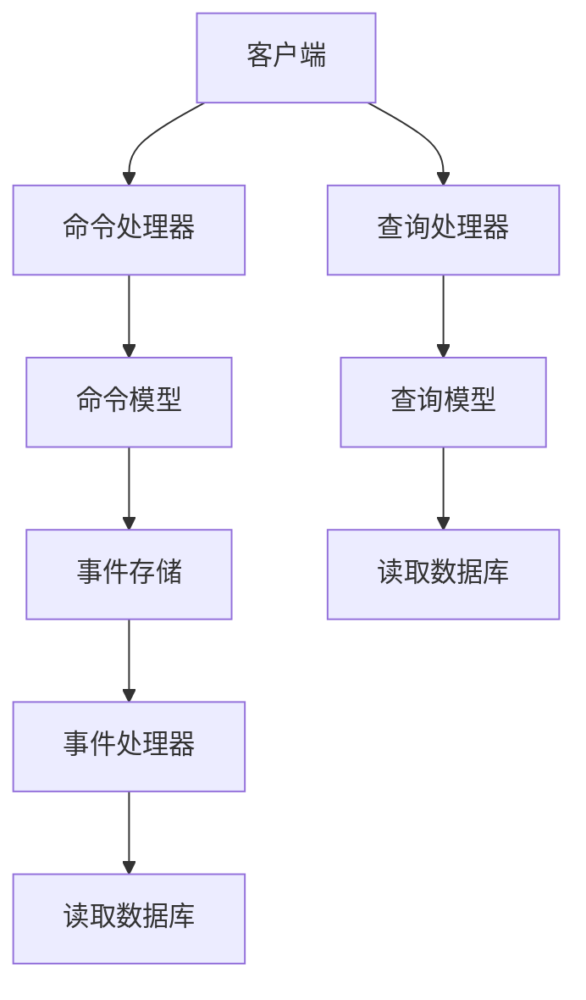

# CQRS模式应用

## 介绍

CQRS（Command Query Responsibility Segregation，命令查询职责分离）是一种架构模式，它将应用程序的读取（查询）和写入（命令）操作分离为两个独立的模型。这种分离使得系统在处理复杂业务逻辑时更加灵活和高效。

在传统的CRUD（创建、读取、更新、删除）模式中，读取和写入操作通常共享同一个数据模型。然而，随着业务复杂性的增加，这种单一模型可能会导致性能瓶颈和代码维护困难。CQRS通过将读取和写入操作分离，允许我们为每种操作优化不同的模型。

## CQRS的核心概念

### 命令（Command）
命令是指对系统状态进行更改的操作，例如创建、更新或删除数据。命令通常不返回数据，而是通过事件（Event）来通知系统状态的变化。

### 查询（Query）
查询是指从系统中获取数据的操作。查询操作不会改变系统状态，因此它们通常是只读的。

### 事件（Event）
事件是系统中状态变化的通知。当命令执行成功后，系统会发布一个事件，其他组件可以订阅这些事件来更新自己的状态。

## CQRS的架构

在CQRS架构中，命令和查询通常通过不同的路径处理。命令通过命令处理器（Command Handler）执行，而查询通过查询处理器（Query Handler）执行。这两个处理器可以使用不同的数据存储，甚至可以使用不同的数据库技术。



## 实际应用场景

### 电商系统中的订单管理

假设我们有一个电商系统，用户可以在系统中下订单、查看订单状态。在传统的CRUD模式中，订单的创建和查询可能共享同一个数据库表。然而，随着订单数量的增加，查询操作可能会变得非常缓慢。

通过引入CQRS模式，我们可以将订单的创建和查询操作分离。订单的创建通过命令处理器处理，并将订单信息存储在事件存储中。查询操作则通过查询处理器从优化的读取数据库中获取数据，从而提高查询性能。

### 代码示例

以下是一个简单的Spring Boot示例，展示了如何在CQRS模式中处理命令和查询。

#### 命令处理器

```java
@Service
public class OrderCommandHandler {

    @Autowired
    private EventStore eventStore;

    public void handle(CreateOrderCommand command) {
        OrderCreatedEvent event = new OrderCreatedEvent(command.getOrderId(), command.getProductId(), command.getQuantity());
        eventStore.save(event);
    }
}
```

#### 查询处理器

```java
@Service
public class OrderQueryHandler {

    @Autowired
    private OrderReadRepository orderReadRepository;

    public OrderView handle(GetOrderQuery query) {
        return orderReadRepository.findById(query.getOrderId()).orElseThrow(() -> new OrderNotFoundException(query.getOrderId()));
    }
}
```

#### 事件处理器

```java
@Service
public class OrderEventHandler {

    @Autowired
    private OrderReadRepository orderReadRepository;

    @EventHandler
    public void on(OrderCreatedEvent event) {
        OrderView orderView = new OrderView(event.getOrderId(), event.getProductId(), event.getQuantity());
        orderReadRepository.save(orderView);
    }
}
```

## 总结

CQRS模式通过将命令和查询操作分离，使得系统在处理复杂业务逻辑时更加灵活和高效。它特别适用于需要高性能查询和复杂业务逻辑的场景，如电商系统、金融系统等。

在实际应用中，CQRS模式可以与事件溯源（Event Sourcing）结合使用，以进一步提高系统的可扩展性和可维护性。

## 附加资源

- [CQRS Pattern - Martin Fowler](https://martinfowler.com/bliki/CQRS.html)
- [Spring Cloud Alibaba官方文档](https://spring-cloud-alibaba-group.github.io/github-pages/hoxton/en-us/index.html)
- [Event Sourcing and CQRS](https://microservices.io/patterns/data/event-sourcing.html)

## 练习

1. 尝试在一个简单的Spring Boot项目中实现CQRS模式，处理用户注册和用户信息查询。
2. 研究如何将CQRS与事件溯源结合使用，并实现一个简单的订单管理系统。
