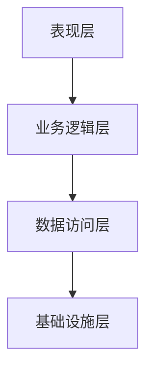

# 微服务分层架构

微服务架构是一种将单一应用程序拆分为多个小型服务的架构风格，每个服务都运行在自己的进程中，并通过轻量级机制（如HTTP API）进行通信。分层架构是微服务设计中的一种常见模式，它将系统划分为多个逻辑层，每一层都有明确的职责和边界。本文将详细介绍微服务分层架构的设计原则、实现方式及其在Spring Cloud Alibaba中的应用。

## 什么是微服务分层架构？

微服务分层架构是一种将系统功能划分为多个逻辑层的设计模式。每一层都有明确的职责，层与层之间通过定义良好的接口进行通信。这种分层设计有助于提高系统的可维护性、可扩展性和可测试性。

常见的微服务分层架构包括以下几层：

1. **表现层（Presentation Layer）**：负责处理用户请求和展示数据，通常是Web界面或API网关。
2. **业务逻辑层（Business Logic Layer）**：包含核心业务逻辑，处理来自表现层的请求并返回结果。
3. **数据访问层（Data Access Layer）**：负责与数据库或其他持久化存储进行交互，执行数据的增删改查操作。
4. **基础设施层（Infrastructure Layer）**：提供系统运行所需的基础设施支持，如消息队列、缓存、日志等。

## 微服务分层架构的设计原则

在设计微服务分层架构时，需要遵循以下原则：

1. **单一职责原则（Single Responsibility Principle）**：每一层只负责一个特定的功能，避免功能耦合。
2. **依赖倒置原则（Dependency Inversion Principle）**：高层模块不应依赖低层模块，两者都应依赖于抽象。
3. **接口隔离原则（Interface Segregation Principle）**：定义小而精的接口，避免大而全的接口。
4. **分层隔离原则（Layered Isolation Principle）**：每一层只与相邻的上下层进行通信，避免跨层调用。

## 微服务分层架构的实现

在Spring Cloud Alibaba中，微服务分层架构可以通过以下方式实现：

### 表现层

表现层通常由API网关（如Spring Cloud Gateway）或Web界面（如Thymeleaf）组成。API网关负责路由请求、负载均衡、认证授权等功能。

```java
@RestController
@RequestMapping("/api")
public class UserController {

    @Autowired
    private UserService userService;

    @GetMapping("/users/{id}")
    public User getUser(@PathVariable Long id) {
        return userService.getUserById(id);
    }
}
```

### 业务逻辑层

业务逻辑层包含核心业务逻辑，通常由Spring的@Service注解标记的类实现。

```java
@Service
public class UserService {

    @Autowired
    private UserRepository userRepository;

    public User getUserById(Long id) {
        return userRepository.findById(id).orElseThrow(() -> new RuntimeException("User not found"));
    }
}
```

### 数据访问层

数据访问层负责与数据库进行交互，通常由Spring的@Repository注解标记的类实现。

```java
@Repository
public interface UserRepository extends JpaRepository<User, Long> {
}
```

### 基础设施层

基础设施层提供系统运行所需的基础设施支持，如消息队列、缓存、日志等。在Spring Cloud Alibaba中，可以使用Nacos作为服务发现和配置中心，使用RocketMQ作为消息队列。

```java
@Configuration
public class RocketMQConfig {

    @Bean
    public RocketMQTemplate rocketMQTemplate() {
        return new RocketMQTemplate();
    }
}
```

## 实际案例

假设我们正在开发一个电商系统，该系统需要处理用户订单。我们可以将系统划分为以下几层：

1. **表现层**：提供REST API，供前端调用。
2. **业务逻辑层**：处理订单创建、支付、发货等业务逻辑。
3. **数据访问层**：与数据库交互，存储和检索订单数据。
4. **基础设施层**：使用RocketMQ处理异步消息，如订单支付成功后发送通知。



## 总结

微服务分层架构是一种将系统功能划分为多个逻辑层的设计模式，每一层都有明确的职责和边界。通过遵循单一职责原则、依赖倒置原则、接口隔离原则和分层隔离原则，可以设计出高内聚、低耦合的微服务系统。在Spring Cloud Alibaba中，可以通过API网关、业务逻辑层、数据访问层和基础设施层的组合，实现一个完整的微服务分层架构。

## 附加资源

- [Spring Cloud Alibaba官方文档](https://spring.io/projects/spring-cloud-alibaba)
- [微服务架构设计模式](https://microservices.io/patterns/microservices.html)
- [Spring Boot官方文档](https://spring.io/projects/spring-boot)

## 练习

1. 尝试在Spring Boot项目中实现一个简单的微服务分层架构，包含表现层、业务逻辑层和数据访问层。
2. 使用Nacos作为服务发现和配置中心，实现服务的动态注册与发现。
3. 使用RocketMQ处理异步消息，模拟订单支付成功后发送通知的场景。
