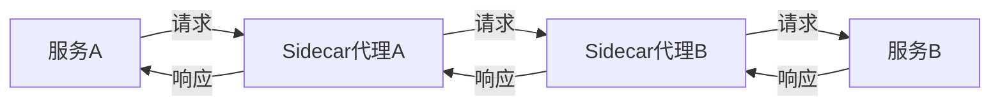

## 什么是服务网格架构？

服务网格（Service Mesh）是一种用于管理微服务之间通信的基础设施层。它通过将服务间通信的逻辑（如负载均衡、服务发现、故障恢复、监控等）从应用程序代码中解耦出来，使得开发者可以专注于业务逻辑的实现，而不必关心底层的通信细节。

服务网格通常由一组轻量级的网络代理（如 Envoy、Linkerd 等）组成，这些代理与应用程序一起部署，负责处理服务间的通信。服务网格的核心功能包括：

- **服务发现**：自动发现和注册服务实例。
- **负载均衡**：在多个服务实例之间分配流量。
- **故障恢复**：处理服务故障，如重试、熔断等。
- **安全通信**：通过 TLS 加密服务间的通信。
- **监控和追踪**：收集服务间的通信数据，用于监控和故障排查。

## 服务网格的工作原理

服务网格通过在应用程序的每个服务实例旁边部署一个代理（称为 Sidecar 代理）来实现其功能。这些代理负责拦截所有进出服务的网络流量，并根据配置的规则进行处理。



在上图中，服务A 和服务B 之间的通信通过各自的 Sidecar 代理进行。Sidecar 代理负责处理负载均衡、服务发现、故障恢复等任务。

## 服务网格的核心组件

服务网格通常由以下几个核心组件组成：

1. **数据平面（Data Plane）**：负责处理服务间的实际通信。数据平面由一组 Sidecar 代理组成，这些代理拦截并处理所有进出服务的网络流量。

2. **控制平面（Control Plane）**：负责管理和配置数据平面。控制平面提供 API 和用户界面，用于配置服务发现、负载均衡、故障恢复等策略。

3. **Sidecar 代理**：与服务实例一起部署的轻量级代理，负责拦截和处理服务间的通信。

## 服务网格的实际应用场景

服务网格在微服务架构中有广泛的应用场景，以下是一些常见的用例：

1. **流量管理**：通过服务网格可以实现细粒度的流量控制，如 A/B 测试、金丝雀发布等。

2. **安全通信**：服务网格可以通过自动化的 TLS 加密来保护服务间的通信，确保数据的安全性。

3. **故障恢复**：服务网格可以自动处理服务故障，如重试、熔断等，提高系统的可靠性。

4. **监控和追踪**：服务网格可以收集服务间的通信数据，用于监控和故障排查，帮助开发者快速定位问题。

## 代码示例：使用 Istio 实现服务网格

Istio 是一个流行的服务网格实现，以下是一个简单的示例，展示如何使用 Istio 实现服务间的通信。

1. **安装 Istio**：

   首先，安装 Istio 的控制平面和数据平面：

   ```bash
   curl -L https://istio.io/downloadIstio | sh -
   cd istio-1.15.0
   export PATH=$PWD/bin:$PATH
   istioctl install --set profile=demo -y
   ```

2. **部署示例应用**：

   部署一个简单的微服务应用，如 Bookinfo：

   ```bash
   kubectl apply -f samples/bookinfo/platform/kube/bookinfo.yaml
   ```

3. **配置流量管理**：

   使用 Istio 的 VirtualService 和 DestinationRule 配置流量管理规则：

   ```yaml
   apiVersion: networking.istio.io/v1alpha3
   kind: VirtualService
   metadata:
     name: reviews
   spec:
     hosts:
     - reviews
     http:
     - route:
       - destination:
           host: reviews
           subset: v1
   ```

4. **验证配置**：

   通过访问 Bookinfo 应用的前端页面，验证流量是否按照配置的规则进行路由。

## 总结

服务网格架构为微服务提供了一种高效、可靠的管理方式，使得开发者可以专注于业务逻辑的实现，而不必关心底层的通信细节。通过服务网格，可以实现流量管理、安全通信、故障恢复、监控和追踪等功能，极大地提高了微服务架构的可维护性和可靠性。

## 附加资源

- [Istio 官方文档](https://istio.io/latest/docs/)
- [Envoy 官方文档](https://www.envoyproxy.io/docs/envoy/latest/)
- [Service Mesh 入门指南](https://servicemesh.io/)

## 练习

1. 尝试在本地 Kubernetes 集群中部署 Istio，并配置一个简单的微服务应用。
2. 使用 Istio 的 VirtualService 和 DestinationRule 配置流量管理规则，实现 A/B 测试。
3. 探索 Istio 的监控和追踪功能，了解如何通过服务网格收集和分析服务间的通信数据。
