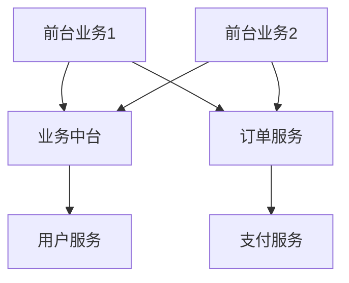

## 介绍

在当今快速变化的商业环境中，企业需要快速响应市场需求，同时保持系统的灵活性和可扩展性。**中台战略**和**微服务架构**是两种重要的技术手段，它们相辅相成，帮助企业实现这一目标。

- **中台战略**：中台是一种组织架构和业务模式，旨在通过共享服务层（中台）来支持多个前台业务。它通过将通用的业务能力抽象出来，形成可复用的服务，从而提升开发效率和业务响应速度。
- **微服务架构**：微服务是一种将单一应用程序拆分为多个小型服务的架构风格。每个服务独立运行，通过轻量级通信协议（如HTTP或消息队列）进行交互。

本文将探讨中台战略与微服务的关系，并通过Spring Cloud Alibaba展示如何实现这一架构演进。

---

## 中台战略与微服务的关系

中台战略的核心是**共享服务**，而微服务架构的核心是**服务拆分**。两者结合可以实现以下目标：

1. **业务复用**：通过中台提供的共享服务，多个前台业务可以复用相同的功能，减少重复开发。
2. **灵活扩展**：微服务架构允许每个服务独立扩展，从而更好地应对业务变化。
3. **快速迭代**：中台和微服务的结合使得开发和部署更加敏捷，能够快速响应市场需求。

---

## 中台战略的实现

中台通常由以下几层组成：

1. **业务中台**：提供核心业务能力，如用户管理、订单管理等。
2. **数据中台**：负责数据的采集、存储和分析，支持业务决策。
3. **技术中台**：提供通用的技术能力，如消息队列、缓存、分布式事务等。

以下是一个简单的业务中台示例，展示如何通过Spring Cloud Alibaba实现用户管理服务：

```java
@RestController
@RequestMapping("/user")
public class UserController {

    @Autowired
    private UserService userService;

    @GetMapping("/{id}")
    public User getUser(@PathVariable Long id) {
        return userService.getUserById(id);
    }

    @PostMapping
    public User createUser(@RequestBody User user) {
        return userService.createUser(user);
    }
}
```

**输入**：  
- `GET /user/1`：获取ID为1的用户信息。
- `POST /user`：创建新用户。

**输出**：  
- `GET` 请求返回用户信息。
- `POST` 请求返回创建的用户信息。

---

## 微服务架构的实现

微服务架构的核心是将系统拆分为多个独立的服务。以下是一个简单的订单服务示例：

```java
@RestController
@RequestMapping("/order")
public class OrderController {

    @Autowired
    private OrderService orderService;

    @PostMapping
    public Order createOrder(@RequestBody Order order) {
        return orderService.createOrder(order);
    }
}
```

**输入**：  
- `POST /order`：创建新订单。

**输出**：  
- 返回创建的订单信息。

---

## 中台与微服务的结合

通过Spring Cloud Alibaba，我们可以将中台和微服务结合起来。以下是一个简单的架构图：



在这个架构中：
- **业务中台**提供用户管理等共享服务。
- **订单服务**和**支付服务**是独立的微服务，通过中台提供的服务进行交互。

---

## 实际案例

假设我们正在开发一个电商平台，以下是中台与微服务结合的实际应用场景：

1. **用户注册**：用户在前台注册时，调用业务中台的用户服务。
2. **下单流程**：用户下单时，调用订单服务，订单服务再调用支付服务完成支付。
3. **数据分析**：数据中台收集用户行为数据，生成报表供业务决策。

---

## 总结

中台战略与微服务架构的结合，可以帮助企业实现业务的快速迭代和灵活扩展。通过Spring Cloud Alibaba，我们可以轻松构建中台和微服务，提升系统的可维护性和可扩展性。

---

## 附加资源与练习

- **资源**：
  - [Spring Cloud Alibaba官方文档](https://spring.io/projects/spring-cloud-alibaba)
  - 《微服务架构设计模式》：深入理解微服务的设计原则。
- **练习**：
  - 尝试使用Spring Cloud Alibaba实现一个简单的业务中台，包含用户服务和订单服务。
  - 设计一个电商平台的中台架构，并实现核心功能。