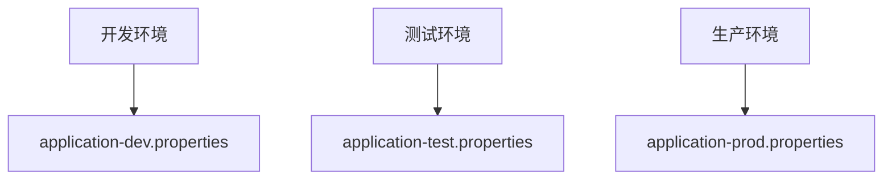

# Nacos多环境配置

在现代软件开发中，应用程序通常需要在多个环境中运行，例如开发环境、测试环境和生产环境。每个环境可能需要不同的配置，例如数据库连接、API密钥或其他服务地址。Nacos配置中心提供了一种灵活的方式来管理这些多环境配置，确保配置的隔离与一致性。

## 什么是Nacos多环境配置？

Nacos多环境配置是指在Nacos配置中心中，为不同的环境（如开发、测试、生产）分别存储和管理配置。通过这种方式，开发团队可以在不同的环境中使用不同的配置，而无需修改代码或手动切换配置文件。

## 为什么需要多环境配置？

1. **环境隔离**：确保开发、测试和生产环境的配置不会相互干扰。
2. **一致性**：通过集中管理配置，确保所有环境中的配置保持一致。
3. **灵活性**：可以轻松地在不同环境之间切换配置，而无需修改代码。

## 如何在Nacos中实现多环境配置？

### 1. 创建命名空间（Namespace）

Nacos通过命名空间来实现多环境配置的隔离。每个命名空间可以代表一个环境，例如 `dev`、`test` 和 `prod`。

```bash
# 创建命名空间
curl -X POST 'http://localhost:8848/nacos/v1/console/namespaces' \
-H 'Content-Type: application/x-www-form-urlencoded' \
-d 'customNamespaceId=dev&namespaceName=开发环境'
```

### 2. 在命名空间中创建配置

在每个命名空间中，你可以为不同的环境创建配置。例如，在 `dev` 命名空间中创建一个名为 `application-dev.properties` 的配置文件。

```properties
# application-dev.properties
database.url=jdbc:mysql://localhost:3306/dev_db
database.username=dev_user
database.password=dev_password
```

### 3. 在应用程序中指定命名空间

在应用程序中，你可以通过指定命名空间来加载对应环境的配置。例如，在Spring Boot应用中，可以通过以下方式指定命名空间：

```yaml
# application.yml
spring:
  cloud:
    nacos:
      config:
        server-addr: localhost:8848
        namespace: dev
        file-extension: properties
```

### 4. 动态切换环境配置

通过修改 `namespace` 的值，你可以轻松地在不同环境之间切换配置。例如，将 `namespace` 从 `dev` 改为 `prod`，应用程序将自动加载生产环境的配置。

## 实际案例

假设你正在开发一个电商平台，该平台需要在开发、测试和生产环境中运行。每个环境的数据库连接信息不同：

- **开发环境**：使用本地数据库
- **测试环境**：使用测试服务器上的数据库
- **生产环境**：使用生产服务器上的数据库

通过在Nacos中为每个环境创建不同的命名空间和配置文件，你可以确保每个环境使用正确的数据库连接信息。



## 总结

Nacos多环境配置提供了一种高效的方式来管理不同环境中的配置。通过使用命名空间，你可以轻松地在开发、测试和生产环境之间切换配置，确保配置的隔离与一致性。

:::tip
在实际项目中，建议将命名空间与CI/CD流水线结合使用，以便在部署时自动加载对应环境的配置。
:::

## 附加资源

- [Nacos官方文档](https://nacos.io/zh-cn/docs/what-is-nacos.html)
- [Spring Cloud Alibaba Nacos Config](https://spring-cloud-alibaba-group.github.io/github-pages/hoxton/en-us/index.html#_spring_cloud_alibaba_nacos_config)

## 练习

1. 在Nacos中创建一个新的命名空间 `uat`，并为其添加一个配置文件 `application-uat.properties`。
2. 修改你的Spring Boot应用程序，使其加载 `uat` 命名空间中的配置。
3. 尝试在不同的环境中切换配置，并验证配置是否正确加载。