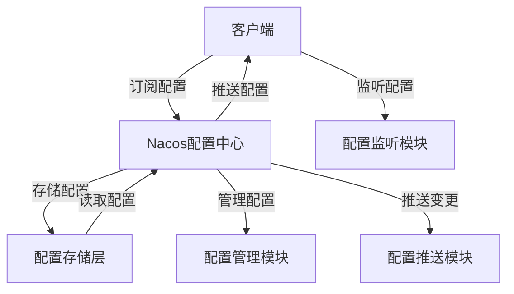

# Nacos配置中心架构

Nacos（Naming and Configuration Service）是一个动态服务发现、配置管理和服务管理平台。它支持多种配置格式（如Properties、YAML、JSON等），并提供了高可用性和动态配置更新的能力。本文将深入探讨Nacos配置中心的架构，帮助你理解其核心组件和工作原理。

## 什么是Nacos配置中心？

Nacos配置中心是Nacos的核心功能之一，用于集中管理应用程序的配置。它允许开发者在运行时动态更新配置，而无需重启应用。通过Nacos配置中心，你可以轻松实现配置的版本管理、灰度发布和环境隔离。

## Nacos配置中心的核心架构

Nacos配置中心的架构主要由以下几个核心组件组成：

1. **配置存储层**：负责存储配置数据，支持多种存储方式（如MySQL、本地文件等）。
2. **配置管理模块**：提供配置的增删改查、版本管理、灰度发布等功能。
3. **配置推送模块**：负责将配置变更推送到客户端，支持长轮询和HTTP长连接。
4. **配置监听模块**：客户端通过监听配置的变化，实时获取最新的配置。



### 配置存储层

配置存储层是Nacos配置中心的基础，负责持久化配置数据。Nacos支持多种存储方式，默认使用本地文件存储，但在生产环境中建议使用MySQL等关系型数据库。

### 配置管理模块

配置管理模块提供了配置的增删改查功能。通过Nacos控制台或API，开发者可以轻松管理配置。此外，Nacos还支持配置的版本管理和灰度发布，确保配置变更的安全性。

### 配置推送模块

配置推送模块是Nacos配置中心的核心功能之一。当配置发生变化时，Nacos会通过长轮询或HTTP长连接将变更推送给订阅该配置的客户端。这种方式确保了配置的实时性和高效性。

### 配置监听模块

客户端通过配置监听模块实时获取配置变更。Nacos提供了多种监听方式，如Java SDK、Spring Cloud集成等。开发者可以根据需求选择合适的监听方式。

## 实际应用场景

### 场景1：动态配置更新

假设你有一个微服务应用，需要在运行时动态更新数据库连接信息。通过Nacos配置中心，你可以在不重启应用的情况下更新配置。

```java
// 示例：使用Nacos Java SDK监听配置变更
ConfigService configService = NacosFactory.createConfigService("127.0.0.1:8848");
configService.addListener("dataSourceConfig", "DEFAULT_GROUP", new Listener() {
    @Override
    public void receiveConfigInfo(String configInfo) {
        // 处理配置变更
        System.out.println("配置已更新：" + configInfo);
    }
});
```

### 场景2：灰度发布

在灰度发布场景中，你可以通过Nacos配置中心将新配置推送给部分用户，验证新配置的稳定性后再全量发布。

```yaml
# 示例：灰度发布配置
feature:
  newFeature: true
  targetUsers: [user1, user2]
```

## 总结

Nacos配置中心通过其强大的配置管理、推送和监听功能，为开发者提供了高效、灵活的配置管理解决方案。无论是动态配置更新还是灰度发布，Nacos都能满足你的需求。

## 附加资源

- [Nacos官方文档](https://nacos.io/zh-cn/docs/what-is-nacos.html)
- [Nacos GitHub仓库](https://github.com/alibaba/nacos)
- [Spring Cloud Alibaba Nacos配置中心](https://spring-cloud-alibaba-group.github.io/github-pages/hoxton/en-us/index.html#_spring_cloud_alibaba_nacos_config)

## 练习

1. 使用Nacos配置中心管理一个简单的Spring Boot应用的配置。
2. 尝试在Nacos中实现灰度发布功能，观察配置变更的效果。

通过本文的学习，你应该对Nacos配置中心的架构有了初步的了解。希望你能在实际项目中灵活运用这些知识，提升应用的配置管理能力。