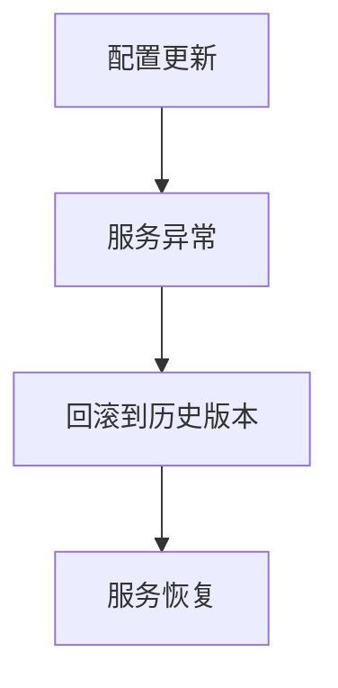
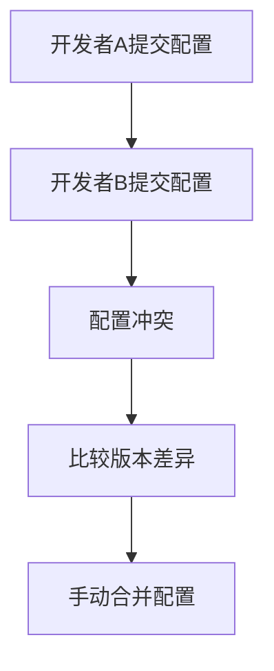

# Nacos配置版本管理

在微服务架构中，配置管理是一个至关重要的环节。Nacos作为一个动态服务发现、配置管理和服务管理平台，提供了强大的配置管理功能。其中，**配置版本管理**是Nacos配置中心的核心功能之一，它允许开发者对配置的历史版本进行管理、回滚以及解决配置冲突。

本文将详细介绍Nacos配置版本管理的概念、使用方法以及实际应用场景，帮助初学者快速掌握这一功能。

## 什么是配置版本管理？

配置版本管理是指对配置文件的历史版本进行记录、存储和管理的过程。在Nacos中，每次对配置进行修改时，系统都会自动生成一个新的版本，并保留旧版本的配置。这样，开发者可以随时查看历史配置、回滚到某个特定版本，或者比较不同版本之间的差异。

配置版本管理的主要功能包括：
- **版本记录**：每次配置修改都会生成一个新的版本。
- **版本回滚**：可以将配置回滚到任意历史版本。
- **版本比较**：可以比较不同版本之间的差异。
- **冲突解决**：当多个开发者同时修改配置时，可以通过版本管理解决冲突。

## 如何使用Nacos配置版本管理？

### 1. 查看配置历史版本

在Nacos控制台中，选择某个配置项后，点击“历史版本”按钮，即可查看该配置的所有历史版本。每个版本都会显示修改时间、修改人以及具体的配置内容。

```bash
# 示例：查看配置历史版本
1. 进入Nacos控制台。
2. 选择需要查看的配置项。
3. 点击“历史版本”按钮。
```

### 2. 回滚到历史版本

如果发现当前配置存在问题，可以通过回滚功能将配置恢复到某个历史版本。

```bash
# 示例：回滚到历史版本
1. 进入Nacos控制台。
2. 选择需要回滚的配置项。
3. 点击“历史版本”按钮。
4. 选择需要回滚的版本，点击“回滚”按钮。
```

### 3. 比较配置版本差异

在Nacos中，可以比较任意两个版本之间的差异，帮助开发者快速定位配置变更。

```bash
# 示例：比较配置版本差异
1. 进入Nacos控制台。
2. 选择需要比较的配置项。
3. 点击“历史版本”按钮。
4. 选择两个版本，点击“比较”按钮。
```

### 4. 解决配置冲突

当多个开发者同时修改同一个配置时，可能会产生冲突。Nacos的配置版本管理功能可以帮助开发者解决这些冲突。

```bash
# 示例：解决配置冲突
1. 进入Nacos控制台。
2. 选择存在冲突的配置项。
3. 查看历史版本，找到冲突的版本。
4. 手动合并配置内容，解决冲突。
```

## 实际应用场景

### 场景1：配置回滚

假设某个微服务的配置在更新后出现了问题，导致服务无法正常运行。此时，可以通过Nacos的配置版本管理功能，快速回滚到上一个稳定的配置版本，恢复服务的正常运行。



### 场景2：配置比较

在团队协作开发中，多个开发者可能会同时修改同一个配置文件。通过Nacos的配置版本比较功能，可以快速查看不同开发者提交的配置差异，避免配置冲突。



## 总结

Nacos的配置版本管理功能为微服务架构中的配置管理提供了强大的支持。通过版本记录、回滚、比较和冲突解决等功能，开发者可以更加高效地管理配置，确保系统的稳定性和可靠性。

### 附加资源

- [Nacos官方文档](https://nacos.io/zh-cn/docs/what-is-nacos.html)
- [Nacos配置管理最佳实践](https://nacos.io/zh-cn/docs/quick-start.html)

### 练习

1. 在Nacos控制台中创建一个新的配置项，并尝试修改几次，查看历史版本。
2. 模拟配置冲突场景，尝试使用Nacos的版本管理功能解决冲突。
3. 比较两个不同版本的配置，记录它们之间的差异。

通过以上练习，你将更加熟悉Nacos的配置版本管理功能，并能够在实际项目中灵活运用。