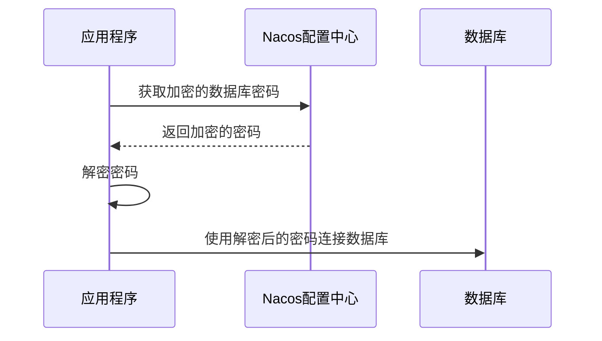

# Nacos配置加密解密

在现代微服务架构中，配置中心扮演着至关重要的角色。Nacos作为一款流行的配置中心，不仅支持配置的动态管理，还提供了配置加密解密的功能，以确保敏感信息（如数据库密码、API密钥等）的安全性。本文将详细介绍如何在Nacos中实现配置的加密与解密，并通过实际案例帮助初学者理解这一概念。

## 什么是配置加密解密？

配置加密解密是指在配置中心中存储敏感信息时，对这些信息进行加密处理，以防止未经授权的访问。当应用程序需要使用这些配置时，再对其进行解密。这种方式可以有效保护敏感数据，避免泄露风险。

## Nacos中的配置加密解密

Nacos本身并不直接提供加密解密的功能，但可以通过集成第三方加密工具或自定义加密算法来实现。常见的做法是使用对称加密算法（如AES）或非对称加密算法（如RSA）对配置进行加密。

### 1. 使用AES对称加密

AES（高级加密标准）是一种对称加密算法，加密和解密使用相同的密钥。以下是一个简单的AES加密解密的示例：

```java
import javax.crypto.Cipher;
import javax.crypto.spec.SecretKeySpec;
import java.util.Base64;

public class AESUtil {
    private static final String ALGORITHM = "AES";
    private static final String KEY = "mysecretkey12345"; // 16字节的密钥

    public static String encrypt(String value) throws Exception {
        SecretKeySpec secretKey = new SecretKeySpec(KEY.getBytes(), ALGORITHM);
        Cipher cipher = Cipher.getInstance(ALGORITHM);
        cipher.init(Cipher.ENCRYPT_MODE, secretKey);
        byte[] encryptedValue = cipher.doFinal(value.getBytes());
        return Base64.getEncoder().encodeToString(encryptedValue);
    }

    public static String decrypt(String encryptedValue) throws Exception {
        SecretKeySpec secretKey = new SecretKeySpec(KEY.getBytes(), ALGORITHM);
        Cipher cipher = Cipher.getInstance(ALGORITHM);
        cipher.init(Cipher.DECRYPT_MODE, secretKey);
        byte[] decryptedValue = cipher.doFinal(Base64.getDecoder().decode(encryptedValue));
        return new String(decryptedValue);
    }
}
```

### 2. 在Nacos中存储加密配置

假设我们有一个数据库密码需要加密存储，可以使用上述AES工具类对其进行加密，然后将加密后的字符串存储在Nacos中。

```java
String originalPassword = "myDatabasePassword";
String encryptedPassword = AESUtil.encrypt(originalPassword);
// 将encryptedPassword存储在Nacos中
```

### 3. 在应用程序中解密配置

当应用程序从Nacos中获取到加密的配置后，可以使用相同的密钥对其进行解密。

```java
String encryptedPassword = // 从Nacos中获取的加密密码
String decryptedPassword = AESUtil.decrypt(encryptedPassword);
// 使用decryptedPassword连接数据库
```

## 实际应用场景

### 场景：数据库密码加密

在一个微服务架构中，数据库密码通常存储在配置中心中。为了确保密码的安全性，可以使用AES加密算法对密码进行加密，并将加密后的密码存储在Nacos中。当应用程序启动时，从Nacos中获取加密的密码并解密，然后使用解密后的密码连接数据库。



## 总结

通过本文的学习，你应该已经了解了如何在Nacos中实现配置的加密与解密。配置加密是保护敏感信息的重要手段，尤其是在微服务架构中，确保配置的安全性至关重要。通过使用对称加密算法（如AES），你可以轻松地在Nacos中存储加密的配置，并在应用程序中解密使用。

## 附加资源与练习

- **练习**：尝试使用RSA非对称加密算法实现配置的加密与解密，并比较其与AES的优缺点。
- **资源**：阅读Nacos官方文档，了解更多关于配置管理的功能与最佳实践。

:::tip
在实际生产环境中，建议将加密密钥存储在安全的密钥管理服务（如AWS KMS、HashiCorp Vault）中，而不是硬编码在代码中。
:::