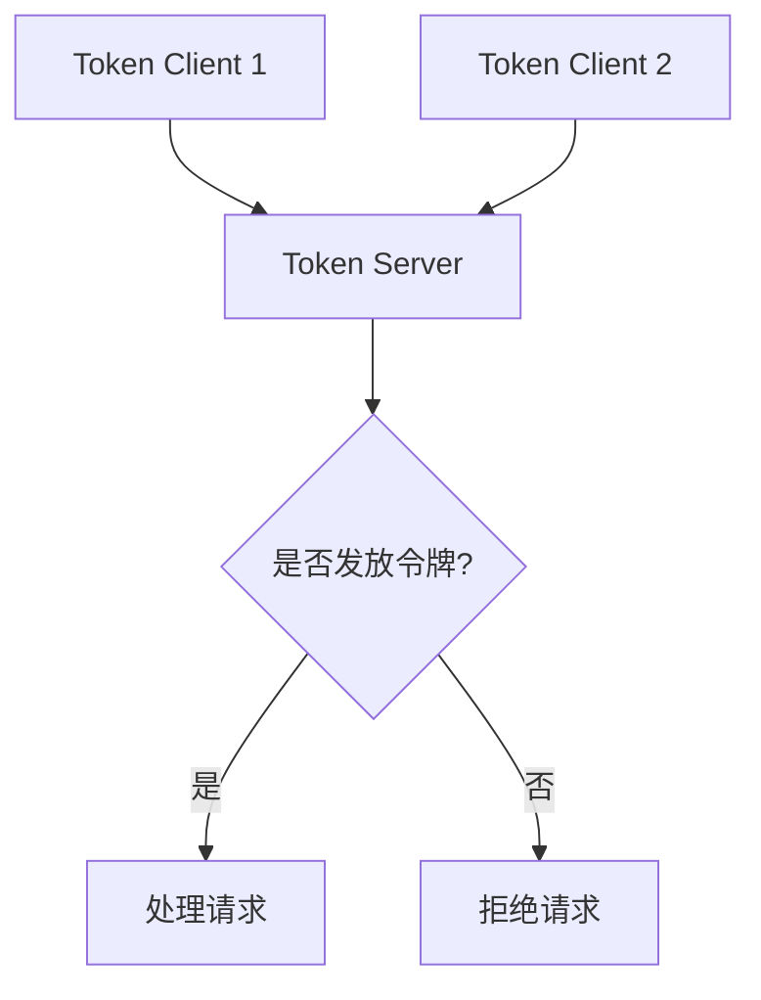

# Sentinel集群流控

## 介绍

Sentinel是阿里巴巴开源的一款流量控制、熔断降级的工具，广泛应用于微服务架构中。在分布式系统中，单个服务的流量控制可能无法满足全局的需求，因此Sentinel提供了**集群流控**功能，允许在多个实例之间共享流量控制的状态，从而实现全局的流量控制。

集群流控的核心思想是将流量控制的状态集中管理，而不是分散在各个实例中。通过这种方式，可以更精确地控制整个集群的流量，避免单个实例的过载或资源浪费。

## 集群流控的工作原理

Sentinel的集群流控依赖于一个**Token Server**，它负责管理整个集群的流量控制状态。每个实例（Token Client）在需要处理请求时，会向Token Server申请令牌（Token）。Token Server根据当前的流量控制规则决定是否发放令牌。



### 关键组件

1. **Token Server**：负责管理集群的流量控制状态，决定是否发放令牌。
2. **Token Client**：每个服务实例都是一个Token Client，负责向Token Server申请令牌。
3. **规则配置**：定义流量控制的规则，如QPS（每秒查询数）、线程数等。

## 配置集群流控

### 1. 启动Token Server

首先，你需要启动一个Token Server。可以通过以下代码启动一个简单的Token Server：

```java
ClusterTokenServer tokenServer = new SentinelDefaultTokenServer();
tokenServer.start();
```

### 2. 配置Token Client

在每个服务实例中，配置Token Client以连接到Token Server：

```java
ClusterFlowConfig clusterFlowConfig = new ClusterFlowConfig()
    .setFlowId(1)  // 规则ID
    .setThresholdType(1)  // 阈值类型，1表示QPS
    .setFallbackToLocalWhenFail(true);  // 当Token Server不可用时，是否回退到本地流控

FlowRule rule = new FlowRule()
    .setResource("cluster-resource")
    .setClusterMode(true)
    .setClusterConfig(clusterFlowConfig);

FlowRuleManager.loadRules(Collections.singletonList(rule));
```

### 3. 定义流量控制规则

在Token Server中定义流量控制规则：

```java
ClusterRuleManager.loadRules(Collections.singletonList(
    new ClusterFlowRule("cluster-resource")
        .setThreshold(100)  // 允许的最大QPS
        .setStrategy(ClusterFlowRuleManager.STRATEGY_DIRECT)  // 直接模式
));
```

## 实际应用场景

### 场景1：电商秒杀活动

在电商平台的秒杀活动中，某个商品的访问量可能会瞬间激增。通过集群流控，可以确保整个集群的QPS不超过设定的阈值，从而避免系统崩溃。

### 场景2：API网关限流

在微服务架构中，API网关通常需要处理大量的请求。通过集群流控，可以在多个网关实例之间共享流量控制状态，确保整个系统的稳定性。

## 总结

Sentinel的集群流控功能为分布式系统提供了强大的流量控制能力。通过集中管理流量控制状态，可以更精确地控制整个集群的流量，避免单个实例的过载或资源浪费。

## 附加资源

- [Sentinel官方文档](https://sentinelguard.io/)
- [Sentinel GitHub仓库](https://github.com/alibaba/Sentinel)

## 练习

1. 尝试在你的本地环境中配置一个简单的Sentinel集群流控，并测试其效果。
2. 修改流量控制规则，观察系统在不同阈值下的表现。

:::tip
在实际生产环境中，建议将Token Server部署为高可用集群，以避免单点故障。
:::