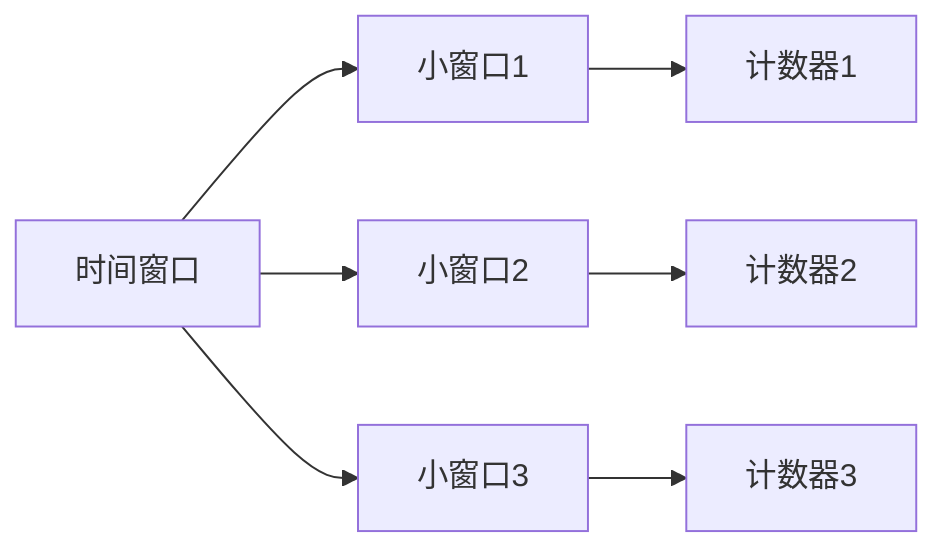
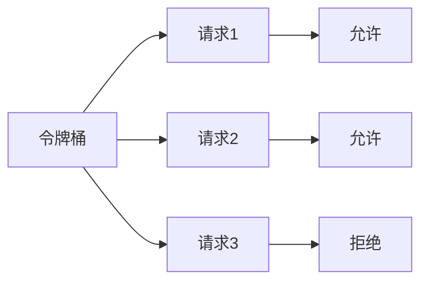
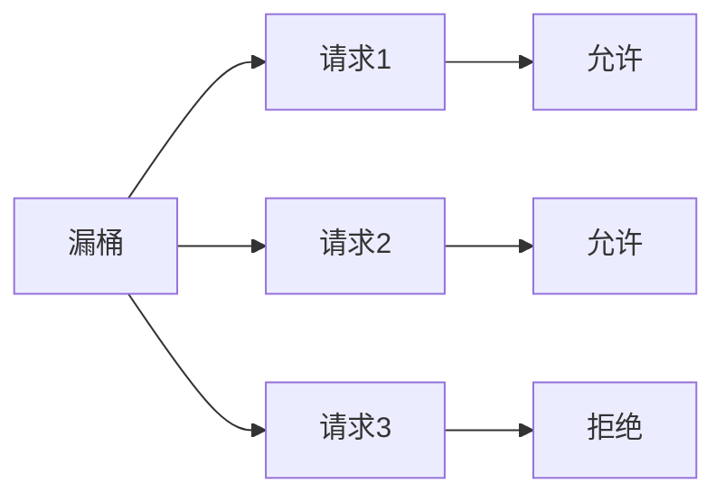

# Sentinel限流算法详解

Sentinel是阿里巴巴开源的一款轻量级流量控制框架，广泛应用于微服务架构中。限流是Sentinel的核心功能之一，用于保护系统免受突发流量的冲击。本文将详细介绍Sentinel中的限流算法，帮助初学者理解其工作原理和实现方式。

## 什么是限流？

限流（Rate Limiting）是一种通过限制单位时间内请求的数量，来保护系统免受过多请求冲击的技术。当系统接收到超过其处理能力的请求时，限流机制会拒绝部分请求，确保系统能够稳定运行。

## Sentinel限流算法

Sentinel提供了多种限流算法，包括：

1. **计数器算法**
2. **滑动窗口算法**
3. **令牌桶算法**
4. **漏桶算法**

### 1. 计数器算法

计数器算法是最简单的限流算法之一。它通过维护一个计数器，记录单位时间内的请求数量。当请求数量超过设定的阈值时，新的请求将被拒绝。

```java
public class CounterRateLimiter {
    private int count = 0;
    private final int limit;
    private final long interval;
    private long lastResetTime = System.currentTimeMillis();

    public CounterRateLimiter(int limit, long interval) {
        this.limit = limit;
        this.interval = interval;
    }

    public synchronized boolean tryAcquire() {
        long now = System.currentTimeMillis();
        if (now - lastResetTime > interval) {
            count = 0;
            lastResetTime = now;
        }
        if (count < limit) {
            count++;
            return true;
        }
        return false;
    }
}
```

**输入：**
- `limit`: 单位时间内允许的最大请求数。
- `interval`: 时间间隔（毫秒）。

**输出：**
- `true`: 请求被允许。
- `false`: 请求被拒绝。

### 2. 滑动窗口算法

滑动窗口算法是对计数器算法的改进。它将时间窗口划分为多个小窗口，每个小窗口维护一个计数器。通过滑动窗口的方式，可以更精确地控制单位时间内的请求数量。



```java
public class SlidingWindowRateLimiter {
    private final int limit;
    private final long interval;
    private final int windowCount;
    private final long[] counters;
    private long lastResetTime = System.currentTimeMillis();

    public SlidingWindowRateLimiter(int limit, long interval, int windowCount) {
        this.limit = limit;
        this.interval = interval;
        this.windowCount = windowCount;
        this.counters = new long[windowCount];
    }

    public synchronized boolean tryAcquire() {
        long now = System.currentTimeMillis();
        long elapsed = now - lastResetTime;
        if (elapsed > interval) {
            Arrays.fill(counters, 0);
            lastResetTime = now;
        }
        int index = (int) ((elapsed % interval) / (interval / windowCount));
        if (counters[index] < limit / windowCount) {
            counters[index]++;
            return true;
        }
        return false;
    }
}
```

**输入：**
- `limit`: 单位时间内允许的最大请求数。
- `interval`: 时间间隔（毫秒）。
- `windowCount`: 小窗口的数量。

**输出：**
- `true`: 请求被允许。
- `false`: 请求被拒绝。

### 3. 令牌桶算法

令牌桶算法通过维护一个令牌桶，以固定的速率向桶中添加令牌。当请求到达时，如果桶中有足够的令牌，则允许请求通过，并消耗相应数量的令牌；否则，请求被拒绝。



```java
public class TokenBucketRateLimiter {
    private final int capacity;
    private final double rate;
    private double tokens;
    private long lastRefillTime = System.currentTimeMillis();

    public TokenBucketRateLimiter(int capacity, double rate) {
        this.capacity = capacity;
        this.rate = rate;
        this.tokens = capacity;
    }

    public synchronized boolean tryAcquire(int tokensRequired) {
        refill();
        if (tokens >= tokensRequired) {
            tokens -= tokensRequired;
            return true;
        }
        return false;
    }

    private void refill() {
        long now = System.currentTimeMillis();
        double elapsed = (now - lastRefillTime) / 1000.0;
        tokens = Math.min(capacity, tokens + elapsed * rate);
        lastRefillTime = now;
    }
}
```

**输入：**
- `capacity`: 令牌桶的容量。
- `rate`: 令牌生成速率（令牌/秒）。
- `tokensRequired`: 请求所需的令牌数量。

**输出：**
- `true`: 请求被允许。
- `false`: 请求被拒绝。

### 4. 漏桶算法

漏桶算法通过维护一个漏桶，以固定的速率处理请求。当请求到达时，如果桶未满，则允许请求通过；否则，请求被拒绝。



```java
public class LeakyBucketRateLimiter {
    private final int capacity;
    private final double rate;
    private double water;
    private long lastLeakTime = System.currentTimeMillis();

    public LeakyBucketRateLimiter(int capacity, double rate) {
        this.capacity = capacity;
        this.rate = rate;
        this.water = 0;
    }

    public synchronized boolean tryAcquire() {
        leak();
        if (water < capacity) {
            water++;
            return true;
        }
        return false;
    }

    private void leak() {
        long now = System.currentTimeMillis();
        double elapsed = (now - lastLeakTime) / 1000.0;
        water = Math.max(0, water - elapsed * rate);
        lastLeakTime = now;
    }
}
```

**输入：**
- `capacity`: 漏桶的容量。
- `rate`: 漏桶的漏水速率（请求/秒）。

**输出：**
- `true`: 请求被允许。
- `false`: 请求被拒绝。

## 实际应用场景

### 场景1：API限流

假设你有一个API服务，每秒最多只能处理100个请求。你可以使用Sentinel的限流功能来保护API服务，防止突发流量导致系统崩溃。

```java
public class ApiRateLimiter {
    private final RateLimiter rateLimiter;

    public ApiRateLimiter(int limit, long interval) {
        this.rateLimiter = new CounterRateLimiter(limit, interval);
    }

    public boolean tryAccess() {
        return rateLimiter.tryAcquire();
    }
}
```

### 场景2：微服务调用限流

在微服务架构中，服务之间的调用可能会因为某个服务的故障而导致雪崩效应。通过使用Sentinel的限流功能，可以限制每个服务的调用频率，避免系统过载。

```java
public class ServiceRateLimiter {
    private final RateLimiter rateLimiter;

    public ServiceRateLimiter(int limit, long interval) {
        this.rateLimiter = new TokenBucketRateLimiter(limit, interval);
    }

    public boolean tryInvoke() {
        return rateLimiter.tryAcquire(1);
    }
}
```

## 总结

Sentinel提供了多种限流算法，每种算法都有其适用的场景。通过合理使用这些算法，可以有效保护系统免受突发流量的冲击，确保系统的稳定性和可靠性。

:::tip
建议初学者在实际项目中尝试使用Sentinel的限流功能，并结合实际需求选择合适的限流算法。
:::

## 附加资源

- [Sentinel官方文档](https://sentinelguard.io/)
- [微服务限流策略](https://microservices.io/patterns/reliability/throttling.html)
- [限流算法详解](https://en.wikipedia.org/wiki/Rate_limiting)

## 练习

1. 实现一个基于滑动窗口算法的限流器，并测试其性能。
2. 比较令牌桶算法和漏桶算法的优缺点，并给出适用场景。
3. 在实际项目中集成Sentinel，并配置限流规则，观察系统行为。