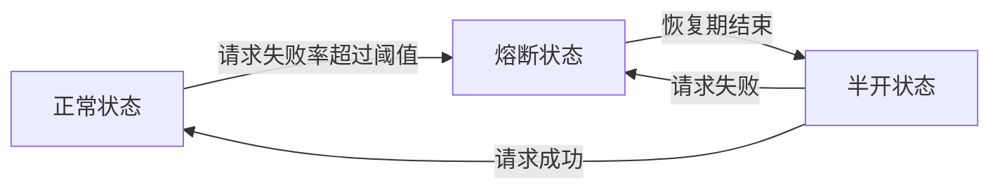

# Sentinel熔断降级

在现代分布式系统中，服务之间的依赖关系非常复杂。当某个服务出现故障或响应时间过长时，可能会导致整个系统的雪崩效应。为了避免这种情况，Sentinel 提供了**熔断降级**机制，用于在系统出现异常时快速失败，保护系统的稳定性。

## 什么是熔断降级？

熔断降级是一种保护机制，当某个资源的请求失败率或响应时间超过预设阈值时，Sentinel 会自动触发熔断，暂时停止对该资源的访问。熔断期间，所有请求都会被快速失败，避免系统资源被耗尽。经过一段时间后，Sentinel 会尝试恢复对该资源的访问，如果恢复正常，则关闭熔断；否则，继续熔断。

熔断降级的核心思想是**快速失败**，避免因某个服务的故障导致整个系统的崩溃。

## 熔断降级的工作原理

Sentinel 的熔断降级机制基于以下三个核心指标：

1. **慢调用比例（Slow Ratio）**：当资源的响应时间超过预设的慢调用阈值时，Sentinel 会统计慢调用的比例。
2. **异常比例（Error Ratio）**：当资源的请求失败率（如抛出异常）超过预设的异常比例阈值时，Sentinel 会触发熔断。
3. **异常数（Error Count）**：当资源的请求失败次数超过预设的异常数阈值时，Sentinel 会触发熔断。

当上述任一指标超过阈值时，Sentinel 会触发熔断，并在熔断期间拒绝所有请求。经过一段时间的恢复期后，Sentinel 会尝试恢复对该资源的访问。

## 熔断降级的配置

在 Sentinel 中，可以通过以下方式配置熔断降级规则：

```java
// 创建熔断降级规则
DegradeRule rule = new DegradeRule("resourceName")
    .setGrade(RuleConstant.DEGRADE_GRADE_EXCEPTION_COUNT) // 基于异常数
    .setCount(10) // 异常数阈值
    .setTimeWindow(10); // 熔断恢复时间窗口（秒）

// 加载规则
DegradeRuleManager.loadRules(Collections.singletonList(rule));
```

在上述代码中，我们创建了一个基于异常数的熔断降级规则。当资源的请求失败次数超过 10 次时，Sentinel 会触发熔断，并在 10 秒后尝试恢复。

## 实际案例

假设我们有一个用户服务，该服务依赖于一个第三方支付服务。当支付服务出现故障时，用户服务的请求会失败。为了避免用户服务因支付服务的故障而崩溃，我们可以为支付服务配置熔断降级规则。

```java
// 配置支付服务的熔断降级规则
DegradeRule paymentRule = new DegradeRule("paymentService")
    .setGrade(RuleConstant.DEGRADE_GRADE_EXCEPTION_RATIO) // 基于异常比例
    .setCount(0.5) // 异常比例阈值（50%）
    .setTimeWindow(10); // 熔断恢复时间窗口（秒）

DegradeRuleManager.loadRules(Collections.singletonList(paymentRule));
```

在上述案例中，当支付服务的请求失败率超过 50% 时，Sentinel 会触发熔断，并在 10 秒后尝试恢复。

## 熔断降级的恢复机制

Sentinel 的熔断降级机制支持**半开状态**。在熔断期间，Sentinel 会定期尝试恢复对资源的访问。如果恢复成功，则关闭熔断；否则，继续熔断。



## 总结

Sentinel 的熔断降级机制是保护系统稳定性的重要工具。通过配置熔断降级规则，我们可以在系统出现异常时快速失败，避免雪崩效应。熔断降级的核心思想是**快速失败**，并通过**半开状态**实现自动恢复。

## 附加资源

- [Sentinel 官方文档](https://sentinelguard.io/zh-cn/docs/introduction.html)
- [Sentinel GitHub 仓库](https://github.com/alibaba/Sentinel)

## 练习

1. 尝试为你的项目中的某个服务配置熔断降级规则，并测试其效果。
2. 修改熔断降级规则中的阈值和恢复时间窗口，观察系统的行为变化。