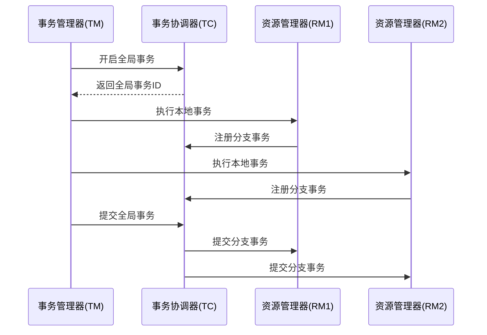

# Seata分布式事务概述

在现代分布式系统中，事务管理是一个复杂且关键的问题。随着微服务架构的普及，传统的单机事务管理机制已无法满足跨服务、跨数据库的事务需求。**Seata**（Simple Extensible Autonomous Transaction Architecture）是一款开源的分布式事务解决方案，旨在简化分布式事务的管理，确保数据一致性。

## 什么是分布式事务？

分布式事务是指跨越多个服务或数据库的事务操作。在微服务架构中，一个业务操作可能涉及多个服务，每个服务都有自己的数据库。为了保证数据的一致性，这些服务需要协同工作，确保所有操作要么全部成功，要么全部失败。

例如，一个电商系统中的下单操作可能涉及以下步骤：
1. 用户服务：扣减用户余额。
2. 库存服务：扣减商品库存。
3. 订单服务：创建订单。

如果其中任何一个步骤失败，整个操作需要回滚，否则会导致数据不一致。

## Seata的核心概念

Seata通过以下核心组件实现分布式事务管理：

1. **TC（Transaction Coordinator）**：事务协调器，负责全局事务的提交或回滚。
2. **TM（Transaction Manager）**：事务管理器，负责开启、提交或回滚全局事务。
3. **RM（Resource Manager）**：资源管理器，负责管理本地事务资源（如数据库连接）。

### Seata的工作模式

Seata支持两种主要的事务模式：
1. **AT（Automatic Transaction）模式**：自动补偿模式，适用于大多数场景。Seata通过代理数据源自动记录事务日志，并在需要时进行补偿。
2. **TCC（Try-Confirm-Cancel）模式**：手动补偿模式，适用于需要更高灵活性和性能的场景。

## Seata的工作原理

以下是一个典型的Seata分布式事务流程：



1. **开启全局事务**：TM向TC发起全局事务请求，TC生成全局事务ID。
2. **执行本地事务**：TM调用各个服务的本地事务，RM向TC注册分支事务。
3. **提交全局事务**：TM向TC发起提交请求，TC协调所有分支事务提交或回滚。

## 实际应用场景

假设我们有一个电商系统，用户下单时需要调用用户服务、库存服务和订单服务。以下是使用Seata实现分布式事务的代码示例：

```java
// 用户服务
@GlobalTransactional
public void placeOrder(String userId, String productId, int quantity) {
    userService.deductBalance(userId, 100); // 扣减用户余额
    inventoryService.deductStock(productId, quantity); // 扣减库存
    orderService.createOrder(userId, productId, quantity); // 创建订单
}
```

在上述代码中，`@GlobalTransactional`注解用于标记一个全局事务。如果任何一个服务操作失败，Seata会自动回滚所有操作。

## 总结

Seata是一款强大的分布式事务解决方案，能够有效解决微服务架构中的事务一致性问题。通过理解Seata的核心概念和工作原理，开发者可以更好地设计和实现分布式系统。

### 附加资源
- [Seata官方文档](https://seata.io/zh-cn/docs/overview/what-is-seata.html)
- [分布式事务模式详解](https://dzone.com/articles/distributed-transactions-in-microservices)

### 练习
1. 尝试在本地搭建一个Seata环境，并实现一个简单的分布式事务场景。
2. 阅读Seata源码，理解其内部实现机制。
