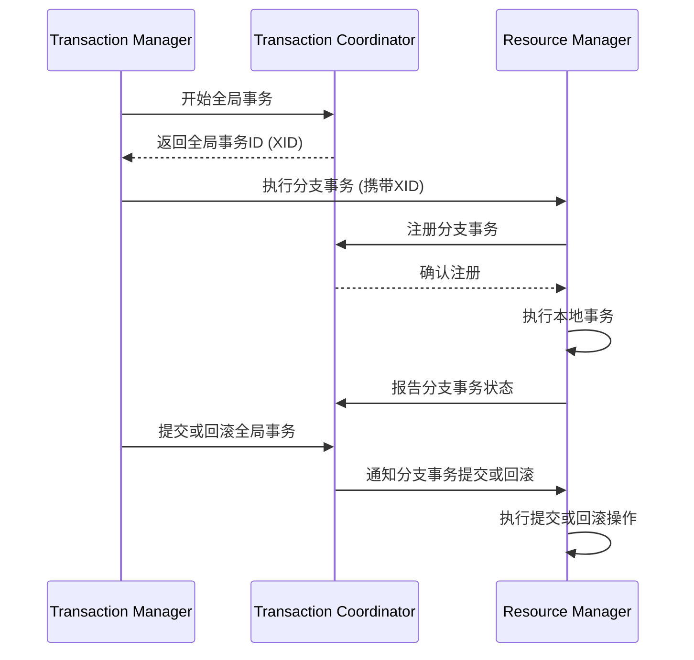

# Seata架构设计

Seata（Simple Extensible Autonomous Transaction Architecture）是一款开源的分布式事务解决方案，旨在解决微服务架构下的数据一致性问题。它通过提供高效的分布式事务管理，帮助开发者在复杂的微服务环境中实现事务的原子性、一致性、隔离性和持久性（ACID）。

## Seata的核心架构

Seata的架构设计主要由三个核心组件组成：**Transaction Coordinator (TC)**、**Transaction Manager (TM)** 和 **Resource Manager (RM)**。这些组件共同协作，确保分布式事务的正确执行。

### 1. Transaction Coordinator (TC)

TC是Seata的核心组件，负责全局事务的协调和管理。它维护全局事务的状态，并协调各个分支事务的提交或回滚。

### 2. Transaction Manager (TM)

TM是事务的发起者，负责定义全局事务的边界。它向TC发起全局事务的开始、提交或回滚请求。

### 3. Resource Manager (RM)

RM负责管理分支事务的资源，例如数据库连接。它与TC通信，报告分支事务的状态，并根据TC的指令执行提交或回滚操作。

## Seata的工作流程

Seata的工作流程可以分为以下几个步骤：

1. **全局事务开始**：TM向TC发起全局事务的开始请求，TC生成全局事务ID（XID）。
2. **分支事务注册**：RM向TC注册分支事务，并绑定到全局事务ID。
3. **分支事务执行**：RM执行本地事务，并将执行结果报告给TC。
4. **全局事务提交或回滚**：TM根据所有分支事务的执行结果，向TC发起全局事务的提交或回滚请求。
5. **分支事务提交或回滚**：TC通知所有RM执行分支事务的提交或回滚操作。



## 实际案例

假设我们有一个电商系统，用户下单时需要同时更新订单服务和库存服务。这两个服务分别运行在不同的微服务中，使用Seata可以确保这两个操作要么全部成功，要么全部失败。

### 代码示例

以下是一个简单的Java代码示例，展示了如何使用Seata管理分布式事务：

```java
@GlobalTransactional
public void placeOrder(Order order) {
    // 更新订单服务
    orderService.createOrder(order);
    
    // 更新库存服务
    inventoryService.deductStock(order.getProductId(), order.getQuantity());
}
```

在这个示例中，`@GlobalTransactional`注解标记了一个全局事务。如果`createOrder`或`deductStock`中的任何一个操作失败，Seata会自动回滚整个事务。

## 总结

Seata通过其核心组件TC、TM和RM，提供了一个高效的分布式事务解决方案。它的架构设计使得在微服务环境中实现数据一致性变得更加简单和可靠。通过实际案例和代码示例，我们可以看到Seata在实际应用中的强大功能。

## 附加资源

- [Seata官方文档](https://seata.io/zh-cn/docs/overview/what-is-seata.html)
- [Seata GitHub仓库](https://github.com/seata/seata)

## 练习

1. 尝试在本地环境中搭建一个简单的Seata示例项目，模拟一个分布式事务场景。
2. 修改代码，使得其中一个分支事务失败，观察Seata如何回滚整个事务。

:::tip
在学习Seata时，建议从简单的场景入手，逐步理解其核心组件和工作原理。通过实践，你将更好地掌握分布式事务的管理技巧。
:::