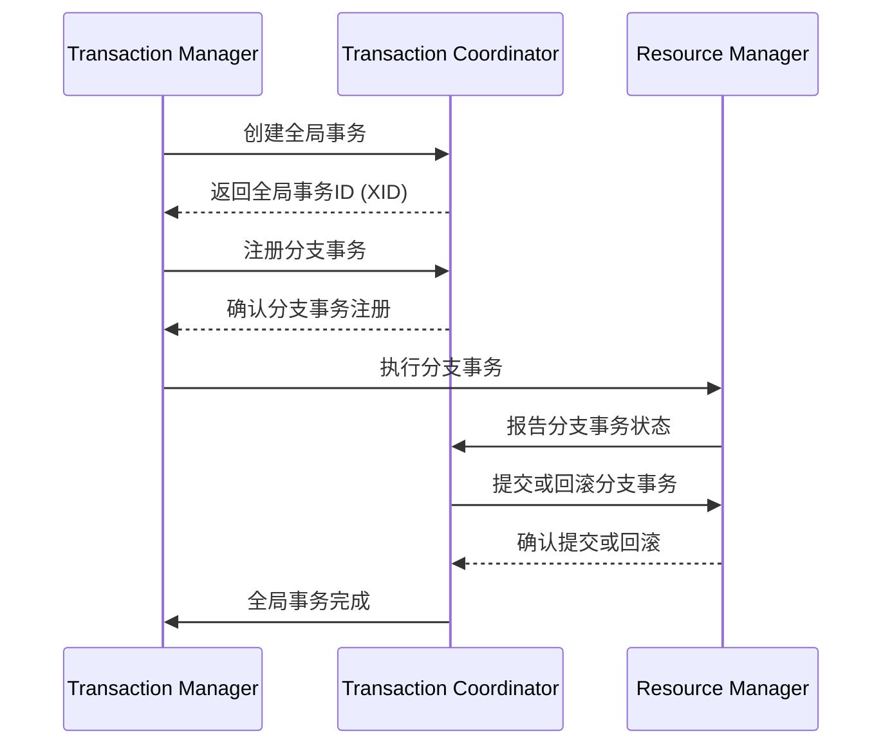

# Seata核心组件

Seata（Simple Extensible Autonomous Transaction Architecture）是一款开源的分布式事务解决方案，旨在解决微服务架构下的分布式事务问题。Seata通过其核心组件，提供了高效、可靠的分布式事务管理能力。本文将详细介绍Seata的核心组件及其工作原理。

## 1. 什么是Seata？

Seata是一个分布式事务框架，支持AT（自动补偿事务）、TCC（Try-Confirm-Cancel）、Saga和XA等多种事务模式。它通过协调多个微服务之间的本地事务，确保全局事务的一致性。

## 2. Seata的核心组件

Seata的核心组件包括以下几个部分：

### 2.1 Transaction Coordinator (TC)

事务协调器（TC）是Seata的核心组件之一，负责全局事务的管理和协调。TC的主要职责包括：

- **全局事务的创建和提交**：TC负责创建全局事务，并在所有分支事务完成后提交全局事务。
- **分支事务的注册和状态管理**：TC负责管理所有分支事务的状态，确保它们能够正确执行或回滚。

### 2.2 Transaction Manager (TM)

事务管理器（TM）是全局事务的发起者，负责定义全局事务的边界。TM的主要职责包括：

- **全局事务的开始和结束**：TM负责启动全局事务，并在所有分支事务完成后提交或回滚全局事务。
- **分支事务的注册**：TM负责将分支事务注册到TC中。

### 2.3 Resource Manager (RM)

资源管理器（RM）是分支事务的执行者，负责管理本地事务的执行。RM的主要职责包括：

- **分支事务的执行和提交**：RM负责执行本地事务，并将执行结果报告给TC。
- **分支事务的回滚**：如果全局事务需要回滚，RM负责回滚本地事务。

## 3. Seata的工作流程

Seata的工作流程可以分为以下几个步骤：

1. **全局事务的创建**：TM向TC发起全局事务的创建请求，TC生成全局事务ID（XID）。
2. **分支事务的注册**：TM将分支事务注册到TC中，TC记录分支事务的状态。
3. **分支事务的执行**：RM执行本地事务，并将执行结果报告给TC。
4. **全局事务的提交或回滚**：TC根据所有分支事务的执行结果，决定提交或回滚全局事务。



## 4. 实际案例

假设我们有一个电商系统，用户下单时需要同时扣减库存和创建订单。这两个操作分别由库存服务和订单服务处理，属于不同的微服务。我们可以使用Seata来确保这两个操作的原子性。

### 4.1 代码示例

以下是一个简单的代码示例，展示了如何使用Seata进行分布式事务管理。

```java
// 库存服务
@GlobalTransactional
public void reduceStock(String productId, int quantity) {
    // 扣减库存
    stockService.reduceStock(productId, quantity);
    // 创建订单
    orderService.createOrder(productId, quantity);
}

// 订单服务
public void createOrder(String productId, int quantity) {
    // 创建订单
    orderDao.createOrder(productId, quantity);
}
```

### 4.2 输入和输出

- **输入**：用户下单请求，包含商品ID和数量。
- **输出**：库存扣减成功且订单创建成功，或者库存扣减失败且订单创建失败。

## 5. 总结

Seata通过其核心组件（TC、TM、RM）提供了强大的分布式事务管理能力，能够有效解决微服务架构下的分布式事务问题。通过本文的介绍，你应该对Seata的核心组件及其工作原理有了初步的了解。

## 6. 附加资源

- [Seata官方文档](https://seata.io/zh-cn/docs/overview/what-is-seata.html)
- [Seata GitHub仓库](https://github.com/seata/seata)

## 7. 练习

1. 尝试在自己的项目中集成Seata，并实现一个简单的分布式事务场景。
2. 阅读Seata的源码，深入了解其内部实现机制。

:::tip
如果你在集成Seata时遇到问题，可以参考官方文档或社区论坛，寻求帮助。
:::