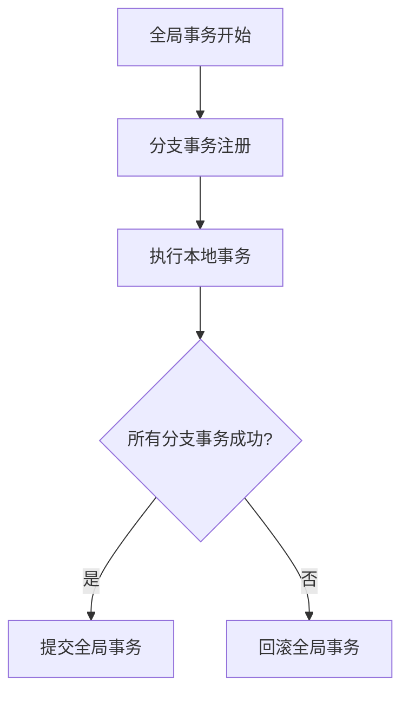

# Seata事务模式：AT模式

Seata（Simple Extensible Autonomous Transaction Architecture）是一个开源的分布式事务解决方案，旨在简化分布式事务的管理。Seata提供了多种事务模式，其中**AT模式（Automatic Transaction Mode）**是最常用的一种。本文将详细介绍AT模式的工作原理、实现方式以及实际应用场景。

---

## 什么是AT模式？

AT模式是Seata中的一种分布式事务模式，全称为**自动补偿事务模式**。它基于两阶段提交（2PC）的思想，但通过自动生成反向SQL来实现事务的补偿操作，从而简化了开发者的工作量。

在AT模式下，Seata会自动记录事务执行前的数据快照（Before Image）和执行后的数据快照（After Image）。如果事务失败，Seata会根据这些快照自动生成反向SQL来回滚事务，确保数据的一致性。

---

## AT模式的工作原理

AT模式的核心思想是通过**全局事务**和**分支事务**的协作来实现分布式事务的一致性。以下是AT模式的工作流程：

1. **全局事务开始**：当一个分布式事务开始时，Seata会生成一个全局事务ID（XID），并将其传播到所有参与事务的服务中。
2. **分支事务注册**：每个参与事务的服务会向Seata服务器注册一个分支事务，并记录事务执行前的数据快照（Before Image）。
3. **执行本地事务**：每个服务执行自己的本地事务，并记录事务执行后的数据快照（After Image）。
4. **提交或回滚**：
   - 如果所有分支事务都成功，Seata会提交全局事务。
   - 如果有任何一个分支事务失败，Seata会根据Before Image生成反向SQL来回滚所有分支事务。

以下是一个简单的流程图，展示了AT模式的工作流程：



---

## AT模式的代码示例

以下是一个简单的代码示例，展示了如何在Spring Boot项目中使用Seata的AT模式。

### 1. 添加依赖

首先，在`pom.xml`中添加Seata的依赖：

```xml
<dependency>
    <groupId>io.seata</groupId>
    <artifactId>seata-spring-boot-starter</artifactId>
    <version>1.5.0</version>
</dependency>
```

### 2. 配置Seata

在`application.yml`中配置Seata：

```yaml
seata:
  enabled: true
  application-id: my-application
  tx-service-group: my_tx_group
  service:
    vgroup-mapping:
      my_tx_group: default
    grouplist:
      default: 127.0.0.1:8091
```

### 3. 使用`@GlobalTransactional`注解

在需要分布式事务的方法上添加`@GlobalTransactional`注解：

```java
@Service
public class OrderService {

    @Autowired
    private OrderMapper orderMapper;

    @Autowired
    private AccountService accountService;

    @GlobalTransactional
    public void createOrder(Order order) {
        // 创建订单
        orderMapper.insert(order);

        // 扣减账户余额
        accountService.deductBalance(order.getUserId(), order.getAmount());
    }
}
```

### 4. 分支事务的实现

在`AccountService`中实现扣减余额的逻辑：

```java
@Service
public class AccountService {

    @Autowired
    private AccountMapper accountMapper;

    @Transactional
    public void deductBalance(Long userId, BigDecimal amount) {
        Account account = accountMapper.selectById(userId);
        if (account.getBalance().compareTo(amount) < 0) {
            throw new RuntimeException("余额不足");
        }
        account.setBalance(account.getBalance().subtract(amount));
        accountMapper.updateById(account);
    }
}
```

---

## 实际应用场景

AT模式适用于以下场景：

1. **电商订单系统**：在创建订单时，需要同时扣减库存和账户余额。如果任何一个操作失败，整个事务需要回滚。
2. **金融转账系统**：在转账过程中，需要同时扣减转出账户的余额和增加转入账户的余额。如果任何一个操作失败，转账事务需要回滚。
3. **分布式库存管理**：在多个仓库之间调拨库存时，需要确保所有仓库的库存数据一致。

---

## 总结

Seata的AT模式通过自动生成反向SQL和两阶段提交机制，简化了分布式事务的管理。它非常适合需要高一致性和易用性的场景。通过本文的介绍和示例，你应该已经掌握了AT模式的基本概念和使用方法。

:::tip 提示
如果你想进一步学习Seata的其他事务模式（如TCC、Saga等），可以参考[Seata官方文档](https://seata.io/zh-cn/)。
:::

---

## 附加资源

- [Seata官方文档](https://seata.io/zh-cn/)
- [分布式事务解决方案对比](https://dzone.com/articles/distributed-transaction-solutions-comparison)
- [Spring Boot集成Seata教程](https://spring.io/guides/gs/distributed-transaction/)

---

## 练习

1. 尝试在自己的Spring Boot项目中集成Seata，并使用AT模式实现一个简单的分布式事务。
2. 修改代码，模拟一个分支事务失败的情况，观察Seata如何自动回滚事务。
3. 阅读Seata的源码，了解AT模式的具体实现细节。

祝你学习愉快！