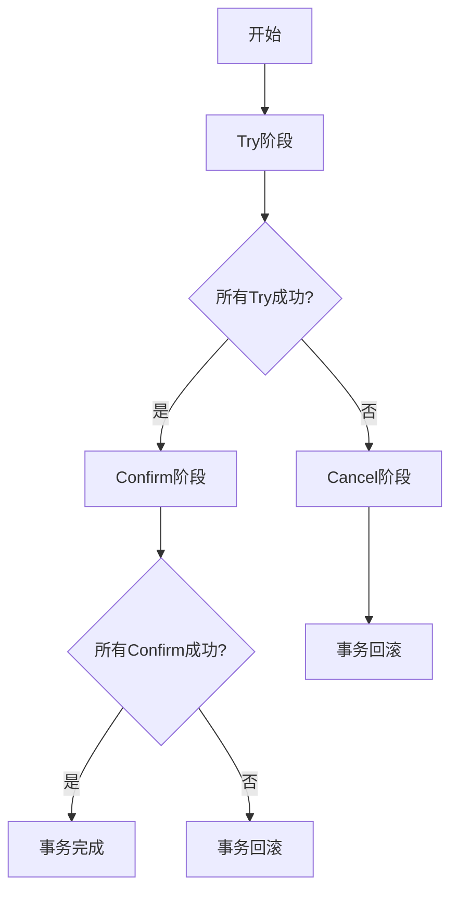

# Seata事务模式：TCC模式

在分布式系统中，事务管理是一个复杂且关键的问题。Seata 是一个开源的分布式事务解决方案，提供了多种事务模式来应对不同的业务场景。其中，TCC（Try-Confirm-Cancel）模式是一种基于补偿机制的事务模式，适用于需要高一致性保证的场景。

## 什么是TCC模式？

TCC模式是一种分布式事务解决方案，它将一个事务拆分为三个阶段：

1. **Try**：尝试执行业务逻辑，预留资源。
2. **Confirm**：确认执行业务逻辑，提交资源。
3. **Cancel**：取消执行业务逻辑，释放资源。

TCC模式的核心思想是通过补偿机制来保证事务的最终一致性。与传统的两阶段提交（2PC）相比，TCC模式更加灵活，适用于复杂的业务场景。

## TCC模式的工作原理

TCC模式的工作流程可以分为以下几个步骤：

1. **Try阶段**：在这个阶段，系统会尝试执行业务逻辑，并预留必要的资源。如果所有参与者都成功执行了Try阶段，事务进入Confirm阶段；否则，进入Cancel阶段。
2. **Confirm阶段**：在这个阶段，系统会确认执行业务逻辑，并提交资源。如果所有参与者都成功执行了Confirm阶段，事务完成；否则，事务回滚。
3. **Cancel阶段**：在这个阶段，系统会取消执行业务逻辑，并释放资源。这个阶段通常用于处理Try阶段失败的情况。



## TCC模式的实现

下面我们通过一个简单的例子来演示如何在Seata中实现TCC模式。

### 示例：转账业务

假设我们有一个转账业务，需要将资金从账户A转移到账户B。我们可以使用TCC模式来实现这个业务。

#### 1. Try阶段

在Try阶段，我们需要冻结账户A的资金，并预留账户B的资金。

```java
public interface TransferService {
    @TwoPhaseBusinessAction(name = "transfer", commitMethod = "confirm", rollbackMethod = "cancel")
    boolean tryTransfer(String fromAccount, String toAccount, BigDecimal amount);
    
    boolean confirm(String fromAccount, String toAccount, BigDecimal amount);
    
    boolean cancel(String fromAccount, String toAccount, BigDecimal amount);
}
```

#### 2. Confirm阶段

在Confirm阶段，我们需要确认转账操作，并提交资金。

```java
public class TransferServiceImpl implements TransferService {
    @Override
    public boolean tryTransfer(String fromAccount, String toAccount, BigDecimal amount) {
        // 冻结账户A的资金
        // 预留账户B的资金
        return true;
    }

    @Override
    public boolean confirm(String fromAccount, String toAccount, BigDecimal amount) {
        // 确认转账操作，提交资金
        return true;
    }

    @Override
    public boolean cancel(String fromAccount, String toAccount, BigDecimal amount) {
        // 取消转账操作，释放资金
        return true;
    }
}
```

#### 3. Cancel阶段

在Cancel阶段，我们需要取消转账操作，并释放资金。

```java
public class TransferServiceImpl implements TransferService {
    @Override
    public boolean tryTransfer(String fromAccount, String toAccount, BigDecimal amount) {
        // 冻结账户A的资金
        // 预留账户B的资金
        return true;
    }

    @Override
    public boolean confirm(String fromAccount, String toAccount, BigDecimal amount) {
        // 确认转账操作，提交资金
        return true;
    }

    @Override
    public boolean cancel(String fromAccount, String toAccount, BigDecimal amount) {
        // 取消转账操作，释放资金
        return true;
    }
}
```

## 实际应用场景

TCC模式适用于需要高一致性保证的场景，例如：

- **金融交易**：如转账、支付等业务。
- **库存管理**：如库存扣减、库存预留等业务。
- **订单处理**：如订单创建、订单取消等业务。

在这些场景中，TCC模式可以确保事务的最终一致性，避免数据不一致的问题。

## 总结

TCC模式是Seata中一种重要的分布式事务解决方案，适用于需要高一致性保证的场景。通过Try、Confirm、Cancel三个阶段，TCC模式可以有效地管理分布式事务，确保事务的最终一致性。

在实际应用中，TCC模式需要开发者仔细设计业务逻辑，确保每个阶段的操作都能正确执行。通过合理使用TCC模式，可以大大提高分布式系统的可靠性和一致性。

## 附加资源

- [Seata官方文档](https://seata.io/zh-cn/docs/overview/what-is-seata.html)
- [分布式事务解决方案](https://www.infoq.cn/article/distributed-transaction-solution)
- [TCC模式详解](https://www.cnblogs.com/skyblog/p/11336634.html)

## 练习

1. 尝试实现一个简单的TCC模式示例，模拟一个订单创建和取消的业务流程。
2. 思考在什么情况下TCC模式可能不适合使用？为什么？
