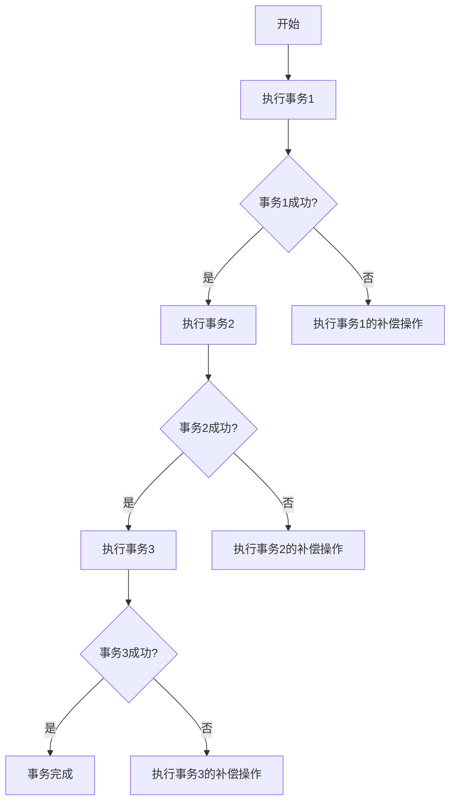

# Seata事务模式：SAGA模式

## 介绍

在分布式系统中，事务管理是一个复杂且关键的问题。Seata 是一个开源的分布式事务解决方案，提供了多种事务模式来应对不同的业务场景。其中，**SAGA模式** 是一种适用于长事务的分布式事务模式，特别适合需要长时间运行且可能涉及多个服务的业务场景。

SAGA模式的核心思想是将一个长事务拆分为多个本地事务，每个本地事务都有对应的补偿操作。如果某个本地事务失败，系统会通过执行补偿操作来回滚之前已经提交的事务，从而保证数据的一致性。

## SAGA模式的工作原理

SAGA模式的工作流程可以分为以下几个步骤：

1. **事务拆分**：将一个长事务拆分为多个本地事务。
2. **事务执行**：依次执行每个本地事务。
3. **补偿机制**：如果某个本地事务失败，系统会依次执行之前已经提交的本地事务的补偿操作。



## 代码示例

假设我们有一个订单系统，包含创建订单、扣减库存和支付三个步骤。我们可以使用SAGA模式来实现这个流程。

### 1. 创建订单

```java
public class OrderService {
    @Transactional
    public void createOrder(Order order) {
        // 创建订单逻辑
        orderRepository.save(order);
    }

    @Compensate
    public void compensateCreateOrder(Order order) {
        // 补偿逻辑：删除订单
        orderRepository.delete(order);
    }
}
```

### 2. 扣减库存

```java
public class InventoryService {
    @Transactional
    public void deductStock(Product product, int quantity) {
        // 扣减库存逻辑
        product.setStock(product.getStock() - quantity);
        productRepository.save(product);
    }

    @Compensate
    public void compensateDeductStock(Product product, int quantity) {
        // 补偿逻辑：恢复库存
        product.setStock(product.getStock() + quantity);
        productRepository.save(product);
    }
}
```

### 3. 支付

```java
public class PaymentService {
    @Transactional
    public void pay(Order order, BigDecimal amount) {
        // 支付逻辑
        order.setStatus(OrderStatus.PAID);
        orderRepository.save(order);
    }

    @Compensate
    public void compensatePay(Order order, BigDecimal amount) {
        // 补偿逻辑：退款
        order.setStatus(OrderStatus.REFUNDED);
        orderRepository.save(order);
    }
}
```

### 事务执行流程

```java
public class OrderSaga {
    public void execute(Order order) {
        try {
            orderService.createOrder(order);
            inventoryService.deductStock(order.getProduct(), order.getQuantity());
            paymentService.pay(order, order.getTotalAmount());
        } catch (Exception e) {
            // 如果任何一步失败，执行补偿操作
            paymentService.compensatePay(order, order.getTotalAmount());
            inventoryService.compensateDeductStock(order.getProduct(), order.getQuantity());
            orderService.compensateCreateOrder(order);
        }
    }
}
```

## 实际案例

假设我们有一个电商平台，用户在平台上购买商品时，系统需要依次执行创建订单、扣减库存和支付三个步骤。如果支付失败，系统需要回滚之前的操作，确保数据的一致性。

在这个场景中，SAGA模式非常适合，因为它允许我们将整个购买流程拆分为多个本地事务，并在某个步骤失败时通过补偿操作来回滚之前已经提交的事务。

## 总结

SAGA模式是Seata中一种适用于长事务的分布式事务解决方案。它通过将长事务拆分为多个本地事务，并在某个步骤失败时执行补偿操作来保证数据的一致性。SAGA模式特别适合需要长时间运行且可能涉及多个服务的业务场景。

## 附加资源

- [Seata官方文档](https://seata.io/zh-cn/docs/overview/what-is-seata.html)
- [分布式事务解决方案对比](https://dzone.com/articles/distributed-transaction-solutions-comparison)

## 练习

1. 尝试在本地环境中搭建一个简单的Seata项目，并使用SAGA模式实现一个简单的订单流程。
2. 修改上面的代码示例，增加一个发货步骤，并在发货失败时执行相应的补偿操作。
