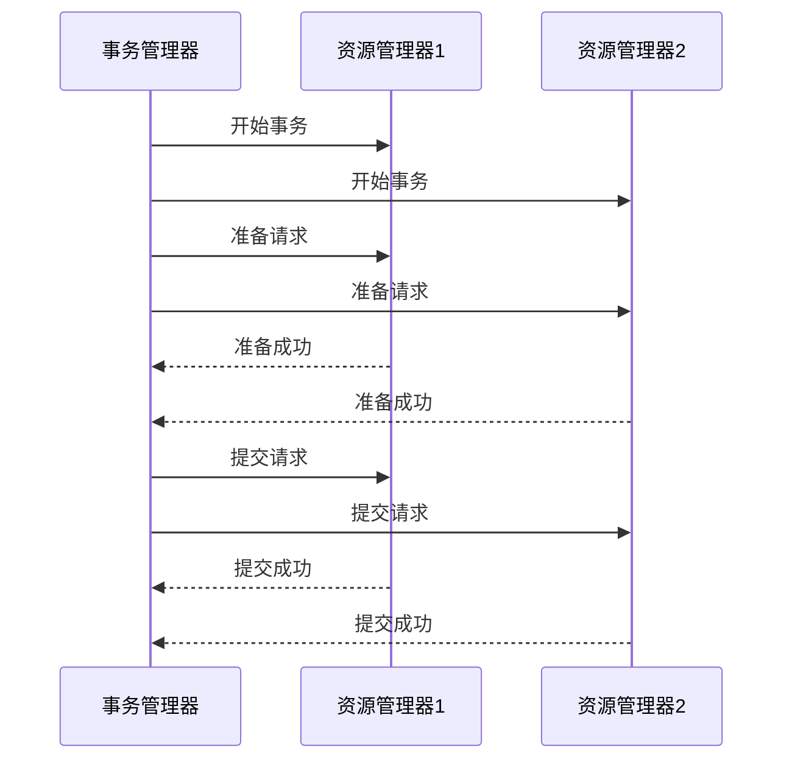

# Seata事务模式：XA模式

## 介绍

在分布式系统中，事务管理是一个复杂且关键的问题。Seata（Simple Extensible Autonomous Transaction Architecture）是一个开源的分布式事务解决方案，支持多种事务模式，其中XA模式是其中之一。XA模式基于XA协议，是一种强一致性的事务模式，适用于需要严格保证数据一致性的场景。

## 什么是XA模式？

XA模式是一种基于XA协议的事务模式，XA协议是由X/Open组织提出的分布式事务处理标准。XA模式的核心思想是通过两阶段提交（2PC，Two-Phase Commit）协议来保证分布式事务的一致性。

在XA模式中，事务管理器（Transaction Manager，TM）负责协调多个资源管理器（Resource Manager，RM）的事务操作。事务分为两个阶段：

1. **准备阶段（Prepare Phase）**：事务管理器向所有参与者（资源管理器）发送准备请求，参与者执行事务操作但不提交，并将结果反馈给事务管理器。
2. **提交阶段（Commit Phase）**：如果所有参与者都准备成功，事务管理器发送提交请求，参与者提交事务；如果有任何一个参与者准备失败，事务管理器发送回滚请求，参与者回滚事务。

## XA模式的工作原理

为了更好地理解XA模式的工作原理，我们可以通过以下步骤来分解：

1. **事务开始**：事务管理器（TM）启动一个全局事务，并生成一个全局事务ID（XID）。
2. **分支事务注册**：每个参与者（RM）在本地事务开始时，向事务管理器注册分支事务。
3. **准备阶段**：事务管理器向所有参与者发送准备请求，参与者执行事务操作但不提交，并将结果反馈给事务管理器。
4. **提交阶段**：如果所有参与者都准备成功，事务管理器发送提交请求，参与者提交事务；如果有任何一个参与者准备失败，事务管理器发送回滚请求，参与者回滚事务。



## XA模式的实际应用场景

XA模式适用于需要严格保证数据一致性的场景，例如金融系统中的转账操作。假设我们有一个分布式系统，包含两个数据库：用户账户数据库和交易记录数据库。在转账操作中，我们需要同时更新两个数据库，确保要么两个数据库都更新成功，要么都回滚。

### 代码示例

以下是一个使用Seata XA模式的简单示例：

```java
// 全局事务注解
@GlobalTransactional
public void transfer(String fromAccount, String toAccount, BigDecimal amount) {
    // 扣除转出账户金额
    accountService.debit(fromAccount, amount);
    // 增加转入账户金额
    accountService.credit(toAccount, amount);
    // 记录交易日志
    transactionService.logTransaction(fromAccount, toAccount, amount);
}
```

在这个示例中，`@GlobalTransactional`注解标识了一个全局事务。Seata会自动管理这个事务的提交和回滚，确保所有操作要么全部成功，要么全部回滚。

## 总结

XA模式是Seata中一种强一致性的事务模式，适用于需要严格保证数据一致性的场景。它通过两阶段提交协议来协调多个资源管理器的事务操作，确保分布式事务的一致性。虽然XA模式提供了强一致性保证，但由于其复杂的协调机制，可能会影响系统性能。因此，在选择事务模式时，需要根据具体业务场景进行权衡。

## 附加资源与练习

- **练习**：尝试在一个简单的分布式系统中实现XA模式的事务管理，观察事务的提交和回滚过程。
- **资源**：阅读Seata官方文档，了解更多关于XA模式的详细配置和使用方法。

:::tip
在实际项目中，XA模式虽然提供了强一致性保证，但在高并发场景下可能会成为性能瓶颈。因此，建议在需要严格一致性保证的场景下使用XA模式，而在其他场景下可以考虑使用Seata的其他事务模式，如AT模式或TCC模式。
:::