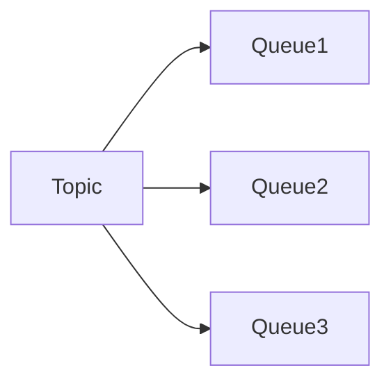
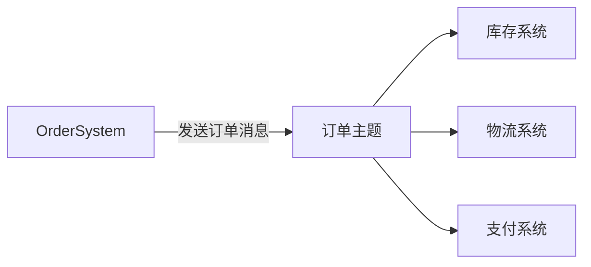
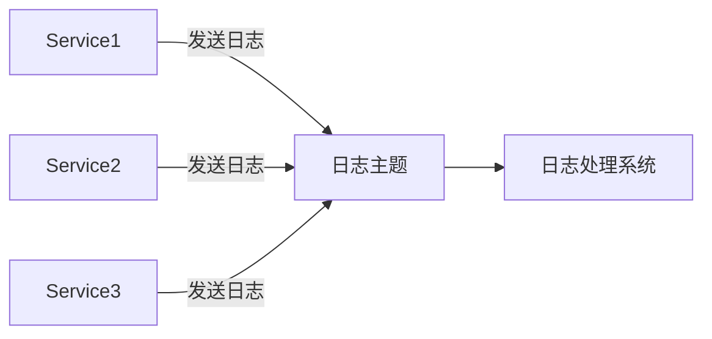

# RocketMQ基础概念

RocketMQ 是一款开源的分布式消息中间件，由阿里巴巴开发并贡献给 Apache 基金会。它被广泛应用于大规模分布式系统中，用于实现异步通信、解耦系统组件以及提高系统的可扩展性和可靠性。本文将介绍 RocketMQ 的核心概念，帮助你快速入门。

## 什么是 RocketMQ？

RocketMQ 是一个高性能、高吞吐量的分布式消息中间件，支持消息的发布/订阅模式。它能够处理海量消息，并保证消息的可靠传递。RocketMQ 的核心设计目标是提供低延迟、高可用性和可扩展性。

## 核心概念

### 1. 消息（Message）

消息是 RocketMQ 中最基本的数据单元。每条消息包含以下内容：

- **Topic**：消息的主题，用于分类消息。
- **Tags**：消息的标签，用于进一步过滤消息。
- **Keys**：消息的唯一标识符，通常用于消息的查询和去重。
- **Body**：消息的实际内容，通常是二进制数据。

```java
Message msg = new Message("TopicTest", "TagA", "Key123", "Hello RocketMQ".getBytes());
```

### 2. 主题（Topic）

主题是消息的逻辑分类，生产者将消息发送到特定的主题，消费者从主题中订阅消息。一个主题可以包含多个队列（Queue），用于实现消息的并行处理。

:::tip
主题是 RocketMQ 中消息分类的基本单位，建议根据业务场景合理设计主题。
:::

### 3. 队列（Queue）

队列是主题的物理分区，每个主题可以包含多个队列。队列的作用是实现消息的并行处理，提高系统的吞吐量。RocketMQ 中的队列是顺序存储的，确保消息的顺序性。



### 4. 生产者（Producer）

生产者是消息的发送者，负责将消息发送到指定的主题。生产者可以是应用程序、服务或系统组件。

```java
DefaultMQProducer producer = new DefaultMQProducer("ProducerGroup");
producer.setNamesrvAddr("localhost:9876");
producer.start();
producer.send(msg);
producer.shutdown();
```

### 5. 消费者（Consumer）

消费者是消息的接收者，负责从指定的主题中订阅并消费消息。消费者可以是应用程序、服务或系统组件。

```java
DefaultMQPushConsumer consumer = new DefaultMQPushConsumer("ConsumerGroup");
consumer.setNamesrvAddr("localhost:9876");
consumer.subscribe("TopicTest", "*");
consumer.registerMessageListener((MessageListenerConcurrently) (msgs, context) -> {
    for (MessageExt msg : msgs) {
        System.out.println(new String(msg.getBody()));
    }
    return ConsumeConcurrentlyStatus.CONSUME_SUCCESS;
});
consumer.start();
```

### 6. 消息存储（Message Store）

RocketMQ 使用本地文件系统存储消息，确保消息的持久化。消息存储采用顺序写的方式，提高了写入性能。

### 7. 消息消费模式

RocketMQ 支持两种消息消费模式：

- **集群消费（Clustering）**：同一个消费者组中的多个消费者共同消费一个主题的消息，每条消息只会被一个消费者消费。
- **广播消费（Broadcasting）**：同一个消费者组中的每个消费者都会收到所有消息。

:::caution
广播消费模式下，每条消息会被所有消费者消费，适用于需要所有消费者处理相同消息的场景。
:::

## 实际应用场景

### 场景 1：订单系统

在电商系统中，订单创建后需要通知库存系统、物流系统和支付系统。使用 RocketMQ 可以将订单消息发送到“订单主题”，各个系统订阅该主题并处理相关业务逻辑。



### 场景 2：日志收集

在分布式系统中，各个服务产生的日志可以通过 RocketMQ 发送到“日志主题”，日志处理系统订阅该主题并集中处理日志数据。



## 总结

RocketMQ 是一个强大的分布式消息中间件，适用于各种需要异步通信和解耦的场景。通过理解消息、主题、队列、生产者和消费者等核心概念，你可以更好地使用 RocketMQ 构建高可用、高性能的分布式系统。

## 附加资源

- [RocketMQ 官方文档](https://rocketmq.apache.org/docs/)
- [RocketMQ GitHub 仓库](https://github.com/apache/rocketmq)

## 练习

1. 创建一个 RocketMQ 生产者，向主题“TestTopic”发送一条消息。
2. 创建一个 RocketMQ 消费者，订阅“TestTopic”并打印收到的消息。
3. 尝试使用集群消费和广播消费模式，观察消息的消费行为。

:::note
在练习过程中，如果遇到问题，可以参考 RocketMQ 官方文档或社区资源。
:::