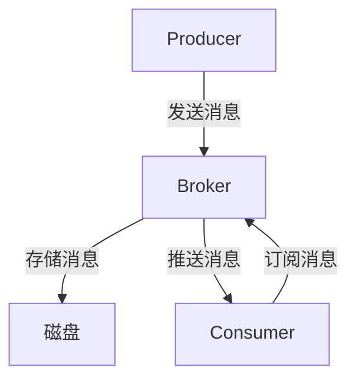

# RocketMQ架构设计

RocketMQ 是一款高性能、高可用的分布式消息中间件，广泛应用于大规模分布式系统中。它由阿里巴巴开源，并在 Apache 基金会孵化。RocketMQ 的设计目标是提供低延迟、高吞吐量的消息传递服务，同时保证消息的可靠性和顺序性。

## RocketMQ 的核心组件

RocketMQ 的架构主要由以下几个核心组件组成：

1. **NameServer**：NameServer 是 RocketMQ 的轻量级服务发现组件，负责管理 Broker 的元数据信息。每个 NameServer 都是独立的，Broker 会定期向 NameServer 注册自己的信息，Producer 和 Consumer 则通过 NameServer 获取 Broker 的地址。

2. **Broker**：Broker 是 RocketMQ 的核心组件，负责消息的存储和传递。每个 Broker 可以管理多个 Topic，并处理 Producer 和 Consumer 的请求。Broker 会将消息存储在本地磁盘上，并支持消息的持久化。

3. **Producer**：Producer 是消息的生产者，负责将消息发送到 Broker。Producer 可以通过 NameServer 获取 Broker 的地址，并将消息发送到指定的 Topic。

4. **Consumer**：Consumer 是消息的消费者，负责从 Broker 订阅并消费消息。Consumer 可以通过 NameServer 获取 Broker 的地址，并从指定的 Topic 中拉取消息。

## RocketMQ 的消息传递流程

RocketMQ 的消息传递流程可以分为以下几个步骤：

1. **Producer 发送消息**：Producer 通过 NameServer 获取 Broker 的地址，并将消息发送到指定的 Topic。

2. **Broker 存储消息**：Broker 接收到消息后，将其存储在本地磁盘上，并返回确认信息给 Producer。

3. **Consumer 订阅消息**：Consumer 通过 NameServer 获取 Broker 的地址，并从指定的 Topic 中拉取消息。

4. **Broker 推送消息**：Broker 将消息推送给 Consumer，Consumer 接收到消息后进行业务处理。



## 实际应用场景

RocketMQ 在实际应用中有多种场景，以下是几个典型的例子：

1. **订单系统**：在电商平台中，订单系统需要处理大量的订单消息。RocketMQ 可以保证订单消息的可靠传递，并支持消息的顺序消费，确保订单处理的正确性。

2. **日志收集**：在大规模分布式系统中，日志收集是一个重要的需求。RocketMQ 可以高效地收集和传递日志消息，支持日志的实时分析和处理。

3. **消息通知**：在社交网络或即时通讯应用中，消息通知是一个常见的需求。RocketMQ 可以保证消息的实时传递，并支持消息的广播和点对点传递。

## 代码示例

以下是一个简单的 RocketMQ Producer 和 Consumer 的代码示例：

### Producer 示例

```java
import org.apache.rocketmq.client.producer.DefaultMQProducer;
import org.apache.rocketmq.common.message.Message;

public class ProducerExample {
    public static void main(String[] args) throws Exception {
        // 创建 Producer 实例
        DefaultMQProducer producer = new DefaultMQProducer("ProducerGroup");
        // 设置 NameServer 地址
        producer.setNamesrvAddr("localhost:9876");
        // 启动 Producer
        producer.start();

        // 创建消息
        Message msg = new Message("TopicTest", "TagA", "Hello RocketMQ".getBytes());
        // 发送消息
        producer.send(msg);

        // 关闭 Producer
        producer.shutdown();
    }
}
```

### Consumer 示例

```java
import org.apache.rocketmq.client.consumer.DefaultMQPushConsumer;
import org.apache.rocketmq.client.consumer.listener.ConsumeConcurrentlyContext;
import org.apache.rocketmq.client.consumer.listener.ConsumeConcurrentlyStatus;
import org.apache.rocketmq.client.consumer.listener.MessageListenerConcurrently;
import org.apache.rocketmq.common.message.MessageExt;

import java.util.List;

public class ConsumerExample {
    public static void main(String[] args) throws Exception {
        // 创建 Consumer 实例
        DefaultMQPushConsumer consumer = new DefaultMQPushConsumer("ConsumerGroup");
        // 设置 NameServer 地址
        consumer.setNamesrvAddr("localhost:9876");
        // 订阅 Topic
        consumer.subscribe("TopicTest", "*");

        // 注册消息监听器
        consumer.registerMessageListener(new MessageListenerConcurrently() {
            @Override
            public ConsumeConcurrentlyStatus consumeMessage(List<MessageExt> msgs, ConsumeConcurrentlyContext context) {
                for (MessageExt msg : msgs) {
                    System.out.println("Received message: " + new String(msg.getBody()));
                }
                return ConsumeConcurrentlyStatus.CONSUME_SUCCESS;
            }
        });

        // 启动 Consumer
        consumer.start();
    }
}
```

## 总结

RocketMQ 是一款功能强大的分布式消息中间件，其架构设计简洁高效，能够满足大规模分布式系统的消息传递需求。通过本文的介绍，你应该对 RocketMQ 的核心组件、消息传递流程以及实际应用场景有了初步的了解。

## 附加资源

- [RocketMQ 官方文档](https://rocketmq.apache.org/docs/)
- [RocketMQ GitHub 仓库](https://github.com/apache/rocketmq)
- [RocketMQ 实战教程](https://www.rocketmq.io/)

## 练习

1. 尝试在本地的 RocketMQ 环境中运行上述 Producer 和 Consumer 示例，观察消息的发送和接收过程。
2. 修改 Producer 代码，发送多条消息到不同的 Topic，并在 Consumer 中订阅这些 Topic，观察消息的消费情况。
3. 研究 RocketMQ 的消息顺序消费机制，并尝试实现一个顺序消费的示例。