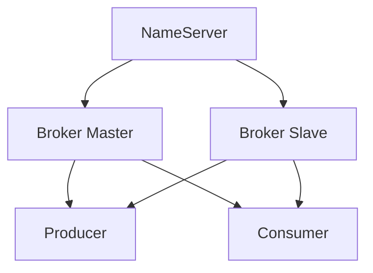

# RocketMQ集群部署

RocketMQ 是一个分布式消息中间件，广泛应用于大规模分布式系统中。为了确保高可用性和高性能，RocketMQ 通常以集群形式部署。本文将详细介绍 RocketMQ 集群的架构、部署步骤以及实际应用场景。

## 1. RocketMQ集群架构简介

RocketMQ 集群主要由以下几个组件组成：

- **NameServer**：负责管理 Broker 的元数据信息，Broker 启动时会向 NameServer 注册，Producer 和 Consumer 通过 NameServer 获取 Broker 的路由信息。
- **Broker**：负责消息的存储和转发。Broker 分为 Master 和 Slave，Master 负责处理读写请求，Slave 负责从 Master 同步数据，提供数据冗余和故障恢复。
- **Producer**：消息的生产者，负责发送消息到 Broker。
- **Consumer**：消息的消费者，负责从 Broker 拉取消息并进行处理。

RocketMQ 集群的典型架构如下：



## 2. RocketMQ集群部署步骤

### 2.1 环境准备

在部署 RocketMQ 集群之前，需要确保以下环境已经准备好：

- **操作系统**：Linux 或 macOS。
- **Java 环境**：JDK 1.8 或更高版本。
- **RocketMQ 安装包**：从 [RocketMQ 官网](https://rocketmq.apache.org/) 下载最新版本的安装包。

### 2.2 部署NameServer

NameServer 是 RocketMQ 集群的元数据管理组件，通常需要部署多个 NameServer 以实现高可用性。

1. **解压安装包**：
   ```bash
   tar -zxvf rocketmq-all-4.9.2-bin-release.tar.gz
   cd rocketmq-all-4.9.2-bin-release
   ```

2. **启动NameServer**：
   ```bash
   nohup sh bin/mqnamesrv &
   ```

3. **验证NameServer是否启动成功**：
   ```bash
   tail -f ~/logs/rocketmqlogs/namesrv.log
   ```
   如果看到 `The Name Server boot success` 的日志，说明 NameServer 启动成功。

### 2.3 部署Broker

Broker 是 RocketMQ 集群的核心组件，负责消息的存储和转发。通常需要部署多个 Broker，其中一个作为 Master，其他作为 Slave。

1. **修改Broker配置文件**：
   在 `conf` 目录下找到 `broker.conf` 文件，修改以下配置：
   ```properties
   brokerClusterName=DefaultCluster
   brokerName=broker-a
   brokerId=0
   deleteWhen=04
   fileReservedTime=48
   brokerRole=ASYNC_MASTER
   flushDiskType=ASYNC_FLUSH
   namesrvAddr=127.0.0.1:9876
   ```

2. **启动Broker**：
   ```bash
   nohup sh bin/mqbroker -c conf/broker.conf &
   ```

3. **验证Broker是否启动成功**：
   ```bash
   tail -f ~/logs/rocketmqlogs/broker.log
   ```
   如果看到 `The broker boot success` 的日志，说明 Broker 启动成功。

### 2.4 部署Producer和Consumer

Producer 和 Consumer 是 RocketMQ 集群的客户端，负责发送和接收消息。

1. **启动Producer**：
   ```bash
   sh bin/tools.sh org.apache.rocketmq.example.quickstart.Producer
   ```

2. **启动Consumer**：
   ```bash
   sh bin/tools.sh org.apache.rocketmq.example.quickstart.Consumer
   ```

3. **验证消息发送和接收**：
   如果 Producer 和 Consumer 启动成功，并且 Consumer 能够接收到 Producer 发送的消息，说明 RocketMQ 集群部署成功。

## 3. 实际应用场景

RocketMQ 集群广泛应用于以下场景：

- **电商系统**：用于订单处理、库存管理等异步消息处理。
- **金融系统**：用于交易消息的可靠传递和事务处理。
- **日志收集**：用于分布式系统的日志收集和分析。

## 4. 总结

本文详细介绍了 RocketMQ 集群的架构和部署步骤。通过部署 NameServer、Broker、Producer 和 Consumer，可以构建一个高可用、高性能的 RocketMQ 集群。RocketMQ 集群在大规模分布式系统中具有广泛的应用场景，能够有效提升系统的可靠性和性能。

## 5. 附加资源与练习

- **官方文档**：[RocketMQ 官方文档](https://rocketmq.apache.org/docs/)
- **练习**：尝试在本地环境中部署一个 RocketMQ 集群，并发送和接收消息。

:::tip
在部署过程中，如果遇到问题，可以参考 RocketMQ 的官方文档或社区论坛，获取更多帮助。
:::